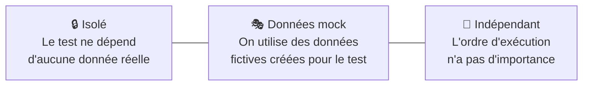
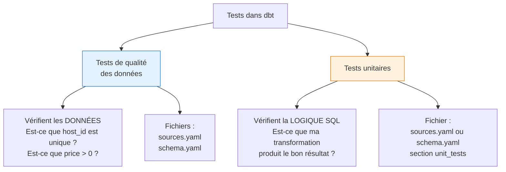
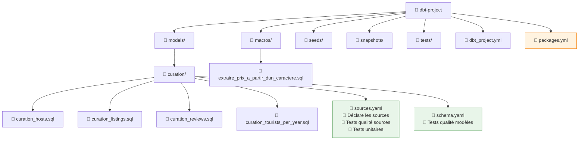
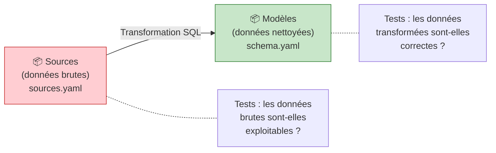
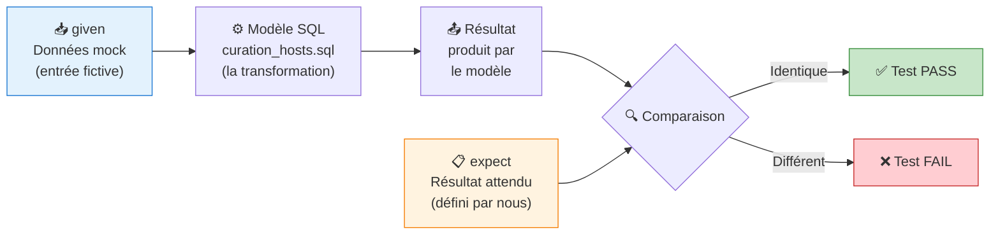
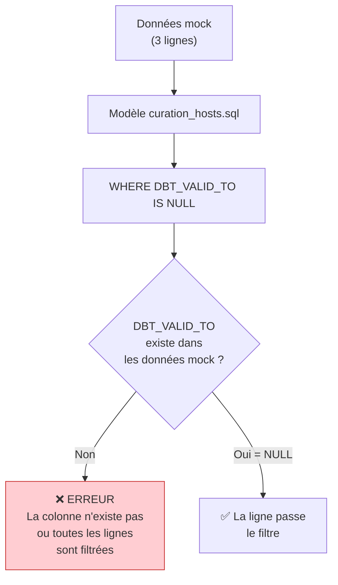
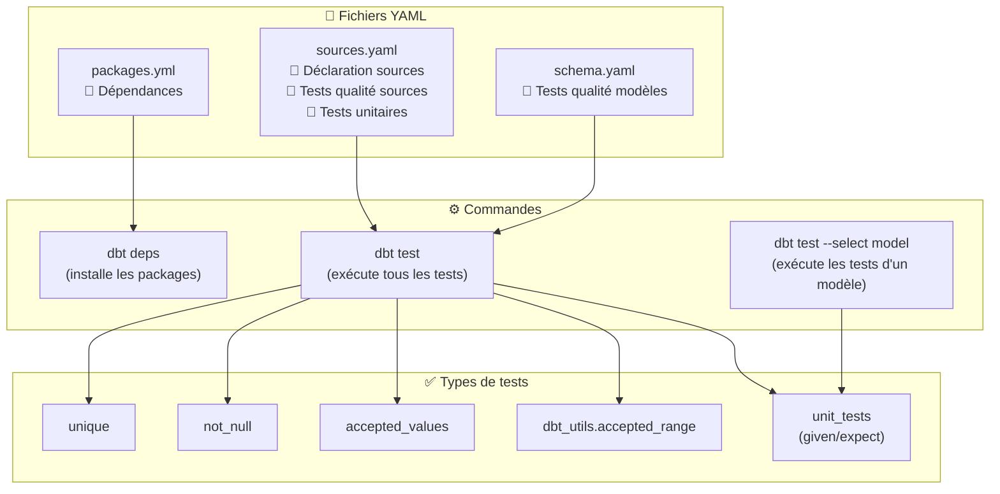
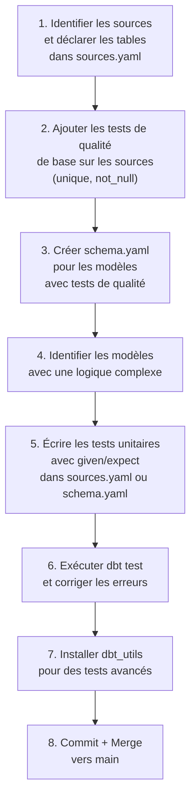

# dbt — Chapitre 6 : Tests de qualité de données et tests unitaires

---

## Introduction

### Contexte

Ce chapitre s'inscrit dans un projet dbt (data build tool) basé sur des données **Airbnb** stockées dans **Snowflake**. Le projet comporte plusieurs modèles de transformation (couche `curation`) qui nettoient et restructurent les données brutes (couche `raw`) : `curation_hosts`, `curation_listings`, `curation_reviews`, `curation_tourists_per_year`.

Jusqu'ici, les modèles ont été construits et exécutés, mais **rien ne garantit** que les transformations SQL produisent les résultats attendus. C'est le rôle des tests.

### Objectifs de ce chapitre

À la fin de ce chapitre, vous serez capable de :

- Comprendre la différence entre test de qualité de données et test unitaire
- Définir des tests de qualité (`unique`, `not_null`, `accepted_values`) sur les sources et les modèles
- Écrire des tests unitaires dbt avec le pattern `given` / `expect`
- Créer des données mock adaptées aux filtres du modèle
- Écrire et tester une macro Jinja/SQL
- Installer et utiliser le package `dbt_utils`

### Prérequis

- Un projet dbt fonctionnel connecté à Snowflake (ou un autre data warehouse)
- Les modèles `curation_hosts`, `curation_listings`, `curation_reviews` et `curation_tourists_per_year` déjà créés
- Des snapshots configurés (`hosts_snapshot`, `listings_snapshot`)
- Connaissances de base en SQL et YAML

---

## Concepts fondamentaux

### 1. Qu'est-ce qu'un test unitaire ?

Un test unitaire est une procédure permettant de **vérifier le bon fonctionnement** d'une partie **précise** d'un logiciel ou d'une portion d'un programme (appelée « unité » ou « module »).

Dans le contexte de dbt, une « unité » est un **modèle SQL** ou une **macro**.

Un test unitaire possède trois propriétés fondamentales :



| Propriété | Signification | Exemple dans dbt |
|-----------|--------------|------------------|
| **Isolé** | Le test vérifie une seule chose, sans dépendance externe | On teste uniquement la logique de `curation_hosts`, pas celle de `curation_listings` |
| **Données mock** | On fournit des données fictives au lieu d'utiliser les vraies données | On crée 3 lignes fictives dans le `given` au lieu de lire les 10 000 lignes de la table réelle |
| **Indépendant de l'ordre** | Le résultat ne change pas selon l'ordre d'exécution des tests | Le test de `curation_hosts` passe, que celui de `curation_listings` soit exécuté avant ou après |

### 2. Les deux types de tests dans dbt

dbt distingue deux familles de tests, qui ont des objectifs très différents :



| | Test de qualité | Test unitaire |
|---|---|---|
| **Vérifie** | Les données elles-mêmes | La logique de transformation SQL |
| **Question posée** | "Les données sont-elles correctes ?" | "Mon code produit-il le bon résultat ?" |
| **Utilise les vraies données** | ✅ Oui | ❌ Non (données mock) |
| **Tests natifs dbt** | `unique`, `not_null`, `accepted_values` | `unit_tests` (given/expect) |
| **Exécuté sur** | Sources ET modèles | Modèles uniquement |

### 3. Quand écrire un test unitaire ?

Un test unitaire est pertinent quand le SQL contient une **logique complexe**. Voici les cas identifiés :

- Expressions régulières (Regex)
- Manipulation de dates
- Window functions
- Commandes `CASE` avec plusieurs branchements `WHEN`
- Fonction `TRUNCATE`
- Logique métier vraiment compliquée
- Cas limites qu'on veut anticiper (données qu'on ne voit pas encore mais qui pourraient arriver)
- Avant de réécrire une requête SQL existante

> **⚠️ Règle importante** : il n'est **PAS** recommandé de tester les fonctions natives du data warehouse comme `MIN()`, `MAX()`, `COUNT()`, `SUM()`, etc. Ces fonctions sont déjà testées par Snowflake/BigQuery/etc. Tester `MIN()` revient à tester le moteur SQL lui-même, ce qui n'est pas notre responsabilité.

### 4. L'arborescence des fichiers dans un projet dbt

Avant de plonger dans le code, voici où se situent les différents fichiers dans un projet dbt :



> **💡 Point clé** : `sources.yaml` définit les **sources** (données brutes) et peut aussi contenir les `unit_tests`. `schema.yaml` définit les tests de qualité sur les **modèles** (données transformées). Ce sont deux fichiers distincts avec des rôles différents.

---

## Tests de qualité des données sur les sources

### Objectif

Vérifier que les données brutes (avant transformation) respectent des règles de base : pas de valeurs nulles sur les colonnes critiques, unicité des identifiants, valeurs dans un ensemble défini.

### Le fichier `sources.yaml`

```yaml
version: 2                          # Version de la syntaxe dbt (toujours 2)

sources:                             # Déclare les sources de données externes
  - name: raw_airbnb_data            # Nom logique de la source (utilisé dans ref/source)
    database: airbnb                 # Nom de la base de données dans Snowflake
    schema: raw                      # Nom du schéma contenant les tables brutes
    tables:                          # Liste des tables de cette source
      - name: hosts                  # Table des hôtes
        columns:                     # Colonnes à tester
          - name: host_id            # Colonne host_id
            description: Identifiant unique de l'hôte
            tests:                   # Tests de qualité à appliquer
              - unique               # Vérifie que chaque valeur est unique
              - not_null             # Vérifie qu'aucune valeur n'est NULL
          - name: host_name
            tests:
              - not_null
          - name: host_since
            tests:
              - not_null
          - name: host_location
            tests:
              - not_null
          - name: host_is_superhost
            tests:
              - not_null
              - accepted_values:     # Vérifie que les valeurs sont dans un ensemble défini
                  values: ['t', 'f'] # Seules les valeurs 't' et 'f' sont acceptées
          - name: host_neighbourhood
            tests:
              - not_null
          - name: host_identity_verified
            tests:
              - not_null
              - accepted_values:
                  values: ['t', 'f']
      - name: listings               # Table des annonces (à compléter en exercice)
      - name: reviews                # Table des avis (à compléter en exercice)
```

### Explication détaillée

**Structure hiérarchique YAML** — l'indentation est cruciale en YAML. Chaque niveau d'indentation crée une relation parent-enfant :

```
sources:                    ← niveau 0 : clé racine
  - name: raw_airbnb_data   ← niveau 1 : un élément de la liste sources
    database: airbnb         ← niveau 2 : propriété de cette source
    tables:                  ← niveau 2 : liste des tables
      - name: hosts          ← niveau 3 : un élément de la liste tables
        columns:             ← niveau 4 : colonnes de cette table
          - name: host_id    ← niveau 5 : une colonne
            tests:           ← niveau 6 : tests de cette colonne
              - unique       ← niveau 7 : un test
```

> **⚠️ Piège n°1 en YAML** : l'indentation doit être faite avec des **espaces** (pas des tabulations). Deux espaces par niveau est la convention standard. Un mauvais niveau d'indentation produit une erreur silencieuse ou un comportement inattendu.

**Les trois tests natifs de dbt** :

| Test | Ce qu'il vérifie | Requête SQL générée par dbt | Passe si... |
|------|-----------------|---------------------------|-------------|
| `unique` | Pas de doublons | `SELECT COUNT(*) FROM (SELECT host_id, COUNT(*) FROM table GROUP BY 1 HAVING COUNT(*) > 1)` | Le résultat est 0 |
| `not_null` | Pas de valeurs NULL | `SELECT COUNT(*) FROM table WHERE host_id IS NULL` | Le résultat est 0 |
| `accepted_values` | Valeurs dans un ensemble défini | `SELECT COUNT(*) FROM table WHERE host_is_superhost NOT IN ('t', 'f')` | Le résultat est 0 |

> **💡 Principe fondamental** : dans dbt, un test **passe** quand la requête SQL qu'il génère renvoie **zéro ligne**. Autrement dit, un test cherche les anomalies — s'il n'en trouve aucune, c'est un succès.

### Exécution et résultats

Pour lancer les tests :

```bash
dbt test                              # Exécute TOUS les tests du projet
dbt test --select curation_hosts      # Exécute uniquement les tests liés à curation_hosts
```

Un résultat typique dans dbt Cloud :

```
dbt test    success    2.8s

  All  4    Pass  4    Warn  0    Error  0    Skip  0

  ✅ source_not_null_raw_airbnb_data_hosts_host_id       0.83s
  ✅ source_not_null_raw_airbnb_data_hosts_host_name      1.02s
  ✅ source_not_null_raw_airbnb_data_hosts_host_since     1.05s
  ✅ source_unique_raw_airbnb_data_hosts_host_id          0.79s
```

> **💡 Convention de nommage automatique** : dbt nomme les tests selon le pattern `source_<type_test>_<source>_<table>_<colonne>`. Cela permet d'identifier immédiatement quel test a échoué.

### Erreurs possibles

| Erreur | Cause | Solution |
|--------|-------|----------|
| `Compilation Error: Source not found` | Le nom de la source ne correspond pas | Vérifier que `name:` correspond exactement au nom dans Snowflake |
| `YAML syntax error` | Mauvaise indentation | Vérifier chaque niveau d'indentation (2 espaces) |
| Test `unique` qui échoue | Doublons dans les données brutes | Analyser les doublons avec `SELECT host_id, COUNT(*) FROM table GROUP BY 1 HAVING COUNT(*) > 1` |
| Test `accepted_values` qui échoue | Valeurs inattendues dans les données | Analyser avec `SELECT DISTINCT colonne FROM table` |

---

## Tests de qualité des données sur les modèles

### Objectif

Vérifier que les données **après transformation** (dans les modèles dbt de la couche `curation`) respectent les règles de qualité attendues.

### Différence clé avec les tests sur les sources



Dans les **sources**, les valeurs de `host_is_superhost` sont `'t'` et `'f'` (données brutes de Snowflake). Dans le **modèle** `curation_hosts`, le SQL transforme ces valeurs en `TRUE` et `FALSE`. Les tests `accepted_values` doivent donc refléter ces différences.

### Le fichier `schema.yaml`

Ce fichier se crée dans le dossier `models/` (à côté ou au même niveau que `sources.yaml`).

```yaml
version: 2                                    # Version de la syntaxe dbt

models:                                        # Déclare les tests pour les modèles
  - name: curation_hosts                       # Nom du modèle dbt à tester
    description: Table hôtes nettoyée et formatée  # Documentation du modèle
    columns:                                   # Colonnes du modèle transformé
      - name: host_id
        description: Identifiant unique de l'hôte
        tests:
          - unique                             # host_id doit être unique après transformation
          - not_null                           # host_id ne doit jamais être NULL

      - name: host_name
        description: Nom de l'hôte
        tests:
          - not_null

      - name: host_since
        description: Date d'inscription de l'hôte
        tests:
          - not_null

      - name: host_location
        description: Ville et pays de l'hôte
        tests:
          - not_null

      - name: host_city
        description: Ville de l'hôte
        tests:
          - not_null

      - name: host_country
        description: Pays de l'hôte
        tests:
          - not_null

      - name: is_superhost
        description: Indicateur si l'hôte a le statut superhost
        tests:
          - not_null
          - accepted_values:
              values: [TRUE, FALSE]            # ⚠️ TRUE/FALSE et non 't'/'f' (données transformées)

      - name: host_neighbourhood
        description: Quartier de l'hôte
        tests:
          - not_null

      - name: is_identity_verified
        description: Indicateur si l'identité de l'hôte a été vérifiée
        tests:
          - not_null
          - accepted_values:
              values: [TRUE, FALSE]            # ⚠️ Même remarque : valeurs transformées
```

> **💡 Remarque importante** : les `accepted_values` dans `sources.yaml` utilisent `['t', 'f']` (données brutes Snowflake), tandis que dans `schema.yaml` elles utilisent `[TRUE, FALSE]` (données transformées par le modèle). C'est une source d'erreur fréquente.

---

## Tests unitaires pour les modèles SQL

### Objectif

Vérifier que la **logique SQL** du modèle produit les résultats attendus, en utilisant des données fictives (mock).

### Le pattern `given` / `expect`

C'est le concept central des tests unitaires dans dbt. Le principe :



En résumé : on fournit des données fictives (`given`), dbt exécute le modèle SQL dessus, et on compare le résultat obtenu avec ce qu'on attendait (`expect`).

### Version 1 — Le test qui échoue (et pourquoi)

Voici un premier essai de test unitaire pour le modèle `curation_hosts`. Ce test est **intentionnellement incomplet** pour illustrer un piège courant.

```yaml
unit_tests:                                                  # Section des tests unitaires
  - name: test_is_host_data_transformation_correct           # Nom unique du test
    description: "Vérifie que host_name, host_city,          # Description humaine
      host_country et response_rate sont créés correctement"
    model: curation_hosts                                    # Modèle SQL à tester

    given:                                                   # ENTRÉE : les données mock
      - input: ref('hosts_snapshot')                         # On simule la table hosts_snapshot
        rows:                                                # Lignes fictives qu'on injecte
          - {host_name: 'Jacko',                             # Ligne 1 : nom normal (> 1 caractère)
             host_location: "ville,pays",                    #   location au format "ville,pays"
             host_response_rate: '32%'}                      #   taux de réponse en string avec %

          - {host_name: 'Xi',                                # Ligne 2 : nom normal
             host_location: "ville,pays",                    #   même format de location
             host_response_rate: '32%'}                      #   même taux

          - {host_name: 'J',                                 # Ligne 3 : nom d'1 seul caractère
             host_location: "pays,ville",                    #   ⚠️ ordre inversé volontairement
             host_response_rate: '32.53%'}                   #   taux avec décimales

    expect:                                                  # SORTIE ATTENDUE
      rows:
        - {host_name: 'Jacko',                               # Ligne 1 attendue : nom inchangé
           host_city: 'ville',                               #   city = partie avant la virgule
           host_country: 'pays',                             #   country = partie après la virgule
           response_rate: 32}                                #   taux converti en entier (32% → 32)

        - {host_name: 'Xi',                                  # Ligne 2 attendue
           host_city: 'ville',
           host_country: 'pays',
           response_rate: 32}

        - {host_name: 'Anonyme',                             # Ligne 3 : 'J' (1 char) → 'Anonyme'
           host_city: 'pays',                                #   ⚠️ city et country inversés
           host_country: 'ville',                            #   car l'input était "pays,ville"
           response_rate: 32}                                #   32.53 tronqué à 32
```

#### Pourquoi ce test échoue

Ce test produit une **erreur** car les données mock sont incomplètes. Le modèle `curation_hosts.sql` contient des clauses `WHERE` qui filtrent les données :



Le modèle SQL contient probablement des filtres comme :

```sql
WHERE DBT_VALID_TO IS NULL           -- Filtre snapshot : ne garder que les lignes actives
  AND host_is_superhost IS NOT NULL  -- Filtre : exclure les hôtes sans statut superhost
  AND host_neighbourhood IS NOT NULL -- Filtre : exclure les hôtes sans quartier
```

Si nos données mock ne contiennent pas ces colonnes, dbt ne peut pas évaluer les conditions `WHERE` et le test échoue.

> **🔑 Règle fondamentale** : les données mock doivent contenir **toutes les colonnes** utilisées par le modèle, y compris celles qui apparaissent dans les clauses `WHERE`, `JOIN`, `GROUP BY`, etc. — pas seulement les colonnes qu'on veut tester dans le `expect`.

### Version 2 — Le test corrigé

```yaml
unit_tests:
  - name: test_is_host_data_transformation_correct
    description: "Vérifie que host_name, host_city,
      host_country et response_rate sont créés correctement"
    model: curation_hosts

    given:
      - input: ref('hosts_snapshot')
        rows:
          - {host_name: 'Jacko',
             host_location: "ville,pays",
             host_response_rate: '32%',
             DBT_VALID_TO: null,              # ✅ AJOUTÉ : colonne snapshot (null = ligne active)
             host_is_superhost: 't',          # ✅ AJOUTÉ : nécessaire pour le filtre WHERE
             host_neighbourhood: 'quartier'}  # ✅ AJOUTÉ : nécessaire pour le filtre WHERE

          - {host_name: 'Xi',
             host_location: "ville,pays",
             host_response_rate: '32.03%',    # ⚠️ Modifié : 32.03% → tronqué à 32
             DBT_VALID_TO: null,
             host_is_superhost: 't',
             host_neighbourhood: 'quartier'}

          - {host_name: 'J',
             host_location: "pays,ville",
             host_response_rate: '32.53%',    # 32.53% → arrondi/tronqué à 33
             DBT_VALID_TO: null,
             host_is_superhost: 't',
             host_neighbourhood: 'quartier'}

    expect:
      rows:
        - {host_name: 'Jacko',
           host_city: 'ville',
           host_country: 'pays',
           response_rate: 32}                 # 32% → 32

        - {host_name: 'Xi',
           host_city: 'ville',
           host_country: 'pays',
           response_rate: 32}                 # 32.03% → 32 (troncature)

        - {host_name: 'Anonyme',
           host_city: 'pays',
           host_country: 'ville',
           response_rate: 33}                 # ⚠️ 32.53% → 33 (arrondi supérieur)
```

#### Comparaison V1 vs V2

| Aspect | V1 (échoue) | V2 (passe) |
|--------|-------------|------------|
| `DBT_VALID_TO` | ❌ Absent | ✅ `null` (ligne active) |
| `host_is_superhost` | ❌ Absent | ✅ `'t'` |
| `host_neighbourhood` | ❌ Absent | ✅ `'quartier'` |
| `host_response_rate` ligne 3 | `'32.53%'` | `'32.53%'` |
| `response_rate` attendu ligne 3 | `32` | `33` (corrigé : arrondi) |

### Tests unitaires des corrections (exercice)

Les captures du cours montrent les corrections pour trois tests supplémentaires. Voici chacun d'eux reconstruit et expliqué.

#### Test : transformation du prix (listings)

```yaml
  - name: test_is_curation_listings_transformation_correct
    description: "Vérifie que la colonne price est bien transformée"
    model: curation_listings                    # Modèle testé
    given:
      - input: ref("listings_snapshot")         # Source : snapshot des listings
        rows:
          - {price: '52.23$',                   # Cas 1 : symbole $ à la FIN
             DBT_VALID_TO: null}                # Ligne active du snapshot
          - {price: '$52.23',                   # Cas 2 : symbole $ au DÉBUT
             DBT_VALID_TO: null}
    expect:
      rows:
        - {price: 52.23}                        # Les deux cas doivent produire 52.23 (float)
```

**Ce que ce test vérifie** : que la transformation varchar → float fonctionne quel que soit l'emplacement du symbole monétaire (`$52.23` ou `52.23$`). Le résultat attendu est un seul prix car les deux formes produisent la même valeur numérique.

> **💡 Remarque** : on ne met qu'une seule ligne dans `expect` car le modèle déduplique ou les deux lignes produisent le même résultat. Vérifiez la logique exacte de votre modèle.

#### Test : agrégation des reviews

```yaml
  - name: test_is_curation_reviews_aggregation_correct
    description: "Vérifie que le compte des commentaires est bien implémenté"
    model: curation_listings                    # ⚠️ C'est bien curation_listings (pas reviews)
    given:
      - input: source("raw_airbnb_data", "reviews")  # Source brute des avis
        rows:
          - {listing_id: 'listing_1', date: '2012-01-01'}  # 2 avis le même jour
          - {listing_id: 'listing_1', date: '2012-01-01'}  #   pour listing_1
          - {listing_id: 'listing_1', date: '2014-02-01'}  # 1 avis un autre jour
          - {listing_id: 'listing_2', date: '2013-01-01'}  # 1 avis pour listing_2
      - input: ref("curation_listings")                     # ⚠️ Deuxième input (JOIN)
        rows:
          - {listing_id: 'listing_1'}                       # Seul listing_1 existe
    expect:
      rows:                                                 # Résultat : agrégation par date
        - {listing_id: 'listing_1',
           review_date: '2012-01-01',
           number_reviews: 2}                               # 2 avis le 2012-01-01
        - {listing_id: 'listing_1',
           review_date: '2014-02-01',
           number_reviews: 1}                               # 1 avis le 2014-02-01
```

**Points importants** :

Ce test utilise **deux inputs** — c'est la première fois qu'on voit ça. Le modèle fait un `JOIN` entre les reviews et les listings, donc il faut fournir des données mock pour les deux tables.

On utilise `source("raw_airbnb_data", "reviews")` au lieu de `ref(...)` — parce que les reviews viennent directement de la source brute, pas d'un autre modèle dbt.

Le `listing_2` n'apparaît pas dans le `expect` car il n'existe pas dans `curation_listings` (filtré par le JOIN).

#### Test : transformation de l'année (tourists_per_year)

```yaml
  - name: test_is_curation_tourists_per_year_correct
    description: "Vérifie que l'année est bien transformée en date par le modèle"
    model: curation_tourists_per_year           # Modèle testé
    given:
      - input: ref("tourists_per_year")         # Table source
        rows:
          - {year: 2012}                        # Entrée : un entier (année)
    expect:
      rows:
        - {year: '2012-12-31'}                  # Sortie : une date au 31 décembre
```

**Ce que ce test vérifie** : le modèle convertit une année entière (ex: `2012`) en une date correspondant au dernier jour de l'année (`2012-12-31`). C'est un test simple mais utile pour vérifier la logique de transformation de date.

---

## Tests unitaires pour les macros

### Objectif

Écrire une macro Jinja/SQL réutilisable et la tester via un test unitaire.

### Le contexte : avant la macro

Dans le modèle `curation_listings.sql`, le prix est transformé de varchar en float avec ce code SQL :

```sql
-- Extrait du modèle curation_listings.sql (AVANT la macro)
SELECT
    room_type,
    accommodates,
    bathrooms,
    bedrooms,
    beds,
    amenities,
    try_cast(split_part(price, '$', 1) AS float) AS price,   -- ⚠️ Hardcodé pour '$'
    minimum_nights,
    maximum_nights
FROM {{ ref("listings_snapshot") }}
WHERE DBT_VALID_TO IS NULL
```

**Problème** : ce code ne gère que le cas où le `$` est au début du prix. Si le prix est `52.23$` (symbole à la fin) ou utilise un autre symbole (`€`, `£`), le code ne fonctionne pas.

### La macro : solution générique

La macro est créée dans le fichier `macros/extraire_prix_a_partir_dun_caractere.sql` :

```sql

{# 
   Macro qui extrait un prix numérique à partir d'une chaîne 
   contenant un symbole monétaire.
   
   Paramètres :
   - price  : la colonne contenant le prix (ex: price)
   - symbol : le caractère à retirer (ex: '$')
   
   Exemples :
   - '$52.23'  → 52.23
   - '52.23$'  → 52.23
   - '52.23'   → NULL (pas de symbole trouvé)
#}
try_cast(                                         {# try_cast : conversion sécurisée     #}
                                                  {# (renvoie NULL au lieu d'une erreur)  #}
    CASE
        WHEN STARTSWITH({{ price }}, '{{ symbol }}')  {# Si le symbole est AU DÉBUT         #}
        THEN SPLIT_PART({{ price }}, '{{ symbol }}', 2)  {# → prend la partie APRÈS le symbole #}

        WHEN ENDSWITH({{ price }}, '{{ symbol }}')    {# Si le symbole est À LA FIN          #}
        THEN SPLIT_PART({{ price }}, '{{ symbol }}', 1)  {# → prend la partie AVANT le symbole #}

        ELSE NULL                                     {# Sinon → NULL (cas non géré)         #}
    END
    AS FLOAT)                                         {# Convertit le résultat en FLOAT      #}

```

#### Explication ligne par ligne détaillée

**Ligne 1 — Déclaration de la macro**

```

```

| Élément | Signification |
|---------|---------------|
| `` | Balise Jinja pour les instructions (logique, pas de sortie) |
| `macro` | Mot-clé Jinja pour déclarer une macro |
| `extraire_prix_a_partir_dun_caractere` | Nom de la macro (sera appelé dans les modèles) |
| `(price, symbol)` | Paramètres : `price` = nom de la colonne, `symbol` = caractère à retirer |
| `-%}` | Le `-` supprime les espaces blancs après la balise (évite les lignes vides dans le SQL généré) |

**Lignes 2-8 — Le corps SQL avec Jinja**

La macro génère du SQL pur, mais avec des **substitutions Jinja** (`{{ }}`). Quand dbt compile cette macro, il remplace les `{{ price }}` et `{{ symbol }}` par les valeurs réelles.

Exemple d'appel et de compilation :

```sql
-- Appel dans le modèle :
{{ extraire_prix_a_partir_dun_caractere('price', '$') }}

-- SQL généré par dbt après compilation :
try_cast(
    CASE
        WHEN STARTSWITH(price, '$') THEN SPLIT_PART(price, '$', 2)
        WHEN ENDSWITH(price, '$') THEN SPLIT_PART(price, '$', 1)
        ELSE NULL
    END
    AS FLOAT)
```

**Les fonctions SQL Snowflake utilisées** :

| Fonction | Rôle | Exemple |
|----------|------|---------|
| `STARTSWITH(str, prefix)` | Vérifie si `str` commence par `prefix` | `STARTSWITH('$52.23', '$')` → `TRUE` |
| `ENDSWITH(str, suffix)` | Vérifie si `str` finit par `suffix` | `ENDSWITH('52.23$', '$')` → `TRUE` |
| `SPLIT_PART(str, delimiter, part)` | Découpe `str` par `delimiter` et renvoie la partie n°`part` | `SPLIT_PART('$52.23', '$', 2)` → `'52.23'` |
| `try_cast(expr AS type)` | Convertit `expr` en `type`, renvoie `NULL` si impossible (au lieu d'une erreur) | `try_cast('52.23' AS FLOAT)` → `52.23` |

**Ligne 9 — Fin de la macro**

```

```

Ferme le bloc de la macro. Tout entre `` et `` est le template SQL qui sera généré.

### Limitation importante

> **⚠️ Dans dbt, on ne peut PAS tester une macro en isolation.** La seule façon de tester une macro est de tester le **modèle** qui l'utilise. C'est pourquoi le test `test_is_curation_listings_transformation_correct` (vu plus haut) teste indirectement la macro en vérifiant que le prix est correctement extrait.

---

## Le package dbt_utils

### Objectif

Installer une librairie communautaire (`dbt_utils`) qui fournit des tests de qualité supplémentaires et des macros utilitaires.

### Installation

**Étape 1** — Créer le fichier `packages.yml` à la racine du projet :

```yaml
packages:                               # Liste des packages à installer
  - package: dbt-labs/dbt_utils         # Package officiel dbt_utils (maintenu par dbt Labs)
    version: 1.2.0                      # Version à installer
```

**Étape 2** — Exécuter la commande d'installation :

```bash
dbt deps    # Télécharge et installe les packages déclarés dans packages.yml
```

> **💡** Après `dbt deps`, un dossier `dbt_packages/` apparaît dans l'arborescence du projet. Il contient le code source de `dbt_utils`.

### Utilisation : le test `accepted_range`

Le test `dbt_utils.accepted_range` vérifie qu'une valeur numérique est dans une plage acceptable.

**Sur les sources** (dans `sources.yaml`, sous la table `listings`) :

```yaml
      - name: minimum_nights          # Colonne nombre minimum de nuits
        tests:
          - dbt_utils.accepted_range: # Test du package dbt_utils
              min_value: 1            # minimum_nights doit être >= 1
```

**Sur les modèles** (dans `schema.yaml`, sous le modèle `curation_listings`) :

```yaml
      - name: price                   # Colonne prix
        tests:
          - dbt_utils.accepted_range:
              min_value: 0            # Le prix doit être > 0
              inclusive: false        # ⚠️ false = strictement supérieur (pas >= 0, mais > 0)
```

**Le paramètre `inclusive`** :

| Valeur | Signification | Condition générée |
|--------|---------------|-------------------|
| `true` (défaut) | La valeur min/max est incluse | `price >= 0` |
| `false` | La valeur min/max est exclue | `price > 0` |

### Erratum important

> **⚠️ Erreur dans le cours vidéo** : le test `accepted_range` sur le prix est proposé dans `sources.yaml` (sur les données brutes). Cela **ne fonctionne pas** car les données brutes contiennent des prix égaux à 0. Il faut placer ce test dans `schema.yaml` (sur le modèle transformé `curation_listings`), qui filtre les lignes avec `WHERE price IS NOT NULL` et exclut les prix à 0.
>
> Si nécessaire, modifiez le modèle `curation_listings.sql` pour ajouter un filtre `WHERE price > 0`.

---

## Schéma récapitulatif : le workflow complet des tests



---

## Méthodologie pas à pas pour un projet professionnel

Voici la démarche à suivre pour mettre en place des tests dans n'importe quel projet dbt :



**Étape 1 — Identifier les sources** : listez toutes les tables brutes dans `sources.yaml` avec leur database et schema.

**Étape 2 — Tests de qualité basiques** : pour chaque colonne critique (clés primaires, identifiants, dates), ajoutez `unique` et/ou `not_null`.

**Étape 3 — Tests des modèles** : créez `schema.yaml` et ajoutez les mêmes types de tests, mais avec les valeurs transformées (ex: `TRUE/FALSE` au lieu de `t/f`).

**Étape 4 — Identifier la complexité** : repérez les modèles contenant des CASE/WHEN complexes, des manipulations de chaînes, des agrégations, des window functions.

**Étape 5 — Données mock** : pour chaque modèle complexe, créez un `unit_test` avec des données mock qui couvrent les cas normaux ET les cas limites. N'oubliez pas les colonnes utilisées dans les `WHERE`.

**Étape 6 — Exécuter et itérer** : lancez `dbt test`, analysez les erreurs, corrigez les données mock ou le modèle.

**Étape 7 — Tests avancés** : ajoutez `dbt_utils` pour des tests de plage, de relations entre tables, etc.

**Étape 8 — Versionner** : chaque ensemble de tests doit être sur une branche Git dédiée, puis merge dans `main`.

---

## Tableaux pratiques

### Commandes dbt essentielles

| Commande | Description |
|----------|-------------|
| `dbt test` | Exécute tous les tests du projet |
| `dbt test --select curation_hosts` | Exécute les tests du modèle `curation_hosts` uniquement |
| `dbt test --select source:raw_airbnb_data` | Exécute les tests de la source `raw_airbnb_data` |
| `dbt deps` | Installe les packages définis dans `packages.yml` |
| `dbt build --select curation_hosts` | Build + test du modèle en une commande |

### Erreurs fréquentes et solutions

| Erreur | Cause | Solution |
|--------|-------|----------|
| `YAML syntax error` | Indentation incorrecte | Utiliser 2 espaces par niveau, jamais de tabulations |
| `Source not found` | Nom de source incorrect | Vérifier que le nom correspond exactement à celui dans Snowflake |
| `Model not found` | Nom de modèle incorrect dans `unit_tests` | Vérifier que `model:` correspond au nom du fichier `.sql` (sans extension) |
| Test unitaire échoue avec 0 lignes | Données mock filtrées par un `WHERE` | Ajouter les colonnes manquantes dans le `given` (ex: `DBT_VALID_TO: null`) |
| `accepted_values` échoue | Valeurs différentes entre source et modèle | Utiliser `'t'/'f'` pour les sources, `TRUE/FALSE` pour les modèles |
| `dbt_utils.accepted_range` échoue | Données brutes ne respectant pas la plage | Déplacer le test des sources vers le modèle (qui filtre les données problématiques) |
| Test `unique` échoue | Doublons dans les données | Analyser avec `GROUP BY ... HAVING COUNT(*) > 1` |
| `Package not found` | `dbt deps` pas exécuté | Lancer `dbt deps` après avoir créé `packages.yml` |

### Bonnes pratiques

| Pratique | Mauvais exemple | Bon exemple |
|----------|----------------|-------------|
| Nommer les tests explicitement | `test_1` | `test_is_host_data_transformation_correct` |
| Données mock complètes | Omettre `DBT_VALID_TO` | Inclure toutes les colonnes du modèle |
| Tester les cas limites | Un seul cas "normal" | Cas normal + cas limite (nom court, valeurs inversées) |
| Séparer sources et modèles | Tout dans un seul fichier | `sources.yaml` pour les sources, `schema.yaml` pour les modèles |
| Git workflow | Tout sur `main` | Une branche par fonctionnalité (ex: `test_unitaires_de_base`) |
| Documenter les colonnes | Pas de description | `description: Identifiant unique de l'hôte` |
| Utiliser `try_cast` | `CAST(x AS FLOAT)` (erreur si échec) | `try_cast(x AS FLOAT)` (NULL si échec) |

---

## Exercices pratiques

### Exercice 1 — Compléter les tests de qualité des sources

**Niveau** : Débutant

Complétez le fichier `sources.yaml` pour ajouter des tests de qualité sur les tables `listings` et `reviews`.

Pour `listings`, testez : `listing_id` (unique, not_null), `host_id` (not_null), `property_type` (not_null), `accommodates` (not_null), `minimum_nights` (not_null).

Pour `reviews`, testez : `listing_id` (not_null), `date` (not_null), `reviewer_name` (not_null).

**Vérification** : lancez `dbt test` et vérifiez que tous les tests passent.

---

### Exercice 2 — Écrire un test unitaire simple

**Niveau** : Intermédiaire

Écrivez un test unitaire pour un modèle fictif `curation_products` qui transforme un prix en euros (`'45,99€'`) en float (`45.99`).

Données mock à fournir :
- `{price_raw: '45,99€'}` → attendu `{price: 45.99}`
- `{price_raw: '€100,00'}` → attendu `{price: 100.00}`
- `{price_raw: '0,50€'}` → attendu `{price: 0.50}`

---

### Exercice 3 — Diagnostiquer un test qui échoue

**Niveau** : Intermédiaire

Le test unitaire suivant échoue. Trouvez pourquoi et corrigez-le.

```yaml
unit_tests:
  - name: test_date_transformation
    model: curation_events
    given:
      - input: ref('events_snapshot')
        rows:
          - {event_name: 'Concert', event_year: 2023}
    expect:
      rows:
        - {event_name: 'Concert', event_date: '2023-12-31'}
```

**Indice** : le modèle `curation_events.sql` contient `WHERE DBT_VALID_TO IS NULL AND event_status = 'confirmed'`.

---

### Exercice 4 — Créer une macro et son test

**Niveau** : Avancé

Créez une macro `nettoyer_telephone(phone)` qui :
- Supprime tous les espaces d'un numéro de téléphone
- Supprime les tirets
- Ajoute le préfixe `+33` si le numéro commence par `0`

Testez-la via un modèle `curation_contacts` avec ces cas :
- `'06 12 34 56 78'` → `'+33612345678'`
- `'06-12-34-56-78'` → `'+33612345678'`
- `'+33612345678'` → `'+33612345678'` (déjà formaté)

---

### Exercice 5 — Utiliser dbt_utils

**Niveau** : Intermédiaire

Ajoutez les tests dbt_utils suivants à votre projet :
1. `dbt_utils.accepted_range` sur la colonne `accommodates` du modèle `curation_listings` (entre 1 et 20)
2. `dbt_utils.accepted_range` sur la colonne `minimum_nights` de la source `listings` (>= 1)

---

## Section Drill (entraînement rapide)

### Questions sur les concepts

**Q1.** Quelle est la différence fondamentale entre un test de qualité et un test unitaire dans dbt ?

<details>
<summary>Réponse</summary>
Un test de qualité vérifie les <strong>données</strong> (sont-elles correctes ?). Un test unitaire vérifie la <strong>logique SQL</strong> (le code produit-il le bon résultat ?). Le test de qualité utilise les vraies données, le test unitaire utilise des données mock.
</details>

**Q2.** Dans quel fichier déclare-t-on les tests de qualité pour les sources ?

<details>
<summary>Réponse</summary>
Dans <code>sources.yaml</code>.
</details>

**Q3.** Dans quel fichier déclare-t-on les tests de qualité pour les modèles ?

<details>
<summary>Réponse</summary>
Dans <code>schema.yaml</code>.
</details>

**Q4.** Que signifie `accepted_values: values: ['t', 'f']` ?

<details>
<summary>Réponse</summary>
Ce test vérifie que la colonne ne contient que les valeurs <code>'t'</code> ou <code>'f'</code>. Toute autre valeur fait échouer le test.
</details>

**Q5.** Pourquoi un test unitaire peut-il échouer même si la logique SQL est correcte ?

<details>
<summary>Réponse</summary>
Parce que les données mock sont incomplètes. Si le modèle contient des clauses <code>WHERE</code> et que les colonnes nécessaires à ces filtres ne sont pas dans les données mock, les lignes seront filtrées et le test échouera.
</details>

**Q6.** Que fait la commande `dbt deps` ?

<details>
<summary>Réponse</summary>
Elle télécharge et installe les packages définis dans <code>packages.yml</code>. Par exemple, <code>dbt_utils</code>.
</details>

**Q7.** Peut-on tester une macro dbt en isolation (sans modèle) ?

<details>
<summary>Réponse</summary>
<strong>Non.</strong> Dans dbt, on ne peut pas tester une macro seule. Il faut la tester via un modèle qui l'appelle.
</details>

**Q8.** Quelle est la différence entre `ref()` et `source()` dans un `given` de test unitaire ?

<details>
<summary>Réponse</summary>
<code>ref('nom_modele')</code> fait référence à un autre modèle ou snapshot dbt. <code>source('source_name', 'table_name')</code> fait référence à une table brute déclarée dans <code>sources.yaml</code>.
</details>

**Q9.** Que signifie `inclusive: false` dans `dbt_utils.accepted_range` ?

<details>
<summary>Réponse</summary>
La borne n'est pas incluse. <code>min_value: 0, inclusive: false</code> signifie que la valeur doit être <strong>strictement supérieure</strong> à 0 (pas >= 0, mais > 0).
</details>

**Q10.** Que fait `try_cast()` par rapport à `CAST()` ?

<details>
<summary>Réponse</summary>
<code>CAST()</code> lève une erreur si la conversion échoue. <code>try_cast()</code> renvoie <code>NULL</code> au lieu d'une erreur. C'est plus sûr pour les données réelles qui peuvent contenir des valeurs inattendues.
</details>

---

## Section ancrage mémoriel

### Points clés à retenir

> **🔑 Point 1** — Un test dbt **passe** quand la requête qu'il génère renvoie **zéro ligne** (zéro anomalie trouvée).

> **🔑 Point 2** — Les tests de qualité vérifient les **données**, les tests unitaires vérifient la **logique SQL**.

> **🔑 Point 3** — Le pattern `given`/`expect` est le fondement des tests unitaires dbt : on fournit des données fictives (given) et on déclare le résultat attendu (expect).

> **🔑 Point 4** — Les données mock doivent contenir **toutes les colonnes** utilisées par le modèle, y compris celles des clauses `WHERE`, pas seulement celles qu'on teste.

> **🔑 Point 5** — Les `accepted_values` diffèrent entre sources (`'t'`/`'f'`) et modèles (`TRUE`/`FALSE`) car les modèles transforment les données.

> **🔑 Point 6** — Les macros dbt ne peuvent pas être testées isolément — il faut tester le modèle qui les utilise.

> **🔑 Point 7** — Toujours utiliser `try_cast()` au lieu de `CAST()` pour éviter les erreurs sur des données inattendues.

### Résumé synthétique

Ce chapitre couvre trois niveaux de tests dans dbt. Le premier niveau, les tests de qualité sur les sources (`sources.yaml`), vérifie que les données brutes sont exploitables (unicité, nullicité, valeurs acceptées). Le deuxième niveau, les tests de qualité sur les modèles (`schema.yaml`), vérifie que les données transformées sont cohérentes. Le troisième niveau, les tests unitaires (`unit_tests`), vérifie que la logique SQL elle-même est correcte en utilisant des données mock avec le pattern given/expect. Le chapitre montre aussi comment écrire des macros Jinja/SQL réutilisables et comment les tester indirectement, puis comment étendre les capacités de test avec le package `dbt_utils`.

### Flashcards de révision

| Recto (Question) | Verso (Réponse) |
|-------------------|-----------------|
| Trois propriétés d'un test unitaire ? | Isolé, utilise des données mock, indépendant de l'ordre |
| Fichier pour les tests de qualité des sources ? | `sources.yaml` |
| Fichier pour les tests de qualité des modèles ? | `schema.yaml` |
| Trois tests natifs dbt ? | `unique`, `not_null`, `accepted_values` |
| Pattern des tests unitaires dbt ? | `given` (entrée mock) / `expect` (sortie attendue) |
| Quand un test dbt passe-t-il ? | Quand la requête générée renvoie 0 ligne |
| Différence `ref()` vs `source()` ? | `ref()` = modèle/snapshot dbt, `source()` = table brute |
| Commande pour exécuter les tests ? | `dbt test` |
| Commande pour installer les packages ? | `dbt deps` |
| Peut-on tester une macro en isolation ? | Non, il faut tester via un modèle qui l'appelle |
| Différence `CAST()` vs `try_cast()` ? | `CAST()` = erreur si échec, `try_cast()` = NULL si échec |
| Que fait `SPLIT_PART('$52', '$', 2)` ? | Renvoie `'52'` (2e partie après découpe par `$`) |
| Que fait `STARTSWITH('$52', '$')` ? | Renvoie `TRUE` (la chaîne commence par `$`) |
| `inclusive: false` dans `accepted_range` ? | La borne est exclue (strictement supérieur/inférieur) |
| Pourquoi un test unitaire échoue avec 0 lignes ? | Données mock incomplètes → filtrées par les clauses WHERE |

---

## Canevas pour réutilisation en milieu professionnel

Ce canevas est un template prêt à l'emploi pour implémenter des tests dbt sur une mission réelle.

### Étape 1 — Créer `sources.yaml`

```yaml
version: 2

sources:
  - name: <NOM_SOURCE>                    # Ex: raw_crm_data
    database: <NOM_DATABASE>              # Ex: production_db
    schema: <NOM_SCHEMA>                  # Ex: raw
    tables:
      - name: <TABLE_1>                   # Ex: customers
        columns:
          - name: <CLE_PRIMAIRE>          # Ex: customer_id
            description: <DESCRIPTION>
            tests:
              - unique
              - not_null
          - name: <COLONNE_CRITIQUE>
            tests:
              - not_null
          - name: <COLONNE_ENUM>          # Ex: status
            tests:
              - not_null
              - accepted_values:
                  values: [<VALEUR_1>, <VALEUR_2>]   # Ex: ['active', 'inactive']
      - name: <TABLE_2>
      - name: <TABLE_3>
```

### Étape 2 — Créer `schema.yaml`

```yaml
version: 2

models:
  - name: <NOM_MODELE>                    # Ex: curation_customers
    description: <DESCRIPTION>
    columns:
      - name: <CLE_PRIMAIRE>
        description: <DESCRIPTION>
        tests:
          - unique
          - not_null
      - name: <COLONNE_BOOLEENNE>
        tests:
          - not_null
          - accepted_values:
              values: [TRUE, FALSE]       # ⚠️ Valeurs TRANSFORMÉES
      # Répéter pour chaque colonne critique
```

### Étape 3 — Écrire les tests unitaires

```yaml
unit_tests:
  - name: test_is_<NOM_MODELE>_transformation_correct
    description: "<DESCRIPTION_DU_TEST>"
    model: <NOM_MODELE>
    given:
      - input: ref('<NOM_SNAPSHOT_OU_MODELE>')
        rows:
          # CAS NORMAL
          - {<col1>: '<valeur_normale>',
             <col2>: '<valeur_normale>',
             DBT_VALID_TO: null,           # Si snapshot
             <colonnes_WHERE>: '<valeur>'}  # Toutes les colonnes des filtres

          # CAS LIMITE
          - {<col1>: '<valeur_limite>',
             <col2>: '<valeur_limite>',
             DBT_VALID_TO: null,
             <colonnes_WHERE>: '<valeur>'}

    expect:
      rows:
        - {<col_sortie_1>: <valeur_attendue>,
           <col_sortie_2>: <valeur_attendue>}
        - {<col_sortie_1>: <valeur_attendue>,
           <col_sortie_2>: <valeur_attendue>}
```

### Étape 4 — Installer dbt_utils

```yaml
# packages.yml
packages:
  - package: dbt-labs/dbt_utils
    version: 1.2.0
```

```bash
dbt deps
```

### Étape 5 — Ajouter des tests avancés

```yaml
# Dans sources.yaml ou schema.yaml
      - name: <COLONNE_NUMERIQUE>
        tests:
          - dbt_utils.accepted_range:
              min_value: <MIN>
              max_value: <MAX>              # Optionnel
              inclusive: true               # true = >= , false = >
```

### Étape 6 — Exécuter et valider

```bash
dbt test                                  # Tout tester
dbt test --select <modele>                # Tester un modèle spécifique
dbt build --select <modele>               # Build + test en une commande
```

### Étape 7 — Versionner

```
git add .
git commit -m "feat: ajout tests qualité et unitaires pour <modele>"
git push
# Merge Request / Pull Request vers main
```

### Checklist de validation

- [ ] `sources.yaml` contient toutes les sources avec leurs tests de qualité
- [ ] `schema.yaml` contient tous les modèles avec leurs tests de qualité
- [ ] Les colonnes clés primaires ont `unique` + `not_null`
- [ ] Les colonnes booléennes ont `accepted_values`
- [ ] Les modèles avec logique complexe ont des `unit_tests`
- [ ] Les données mock contiennent toutes les colonnes nécessaires (y compris les `WHERE`)
- [ ] Les cas limites sont testés (valeurs nulles, chaînes vides, formats inattendus)
- [ ] `dbt test` passe à 100% sans erreur
- [ ] Les tests sont sur une branche dédiée puis mergés dans main

---

## Annexes

### Glossaire

| Terme | Définition |
|-------|-----------|
| **dbt** | Data Build Tool — outil de transformation de données qui utilise SQL et YAML |
| **Test de qualité** | Test qui vérifie les données elles-mêmes (nullicité, unicité, plage de valeurs) |
| **Test unitaire** | Test qui vérifie la logique de transformation SQL avec des données fictives |
| **Données mock** | Données fictives créées spécifiquement pour un test |
| **given** | Section d'un test unitaire dbt définissant les données d'entrée fictives |
| **expect** | Section d'un test unitaire dbt définissant le résultat attendu |
| **source** | Table de données brutes externe au projet dbt |
| **model** | Fichier SQL dbt qui transforme les données |
| **macro** | Fonction Jinja/SQL réutilisable dans les modèles dbt |
| **Jinja** | Langage de templating utilisé par dbt pour générer du SQL dynamique |
| **snapshot** | Mécanisme dbt pour capturer l'historique des changements d'une table |
| **DBT_VALID_TO** | Colonne ajoutée par les snapshots : `NULL` = ligne active, date = ligne expirée |
| **YAML** | Format de sérialisation de données utilisé pour la configuration dbt |
| **dbt_utils** | Package communautaire fournissant des tests et macros supplémentaires |
| **accepted_range** | Test dbt_utils vérifiant qu'une valeur est dans une plage numérique |
| **try_cast** | Fonction SQL Snowflake de conversion sécurisée (renvoie NULL au lieu d'une erreur) |
| **SPLIT_PART** | Fonction SQL qui découpe une chaîne et renvoie la partie demandée |
| **STARTSWITH / ENDSWITH** | Fonctions SQL vérifiant si une chaîne commence/finit par un préfixe/suffixe |
| **dbt deps** | Commande dbt qui installe les packages déclarés dans `packages.yml` |
| **Lineage** | Visualisation du graphe de dépendances entre les modèles dbt |

### Résumé des tests disponibles

| Test | Source | Syntaxe | Ce qu'il vérifie |
|------|--------|---------|-----------------|
| `unique` | dbt natif | `- unique` | Pas de doublons |
| `not_null` | dbt natif | `- not_null` | Pas de valeurs NULL |
| `accepted_values` | dbt natif | `- accepted_values: values: [...]` | Valeurs dans un ensemble |
| `relationships` | dbt natif | `- relationships: to: ref(...) field: ...` | Intégrité référentielle |
| `accepted_range` | dbt_utils | `- dbt_utils.accepted_range: min_value: ...` | Valeur dans une plage |
| `expression_is_true` | dbt_utils | `- dbt_utils.expression_is_true: expression: ...` | Expression SQL vraie |
| `not_constant` | dbt_utils | `- dbt_utils.not_constant` | La colonne varie |
| `unit_tests` | dbt natif | `unit_tests: - name: ... given: ... expect: ...` | Logique SQL correcte |

### Liens utiles

| Ressource | URL |
|-----------|-----|
| Documentation dbt : unit tests | https://docs.getdbt.com/docs/build/unit-tests |
| Documentation dbt : unit tests v1.11 | https://docs.getdbt.com/docs/build/unit-tests?version=1.11 |
| Package dbt_utils sur le hub | https://hub.getdbt.com/dbt-labs/dbt_utils/latest/ |
| GitHub dbt_utils | https://github.com/dbt-labs/dbt-utils |
