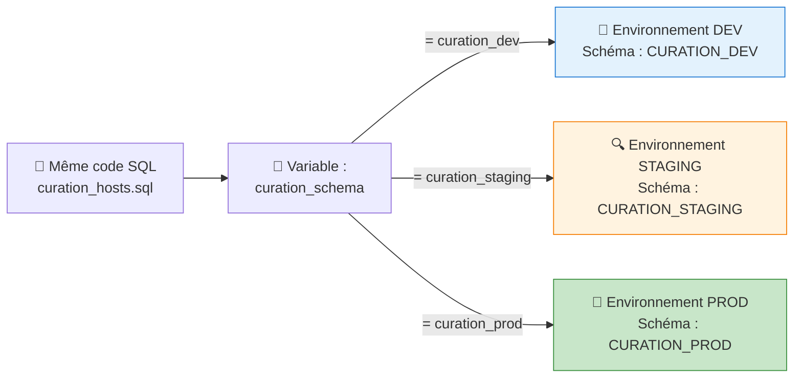
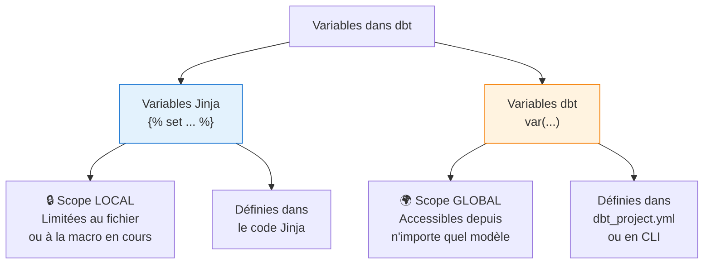
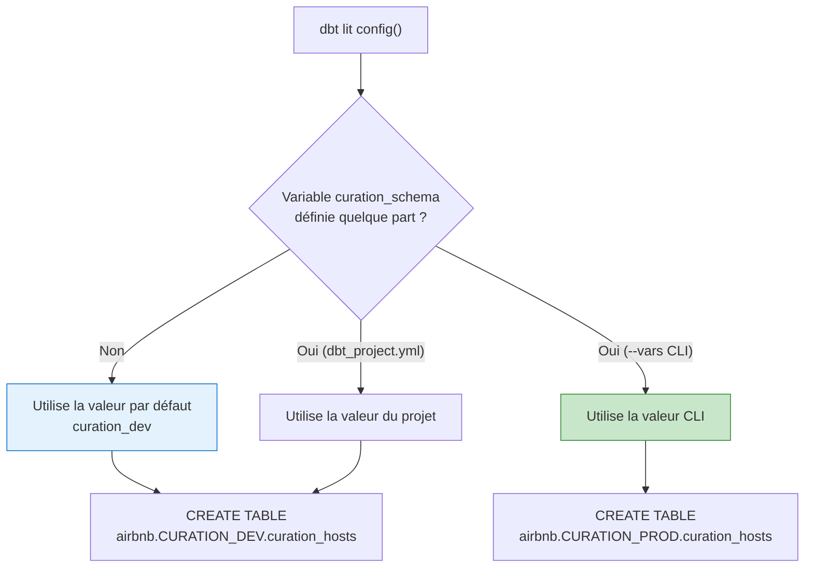
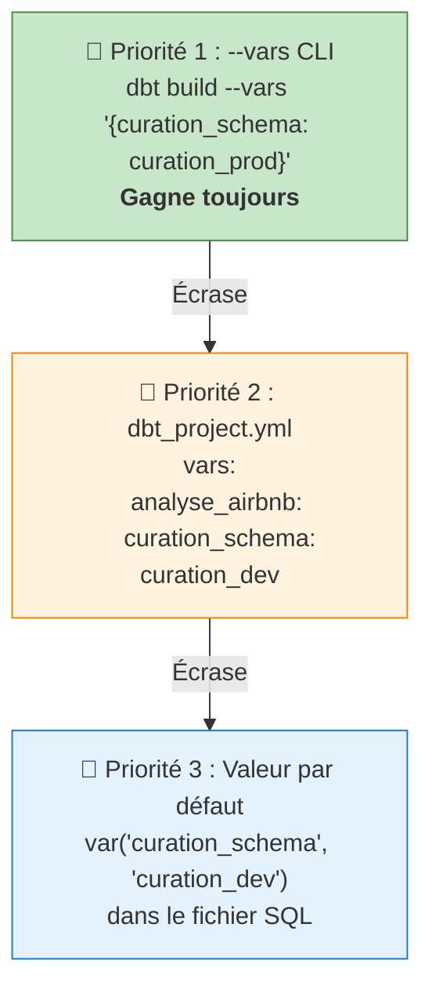
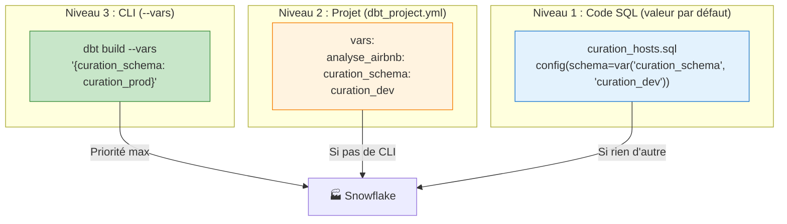

# dbt — Chapitre 7 : Les variables

---

## Introduction

### Contexte

Dans les chapitres précédents, nous avons construit des modèles dbt (couche `curation`) et écrit des macros Jinja/SQL. Jusqu'ici, toutes les valeurs de configuration étaient **écrites en dur** (hardcodées) dans le code : le nom du schéma de destination, les paramètres des macros, etc.

Le problème est simple : en entreprise, un projet dbt doit fonctionner dans **plusieurs environnements** (développement, staging, production). Si le schéma de destination est écrit en dur comme `curation`, impossible de tester en développement sans écraser les données de production.

Ce chapitre introduit les **variables** — le mécanisme qui permet de rendre le code flexible et adaptable à n'importe quel environnement.



### Objectifs de ce chapitre

À la fin de ce chapitre, vous serez capable de :

- Utiliser la macro `log()` pour afficher des informations de débogage
- Déclarer et utiliser des variables Jinja avec ``
- Utiliser `config()` et `var()` pour rendre un modèle dynamique
- Définir des variables au niveau du projet dans `dbt_project.yml`
- Surcharger des variables en ligne de commande avec `--vars`
- Comprendre la hiérarchie de précédence des variables

### Prérequis

- Un projet dbt fonctionnel connecté à Snowflake
- Les modèles `curation_hosts`, `curation_listings`, `curation_reviews` et `curation_tourists_per_year` déjà créés
- La macro `extraire_prix_a_partir_dun_caractere` déjà créée (chapitre précédent)
- Connaissances de base en Jinja et YAML

---

## Concepts fondamentaux

### 1. Deux familles de variables dans dbt

Le chapitre distingue deux types de variables qui n'ont **pas le même scope** ni le même usage :



| | Variables Jinja (``) | Variables dbt (`var()`) |
|---|---|---|
| **Scope** | Local (fichier/macro) | Global (tout le projet) |
| **Déclaration** | `` | `vars:` dans `dbt_project.yml` |
| **Utilisation** | `{{ nom }}` | `{{ var("nom") }}` |
| **Valeur par défaut** | Non (doit être définie) | Oui : `var("nom", "defaut")` |
| **Surcharge CLI** | Non | Oui : `--vars '{nom: valeur}'` |
| **Cas d'usage** | Calculs intermédiaires, logs | Configuration d'environnements |

### 2. Rappel : les deux syntaxes Jinja

Avant de plonger dans les variables, rappelons les deux types de balises Jinja :

| Syntaxe | Nom | Rôle | Produit du SQL ? |
|---------|-----|------|:---:|
| `` | **Instruction** | Logique : `set`, `if`, `for`, `macro` | ❌ Non |
| `{{ ... }}` | **Expression** | Affiche/injecte une valeur dans le SQL | ✅ Oui |

Exemple concret :

```jinja
          {# Instruction : crée une variable (pas de sortie SQL) #}
WHERE price > {{ prix_min }}      {# Expression : injecte la valeur → WHERE price > 10   #}
```

---

## Les variables Jinja

### La macro `log()` : débogage dans dbt

La macro `log()` est une fonction intégrée de dbt qui affiche un message dans les logs lors de l'exécution. C'est l'équivalent d'un `print()` en Python ou d'un `console.log()` en JavaScript.

**Syntaxe** :

```jinja
{{ log('message à afficher', info=True) }}
```

| Argument | Rôle | Obligatoire |
|----------|------|:-----------:|
| Premier argument (texte) | Le message à afficher dans les logs | ✅ |
| `info=True` | Rend le message visible dans les logs standard | ✅ (sinon le message est masqué) |

> **⚠️ Piège courant** : sans `info=True`, le message est envoyé au niveau `DEBUG` et n'apparaît pas dans les logs normaux. Pensez toujours à ajouter `info=True`.

### Bloc de code 1 — Macro avec `log()`

Voici la macro `extraire_prix_a_partir_dun_caractere` enrichie d'un message de log :

```sql


{{ log('execution macro extraire_prix', info=True) }}
{# ↑ Affiche "execution macro extraire_prix" dans les logs dbt        #}
{# Le message est statique : toujours le même texte, peu importe       #}
{# les arguments passés à la macro                                     #}

try_cast(
    CASE
        WHEN STARTSWITH({{ price }}, '{{ symbol }}')              -- Si le symbole est au début
        THEN SPLIT_PART({{ price }}, '{{ symbol }}', 2)           -- → prend la partie après
        WHEN ENDSWITH({{ price }}, '{{ symbol }}')                 -- Si le symbole est à la fin
        THEN SPLIT_PART({{ price }}, '{{ symbol }}', 1)           -- → prend la partie avant
        ELSE NULL                                                  -- Sinon → NULL
    END
    AS FLOAT)


```

**Pour tester cette macro** directement (sans passer par un modèle), on utilise la commande `dbt run-operation` :

```bash
dbt run-operation extraire_prix_a_partir_dun_caractere --args '{price: 12.79$, symbol: $}'
```

| Partie de la commande | Signification |
|----------------------|---------------|
| `dbt run-operation` | Exécute une macro directement |
| `extraire_prix_a_partir_dun_caractere` | Nom de la macro à exécuter |
| `--args '{price: 12.79$, symbol: $}'` | Arguments passés à la macro (format YAML) |

Dans les logs, on verra :
```
execution macro extraire_prix
```

### Bloc de code 2 — Variable Jinja avec `` et concaténation `~`

On améliore maintenant le message de log pour qu'il affiche **dynamiquement** la valeur du symbole monétaire :

```sql



{# ↑ NOUVELLE LIGNE : crée une variable locale "symbole_devise"       #}
{# qui contient la valeur du paramètre "symbol"                        #}
{#  est une INSTRUCTION Jinja (pas de sortie SQL)             #}

{{ log('execution macro extraire_prix avec symbol devise ' ~ symbole_devise, info=True) }}
{# ↑ MODIFIÉ : le message de log est maintenant DYNAMIQUE              #}
{#   L'opérateur ~ concatène les chaînes en Jinja :                    #}
{#   'execution macro extraire_prix avec symbol devise ' ~ '$'         #}
{#   → 'execution macro extraire_prix avec symbol devise $'            #}

try_cast(
    CASE
        WHEN STARTSWITH({{ price }}, '{{ symbol }}')
        THEN SPLIT_PART({{ price }}, '{{ symbol }}', 2)
        WHEN ENDSWITH({{ price }}, '{{ symbol }}')
        THEN SPLIT_PART({{ price }}, '{{ symbol }}', 1)
        ELSE NULL
    END
    AS FLOAT)


```

**Explication des éléments nouveaux** :

**``** — Crée une variable locale nommée `symbole_devise` et lui assigne la valeur du paramètre `symbol`. Cette variable n'existe que dans cette macro (scope local).

**L'opérateur `~`** — En Jinja, le `~` est l'opérateur de **concaténation de chaînes**. Il est l'équivalent du `+` pour les chaînes en Python, ou du `||` en SQL.

| Langage | Concaténation | Exemple |
|---------|--------------|---------|
| Jinja | `~` | `'hello ' ~ 'world'` → `'hello world'` |
| Python | `+` | `'hello ' + 'world'` → `'hello world'` |
| SQL | `\|\|` | `'hello ' \|\| 'world'` → `'hello world'` |

Dans les logs, on verra maintenant :
```
execution macro extraire_prix avec symbol devise $
```

> **💡 Quand utiliser `` ?** Pour stocker un résultat intermédiaire, rendre le code plus lisible, ou éviter de répéter une expression complexe. C'est une bonne pratique même si ce n'est pas strictement nécessaire ici.

---

## Les variables dbt — Partie 1 : `config()` et `var()`

### Le problème à résoudre

Jusqu'ici, le schéma de destination des modèles est défini globalement dans `dbt_project.yml` :

```yaml
models:
  analyse_airbnb:
    curation:
      +schema: curation       # Tous les modèles vont dans le schéma "curation"
```

Le problème : en développement, on ne veut **pas** écrire dans le schéma de production `curation`. On veut écrire dans un schéma de développement `curation_dev`.

La solution : utiliser une **variable dbt** pour rendre le schéma dynamique.

### Le bloc `config()` dans un modèle

Le bloc `config()` se place **en tout début** d'un fichier SQL dbt. Il permet de définir des métadonnées spécifiques à ce modèle (schéma, matérialisation, tags, etc.).

```sql
{{
    config(
        schema=var("curation_schema", "curation_dev")
    )
}}
```

Ce bloc est entouré de `{{ }}` car c'est une **expression Jinja** qui produit une configuration dbt.

### La fonction `var()`

`var()` est la fonction dbt pour récupérer la valeur d'une variable. Elle accepte deux arguments :

```
var("nom_variable", "valeur_par_defaut")
```

| Argument | Rôle | Obligatoire |
|----------|------|:-----------:|
| `"nom_variable"` | Le nom de la variable à récupérer | ✅ |
| `"valeur_par_defaut"` | Valeur utilisée si la variable n'est définie nulle part | ❌ (mais fortement recommandé) |

> **⚠️ Bonne pratique** : toujours fournir une valeur par défaut. Sans elle, si la variable n'est définie ni dans `dbt_project.yml` ni en CLI, dbt lève une erreur de compilation.

### Bloc de code 3 — Modèle `curation_hosts.sql` complet avec `config()` et `var()`

```sql
{{                                                           -- Début du bloc Jinja config
    config(                                                  -- Fonction de configuration du modèle
        schema=var("curation_schema", "curation_dev")        -- Le schéma est défini par une variable
    )                                                        --   "curation_schema" = nom de la variable
}}                                                           --   "curation_dev" = valeur par défaut

WITH hosts_raw AS (                                          -- CTE (Common Table Expression)
    SELECT
        host_id,                                             -- Identifiant de l'hôte
        CASE WHEN len(host_name) = 1                         -- Si le nom fait 1 seul caractère
            THEN 'Anonyme'                                   --   → remplacer par 'Anonyme'
            ELSE host_name                                   --   sinon garder le nom original
        END AS host_name,
        host_since,                                          -- Date d'inscription
        host_location,                                       -- Localisation complète "ville,pays"
        SPLIT_PART(host_location, ',', 1) AS host_city,      -- Extraire la ville (avant la virgule)
        SPLIT_PART(host_location, ',', 2) AS host_country,   -- Extraire le pays (après la virgule)
        TRY_CAST(                                            -- Convertir le taux de réponse
            REPLACE(host_response_rate, '%', '')             --   en retirant le '%'
            AS INTEGER                                       --   puis en convertissant en entier
        ) AS response_rate,
        host_is_superhost = 't' AS is_superhost,             -- 't' → TRUE, 'f' → FALSE
        host_neighbourhood,                                  -- Quartier
        host_identity_verified = 't' AS is_identity_verified -- Idem pour la vérification
    FROM {{ ref("hosts_snapshot") }}                         -- Source : le snapshot des hôtes
    WHERE DBT_VALID_TO is null                               -- Filtre snapshot : lignes actives
        AND host_location is not null                        -- Exclure les locations NULL
        and host_is_superhost is not null                    -- Exclure les superhosts NULL
        and host_neighbourhood is not null                   -- Exclure les quartiers NULL
)
SELECT *
FROM hosts_raw
```

#### Ce qui se passe lors de l'exécution

Quand on lance `dbt build --select curation_hosts` :

1. dbt lit le bloc `config()` et cherche la valeur de la variable `curation_schema`
2. Si la variable n'est définie nulle part → utilise la valeur par défaut `"curation_dev"`
3. dbt crée la table dans le schéma `CURATION_DEV` de Snowflake



Le résultat dans Snowflake montre un **nouveau schéma** `CURATION_DEV` contenant la table `CURATION_HOSTS`, séparé du schéma `CURATION` de production.

#### Commande d'exécution

```bash
dbt build --select curation_hosts
```

Les logs de sortie confirment la destination :

```
16:14:10  START sql table model curation_dev.curation_hosts ......... [RUN]
16:14:12  OK created sql table model curation_dev.curation_hosts .... [1 in 1.46s]
```

> **💡 Remarque** : le nom du schéma dans les logs est `curation_dev` (la valeur par défaut), ce qui confirme que la variable fonctionne.

---

## Les variables dbt — Partie 2 : projet et ligne de commande

### Définir les variables au niveau du projet

Au lieu de compter uniquement sur la valeur par défaut dans `var()`, on peut définir la valeur dans `dbt_project.yml`. C'est la manière **recommandée** de gérer les variables pour tout un projet.

### Bloc de code 4 — `dbt_project.yml` avec section `vars:`

```yaml
# ═══════════════════════════════════════════════════════════════
# Extrait de dbt_project.yml (lignes 38-54)
# ═══════════════════════════════════════════════════════════════

models:                            # Configuration des modèles
  analyse_airbnb:                  # Nom du projet dbt
    curation:                      # Dossier curation/
      +materialized: table         #   Matérialisation en table (pas en vue)
      +schema: curation            #   Schéma par défaut (peut être surchargé par config())

seeds:                             # Configuration des seeds
  analyse_airbnb:
    tourists_per_year:
      +enabled: true
      +database: airbnb
      +schema: raw

vars:                              # ← NOUVELLE SECTION : variables du projet
  analyse_airbnb:                  #   Scopée au projet "analyse_airbnb"
    curation_schema: curation_dev  #   Variable "curation_schema" = "curation_dev"
```

#### Explication de la section `vars:`

```yaml
vars:                              # Mot-clé qui déclare la section variables
  analyse_airbnb:                  # Nom du projet (scope)
    curation_schema: curation_dev  # clé: valeur
```

| Élément | Signification |
|---------|---------------|
| `vars:` | Section de déclaration des variables dans `dbt_project.yml` |
| `analyse_airbnb:` | Nom du projet — les variables sont scopées par projet/package |
| `curation_schema: curation_dev` | La variable `curation_schema` a la valeur `curation_dev` |

> **💡 Scoping par projet** : le niveau `analyse_airbnb:` sous `vars:` signifie que cette variable est définie uniquement pour le projet `analyse_airbnb`. Si vous avez plusieurs packages dbt, chacun peut avoir ses propres variables.

### Surcharger les variables en ligne de commande

La commande `--vars` permet de **surcharger** les variables au moment de l'exécution, sans modifier aucun fichier :

### Bloc de code 5 — Commande CLI avec `--vars`

```bash
dbt build --vars '{curation_schema: curation_prod}'
```

| Partie | Signification |
|--------|---------------|
| `dbt build` | Compile, exécute et teste tous les modèles |
| `--vars` | Option pour définir/surcharger des variables |
| `'{curation_schema: curation_prod}'` | Format YAML entre quotes simples : la variable `curation_schema` prend la valeur `curation_prod` |

Cette commande va créer les tables dans le schéma `CURATION_PROD` au lieu de `CURATION_DEV`, **sans modifier une seule ligne de code**.

> **⚠️ Attention à la syntaxe** : le `--vars` attend du YAML entre **quotes simples**. Les quotes doubles autour de la valeur entière ne fonctionnent pas sur tous les shells.

```bash
# ✅ Correct
dbt build --vars '{curation_schema: curation_prod}'

# ✅ Correct aussi (plusieurs variables)
dbt build --vars '{curation_schema: curation_prod, autre_var: valeur}'

# ❌ Incorrect (pas de quotes autour du YAML)
dbt build --vars {curation_schema: curation_prod}
```

---

## La hiérarchie de précédence des variables

C'est **LE concept le plus important** de ce chapitre. Quand une même variable est définie à plusieurs niveaux, dbt applique une hiérarchie stricte :



### Tableau de résolution

| Définie dans `var()` (défaut) | Définie dans `dbt_project.yml` | Définie en `--vars` CLI | Valeur utilisée |
|:---:|:---:|:---:|---|
| `curation_dev` | ❌ | ❌ | `curation_dev` (défaut) |
| `curation_dev` | `curation_staging` | ❌ | `curation_staging` (projet) |
| `curation_dev` | `curation_staging` | `curation_prod` | `curation_prod` (CLI gagne) |
| ❌ (pas de défaut) | ❌ | ❌ | ❌ **ERREUR** de compilation |

### Cas pratique complet

Voici ce qui se passe dans 3 scénarios différents avec le même code :

**Le code SQL** (dans `curation_hosts.sql`) :
```sql
{{ config(schema=var("curation_schema", "curation_dev")) }}
```

**Le fichier `dbt_project.yml`** :
```yaml
vars:
  analyse_airbnb:
    curation_schema: curation_dev
```

| Commande exécutée | Valeur résolue | Schéma créé dans Snowflake |
|---|---|---|
| `dbt build` | `curation_dev` (depuis dbt_project.yml) | `CURATION_DEV` |
| `dbt build --vars '{curation_schema: curation_prod}'` | `curation_prod` (CLI écrase le projet) | `CURATION_PROD` |
| `dbt build --vars '{curation_schema: curation_staging}'` | `curation_staging` (CLI écrase le projet) | `CURATION_STAGING` |

> **🔑 Règle d'or** : la ligne de commande (`--vars`) a **toujours** la priorité la plus haute. C'est ce qui permet aux pipelines CI/CD de définir l'environnement sans toucher au code.

---

## Schéma récapitulatif : les 3 niveaux de variables



---

## Méthodologie pas à pas pour un projet professionnel

### Étape 1 — Identifier les valeurs à rendre dynamiques

Passez en revue vos modèles et identifiez tout ce qui change selon l'environnement :

- Noms de schémas (dev, staging, prod)
- Noms de bases de données
- Dates de filtrage (ex: `date_debut` pour un backfill)
- Noms de tables source (si différents entre environnements)

### Étape 2 — Ajouter `config()` + `var()` dans chaque modèle

En haut de chaque fichier SQL concerné :

```sql
{{
    config(
        schema=var("nom_variable", "valeur_par_defaut_dev")
    )
}}
```

### Étape 3 — Définir les variables dans `dbt_project.yml`

```yaml
vars:
  nom_projet:
    nom_variable: valeur_par_defaut
```

### Étape 4 — Configurer les pipelines CI/CD

Dans votre pipeline de déploiement, utilisez `--vars` pour injecter les valeurs de production :

```bash
# Pipeline dev
dbt build --vars '{curation_schema: curation_dev}'

# Pipeline staging
dbt build --vars '{curation_schema: curation_staging}'

# Pipeline prod
dbt build --vars '{curation_schema: curation_prod}'
```

### Étape 5 — Ajouter des logs de débogage (optionnel)

Dans vos macros ou modèles critiques :

```jinja
{{ log('Building model with schema: ' ~ var("curation_schema", "unknown"), info=True) }}
```

### Étape 6 — Commit + Merge

Après avoir vérifié que tout fonctionne :

```bash
git add .
git commit -m "feat: variables pour gestion multi-environnement"
git push
# Merge Request vers main
```

---

## Tableaux pratiques

### Commandes utiles

| Commande | Description |
|----------|-------------|
| `dbt run-operation <macro> --args '{arg: val}'` | Exécute une macro directement pour la tester |
| `dbt build --select <modele>` | Build + test d'un modèle spécifique |
| `dbt build` | Build complet du projet |
| `dbt build --vars '{clé: valeur}'` | Build avec surcharge de variable |
| `dbt build --vars '{clé1: val1, clé2: val2}'` | Build avec plusieurs variables surchargées |
| `dbt compile --select <modele>` | Compile le SQL sans l'exécuter (utile pour vérifier la résolution des variables) |

### Syntaxe Jinja : aide-mémoire

| Syntaxe | Type | Usage | Exemple |
|---------|------|-------|---------|
| `` | Instruction | Déclarer une variable locale | `` |
| `{{ x }}` | Expression | Injecter une valeur dans le SQL | `WHERE price > {{ prix }}` |
| `{{ log('msg', info=True) }}` | Expression | Afficher un message de débogage | `{{ log('début', info=True) }}` |
| `{{ var("nom", "def") }}` | Expression | Récupérer une variable dbt | `{{ var("schema", "dev") }}` |
| `{{ config(...) }}` | Expression | Configurer un modèle | `{{ config(schema='prod') }}` |
| `~` | Opérateur | Concaténer des chaînes | `'hello ' ~ 'world'` |

### Erreurs fréquentes et solutions

| Erreur | Cause | Solution |
|--------|-------|----------|
| `Compilation Error: variable not found` | Variable utilisée avec `var("nom")` sans valeur par défaut et non définie dans `dbt_project.yml` | Ajouter une valeur par défaut : `var("nom", "defaut")` |
| Message de log invisible | `info=True` manquant | Ajouter `info=True` dans `log()` |
| `YAML syntax error` dans `--vars` | Mauvais format YAML dans la commande CLI | Utiliser des quotes simples : `--vars '{clé: valeur}'` |
| Modèle créé dans le mauvais schéma | Mauvaise hiérarchie de précédence | Vérifier `dbt_project.yml` et la commande `--vars` |
| `` non reconnue | Utilisation de `{{ set ... }}` au lieu de `` | `set` est une **instruction** → ``, pas `{{ }}` |
| Variable Jinja inaccessible dans un autre fichier | `` est local | Utiliser `var()` pour les variables globales |
| `~` ne fonctionne pas | Utilisation dans du SQL pur (hors Jinja) | `~` est un opérateur Jinja, pas SQL. En SQL, utiliser `\|\|` |

### Bonnes pratiques

| Pratique | Mauvais exemple | Bon exemple |
|----------|----------------|-------------|
| Toujours fournir une valeur par défaut | `var("schema")` | `var("schema", "dev")` |
| Nommer les variables clairement | `var("s")` | `var("curation_schema")` |
| Défaut = environnement de dev | `var("schema", "prod")` | `var("schema", "curation_dev")` |
| Scoper les vars dans dbt_project.yml | `vars: curation_schema: dev` | `vars: analyse_airbnb: curation_schema: dev` |
| Ajouter des logs dans les macros | Aucun log | `{{ log('début macro X', info=True) }}` |
| Ne pas hardcoder les environnements | `+schema: curation_prod` | `schema=var("curation_schema", "curation_dev")` |

---

## Exercices pratiques

### Exercice 1 — Appliquer `config()` + `var()` aux autres modèles

**Niveau** : Débutant

Modifiez les modèles `curation_listings.sql`, `curation_reviews.sql` et `curation_tourists_per_year.sql` pour qu'ils utilisent la même variable `curation_schema` que `curation_hosts.sql`.

**Étapes** :
1. Ajoutez le bloc `config()` en haut de chaque fichier
2. Lancez `dbt build` et vérifiez que toutes les tables sont créées dans `CURATION_DEV`
3. Lancez `dbt build --vars '{curation_schema: curation_test}'` et vérifiez dans Snowflake

---

### Exercice 2 — Ajouter une variable pour la base de données

**Niveau** : Intermédiaire

Créez une variable `target_database` qui permet de changer la base de données de destination. 

**Étapes** :
1. Modifiez `curation_hosts.sql` pour ajouter `database=var("target_database", "airbnb_dev")`
2. Définissez la variable dans `dbt_project.yml`
3. Testez avec `--vars '{target_database: airbnb_prod}'`

---

### Exercice 3 — Ajouter un log dynamique dans un modèle

**Niveau** : Débutant

Ajoutez un message de log dans le modèle `curation_hosts.sql` qui affiche la valeur de la variable `curation_schema` lors de l'exécution.

**Résultat attendu dans les logs** :
```
Building curation_hosts in schema: curation_dev
```

**Indice** : utilisez `{{ log('Building curation_hosts in schema: ' ~ var("curation_schema", "unknown"), info=True) }}`

---

### Exercice 4 — Variable de date pour un backfill

**Niveau** : Avancé

Créez une variable `date_debut` qui permet de filtrer les données à partir d'une date donnée. Modifiez le modèle `curation_reviews.sql` pour ajouter un filtre `WHERE date >= var("date_debut")`.

**Commandes à tester** :
```bash
# Backfill depuis janvier 2023
dbt build --select curation_reviews --vars '{date_debut: "2023-01-01"}'

# Backfill depuis le début
dbt build --select curation_reviews --vars '{date_debut: "2000-01-01"}'
```

---

### Exercice 5 — Comprendre la précédence

**Niveau** : Intermédiaire

Vous avez la configuration suivante :

```sql
-- Dans curation_hosts.sql
{{ config(schema=var("curation_schema", "default_schema")) }}
```

```yaml
# Dans dbt_project.yml
vars:
  analyse_airbnb:
    curation_schema: project_schema
```

Pour chaque commande ci-dessous, indiquez dans quel schéma le modèle sera créé :

1. `dbt build --select curation_hosts`
2. `dbt build --select curation_hosts --vars '{curation_schema: cli_schema}'`
3. (Si on supprime la ligne `curation_schema: project_schema` du `dbt_project.yml`) `dbt build --select curation_hosts`

<details>
<summary>Réponses</summary>
<ol>
<li><code>project_schema</code> — la valeur du <code>dbt_project.yml</code> écrase la valeur par défaut</li>
<li><code>cli_schema</code> — le <code>--vars</code> CLI a la plus haute priorité</li>
<li><code>default_schema</code> — sans <code>dbt_project.yml</code> ni CLI, c'est la valeur par défaut dans <code>var()</code> qui est utilisée</li>
</ol>
</details>

---

## Section Drill (entraînement rapide)

**Q1.** Quelle est la syntaxe pour déclarer une variable locale en Jinja ?

<details>
<summary>Réponse</summary>
<code></code>
</details>

**Q2.** Quel opérateur permet de concaténer des chaînes en Jinja ?

<details>
<summary>Réponse</summary>
L'opérateur <code>~</code> (tilde).
</details>

**Q3.** Que fait `{{ log('message', info=True) }}` ?

<details>
<summary>Réponse</summary>
Affiche <code>message</code> dans les logs dbt lors de l'exécution. Le paramètre <code>info=True</code> est nécessaire pour que le message soit visible dans les logs standard.
</details>

**Q4.** Quelle est la différence entre `` et `{{ var("x", 5) }}` ?

<details>
<summary>Réponse</summary>
<code></code> crée une variable <strong>locale</strong> Jinja (limitée au fichier/macro). <code>var("x", 5)</code> récupère une variable <strong>dbt globale</strong>, qui peut être définie dans <code>dbt_project.yml</code> ou surchargée en CLI.
</details>

**Q5.** Dans quel ordre de précédence dbt résout-il les variables ?

<details>
<summary>Réponse</summary>
<strong>CLI <code>--vars</code></strong> (priorité max) > <strong><code>dbt_project.yml</code></strong> > <strong>Valeur par défaut dans <code>var()</code></strong> (priorité min).
</details>

**Q6.** Que se passe-t-il si on écrit `var("schema")` sans valeur par défaut et que la variable n'est définie nulle part ?

<details>
<summary>Réponse</summary>
dbt lève une <strong>erreur de compilation</strong>. Il faut toujours fournir une valeur par défaut : <code>var("schema", "dev")</code>.
</details>

**Q7.** Comment surcharger une variable en ligne de commande ?

<details>
<summary>Réponse</summary>
Avec l'option <code>--vars</code> suivie de YAML entre quotes simples :<br>
<code>dbt build --vars '{nom_variable: valeur}'</code>
</details>

**Q8.** Quelle commande permet de tester une macro sans passer par un modèle ?

<details>
<summary>Réponse</summary>
<code>dbt run-operation nom_macro --args '{arg1: val1, arg2: val2}'</code>
</details>

**Q9.** Pourquoi la valeur par défaut de `var()` devrait-elle correspondre à l'environnement de développement ?

<details>
<summary>Réponse</summary>
Par sécurité : si un développeur lance <code>dbt build</code> sans <code>--vars</code>, il écrira dans le schéma de <strong>dev</strong> par défaut, et ne risquera pas d'écraser les données de production.
</details>

**Q10.** Quelle est la différence entre `` et `{{ }}` en Jinja ?

<details>
<summary>Réponse</summary>
<code></code> est pour les <strong>instructions</strong> (logique : set, if, for, macro) — ne produit pas de SQL. <code>{{ }}</code> est pour les <strong>expressions</strong> (affichage) — injecte une valeur dans le SQL.
</details>

---

## Section ancrage mémoriel

### Points clés à retenir

> **🔑 Point 1** — Les variables Jinja (``) sont **locales** au fichier. Les variables dbt (`var()`) sont **globales** au projet.

> **🔑 Point 2** — `var("nom", "defaut")` récupère une variable dbt. Le deuxième argument est la valeur par défaut, à fournir **systématiquement**.

> **🔑 Point 3** — La hiérarchie de précédence est : **CLI `--vars`** > **`dbt_project.yml`** > **valeur par défaut**. Le CLI gagne toujours.

> **🔑 Point 4** — `{{ log('message', info=True) }}` est l'outil de débogage dans dbt. Sans `info=True`, le message est invisible.

> **🔑 Point 5** — L'opérateur `~` concatène les chaînes en Jinja (comme `+` en Python).

> **🔑 Point 6** — La valeur par défaut devrait toujours correspondre à l'environnement de **développement**, pour protéger la production.

> **🔑 Point 7** — `dbt run-operation` permet de tester une macro directement sans passer par un modèle.

### Résumé synthétique

Ce chapitre introduit les variables dans dbt à trois niveaux. D'abord les variables Jinja (``) pour le scope local et le débogage avec `log()`. Ensuite les variables dbt (`var()`) utilisées dans `config()` pour rendre les modèles dynamiques, notamment le schéma de destination. Enfin la gestion centralisée des variables dans `dbt_project.yml` et leur surcharge en CLI via `--vars`. Le concept clé est la hiérarchie de précédence : la valeur CLI écrase celle du projet, qui écrase la valeur par défaut. Cela permet de déployer le même code dans des environnements différents (dev, staging, prod) sans modifier une seule ligne.

### Flashcards de révision

| Recto (Question) | Verso (Réponse) |
|-------------------|-----------------|
| Syntaxe pour une variable locale Jinja ? | `` |
| Syntaxe pour une variable globale dbt ? | `var("nom", "valeur_par_defaut")` |
| Opérateur de concaténation en Jinja ? | `~` (tilde) |
| Fonction de débogage dans dbt ? | `{{ log('message', info=True) }}` |
| Paramètre obligatoire de `log()` ? | `info=True` (sinon message invisible) |
| Où définir les variables dbt pour tout le projet ? | Section `vars:` dans `dbt_project.yml` |
| Comment surcharger une variable en CLI ? | `--vars '{clé: valeur}'` |
| Hiérarchie de précédence ? | CLI > dbt_project.yml > valeur par défaut |
| Différence `` vs `{{ }}` ? | `` = instruction (pas de sortie), `{{ }}` = expression (sortie SQL) |
| Commande pour tester une macro directement ? | `dbt run-operation nom_macro --args '{arg: val}'` |
| Pourquoi une valeur par défaut en dev ? | Protection : un oubli de `--vars` n'écrase pas la prod |
| Scope de `` ? | Local au fichier ou à la macro |
| Scope de `var()` ? | Global au projet |

---

## Canevas pour réutilisation en milieu professionnel

Ce canevas est un template prêt à l'emploi pour implémenter des variables dans un projet dbt en entreprise.

### Étape 1 — Modifier les modèles SQL

Ajoutez ce bloc en **première ligne** de chaque modèle SQL de la couche de transformation :

```sql
{{
    config(
        schema=var("<NOM_PROJET>_schema", "<SCHEMA_DEV>")
    )
}}
-- Reste du SQL du modèle...
```

Remplacez :
- `<NOM_PROJET>` par le nom de votre projet (ex: `analytics`, `finance`, `marketing`)
- `<SCHEMA_DEV>` par le nom de votre schéma de développement

### Étape 2 — Configurer `dbt_project.yml`

```yaml
vars:
  <NOM_PROJET_DBT>:                          # Nom du projet dans dbt_project.yml
    <NOM_PROJET>_schema: <SCHEMA_DEV>        # Valeur par défaut = dev
    <NOM_PROJET>_database: <DATABASE_DEV>    # Optionnel : database variable aussi
```

### Étape 3 — Configurer les pipelines CI/CD

**Pipeline développement** (automatique sur chaque branche) :
```bash
dbt build --vars '{<NOM_PROJET>_schema: <SCHEMA_DEV>}'
```

**Pipeline staging** (automatique sur merge vers `develop`) :
```bash
dbt build --vars '{<NOM_PROJET>_schema: <SCHEMA_STAGING>}'
```

**Pipeline production** (automatique sur merge vers `main`) :
```bash
dbt build --vars '{<NOM_PROJET>_schema: <SCHEMA_PROD>}'
```

### Étape 4 — Ajouter des logs de traçabilité (recommandé)

Dans chaque modèle critique, ajoutez un log qui trace l'environnement :

```sql
{{
    config(
        schema=var("<NOM_PROJET>_schema", "<SCHEMA_DEV>")
    )
}}

{{ log('🔧 Building <NOM_MODELE> in schema: ' ~ var("<NOM_PROJET>_schema", "<SCHEMA_DEV>"), info=True) }}

-- Reste du SQL...
```

### Checklist de validation

- [ ] Tous les modèles de la couche transformation ont un bloc `config(schema=var(...))`
- [ ] La valeur par défaut de `var()` correspond à l'environnement de **dev** (pas prod !)
- [ ] La section `vars:` est présente dans `dbt_project.yml`
- [ ] Les pipelines CI/CD utilisent `--vars` pour injecter l'environnement
- [ ] Un `dbt build` sans `--vars` construit dans le schéma de **dev** (vérification de sécurité)
- [ ] Les macros critiques contiennent des `log()` pour le débogage
- [ ] Les variables sont nommées clairement : `projet_schema`, `projet_database`
- [ ] Commit + Merge effectué après validation

---

## Annexes

### Glossaire

| Terme | Définition |
|-------|-----------|
| **Variable Jinja** | Variable locale déclarée avec ``, limitée au fichier ou à la macro |
| **Variable dbt** | Variable globale récupérée avec `var()`, définie dans `dbt_project.yml` ou en CLI |
| **`var()`** | Fonction dbt qui récupère la valeur d'une variable, avec un second argument optionnel pour la valeur par défaut |
| **`config()`** | Fonction dbt placée en début de modèle pour définir sa configuration (schéma, matérialisation, etc.) |
| **`log()`** | Macro dbt intégrée qui affiche un message dans les logs d'exécution |
| **`info=True`** | Paramètre de `log()` qui rend le message visible dans les logs standard |
| **``** | Instruction Jinja pour déclarer une variable locale |
| **`~`** | Opérateur Jinja de concaténation de chaînes |
| **`--vars`** | Option CLI dbt pour surcharger des variables au moment de l'exécution |
| **Précédence** | Ordre de priorité quand une variable est définie à plusieurs niveaux |
| **`dbt_project.yml`** | Fichier de configuration principal du projet dbt |
| **`dbt run-operation`** | Commande dbt pour exécuter une macro directement (sans modèle) |
| **Schéma** | Dans Snowflake, un namespace au sein d'une base de données qui contient des tables et vues |
| **Scope** | Portée d'une variable : local (fichier) ou global (projet) |
| **CI/CD** | Continuous Integration / Continuous Deployment — pipeline automatisé de build et déploiement |

### Liens utiles

| Ressource | URL |
|-----------|-----|
| Documentation dbt : variables de projet | https://docs.getdbt.com/docs/build/project-variables?version=1.11 |
| Documentation dbt : config() | https://docs.getdbt.com/reference/dbt-jinja-functions/config |
| Documentation dbt : var() | https://docs.getdbt.com/reference/dbt-jinja-functions/var |
| Documentation Jinja : templates | https://jinja.palletsprojects.com/en/3.1.x/templates/ |
