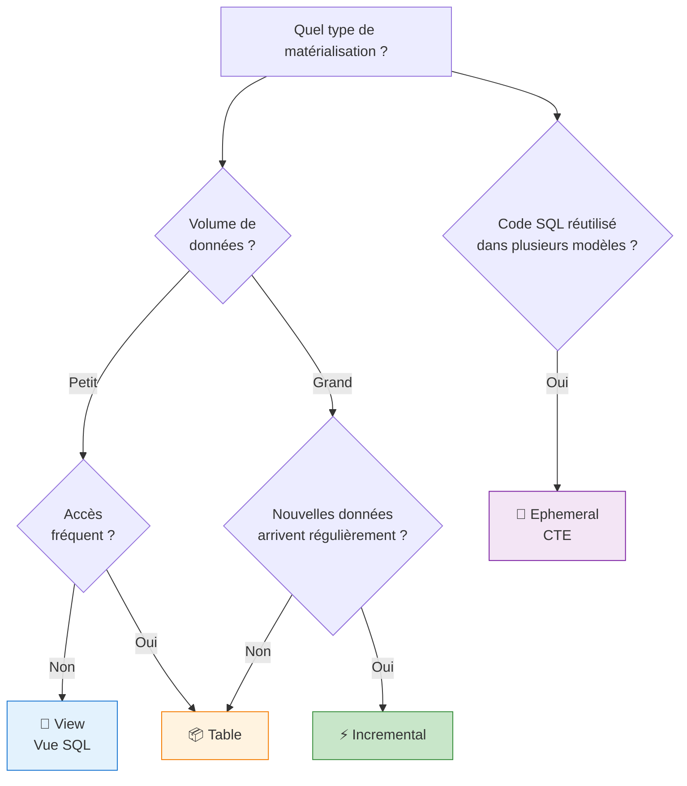
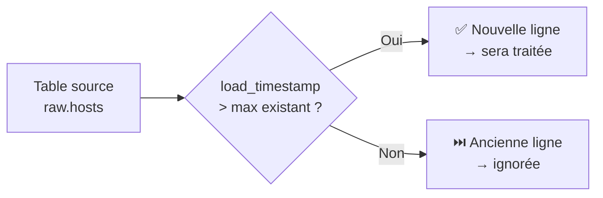
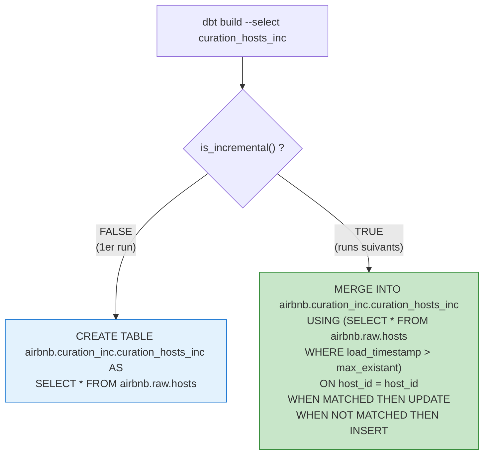
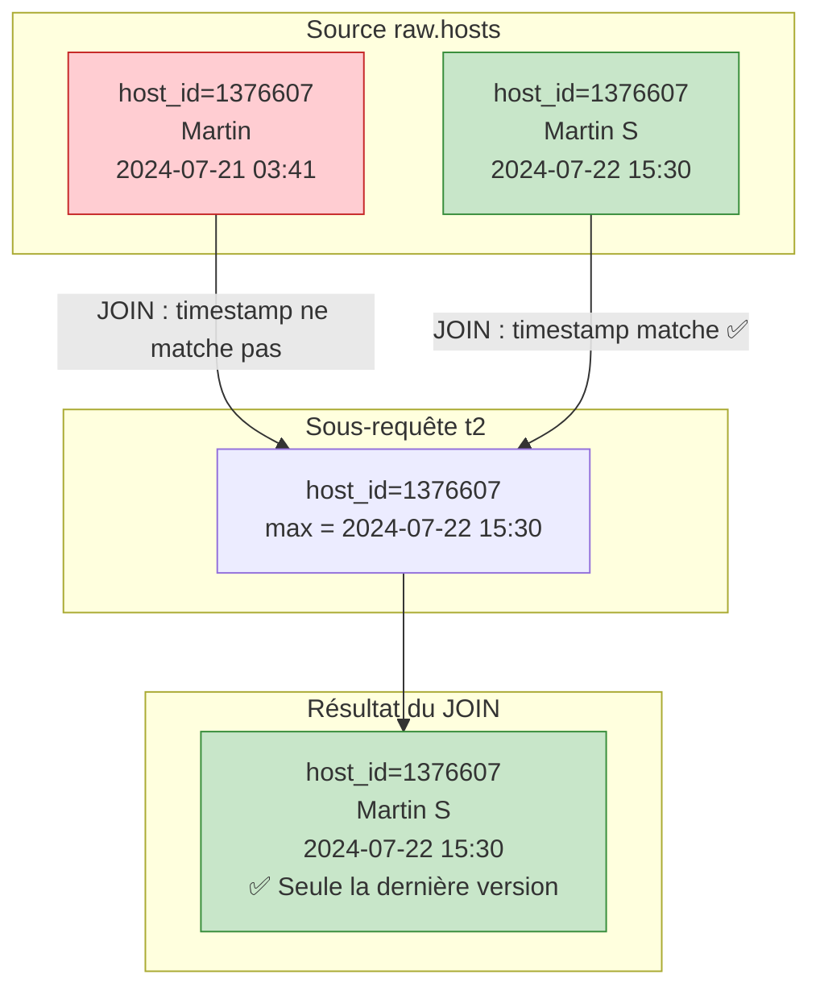
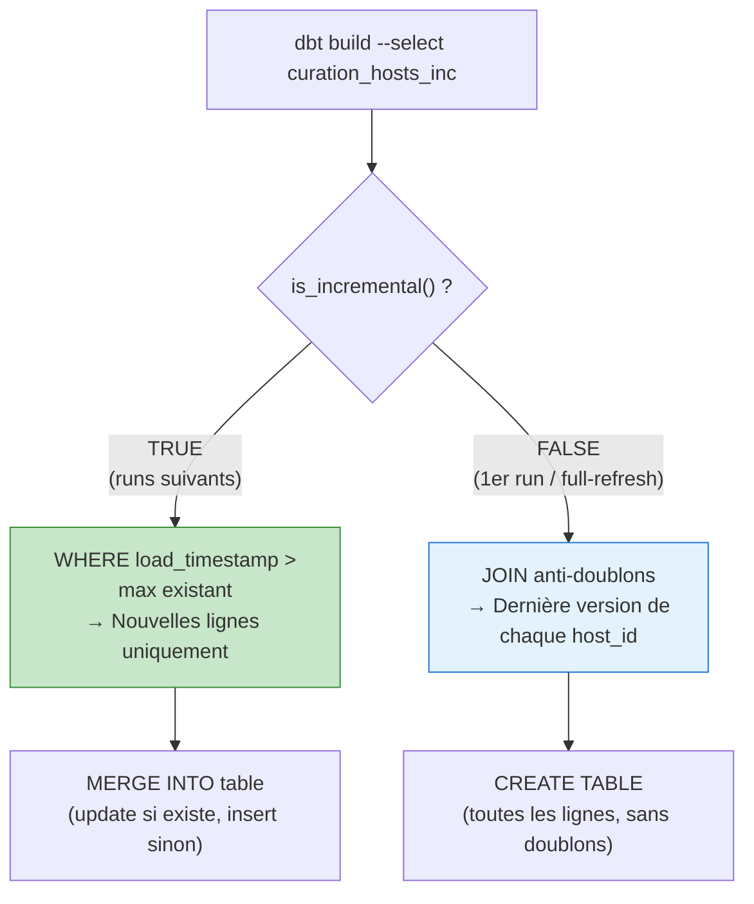

# dbt — Chapitre 8 : Les modèles incrémentaux

---

## Introduction

### Contexte

Dans les chapitres précédents, tous nos modèles dbt utilisent la matérialisation **table** : à chaque exécution de `dbt build`, la table entière est recréée de zéro. Pour la table `curation_hosts` (environ 7 800 lignes), cela prend quelques secondes. Mais imaginez une table de **10 millions de lignes** recréée quotidiennement : chaque exécution prendrait des minutes, consommerait des ressources considérables, et coûterait cher en crédits Snowflake.

La solution : la matérialisation **incrémentale**. Au lieu de tout recréer, on ne traite que les **nouvelles données** arrivées depuis la dernière exécution. Le temps de traitement passe de minutes à secondes.

### Objectifs de ce chapitre

À la fin de ce chapitre, vous serez capable de :

- Choisir le bon type de matérialisation selon le cas d'usage
- Préparer une table source pour le chargement incrémental (colonne `load_timestamp`)
- Implémenter un modèle incrémental avec `is_incremental()` et `{{ this }}`
- Comprendre la différence entre les stratégies append et merge
- Gérer les doublons lors du premier chargement
- Utiliser `--full-refresh` pour reconstruire une table incrémentale

### Prérequis

- Un projet dbt connecté à Snowflake avec les modèles `curation` existants
- Le fichier `sources.yaml` avec la source `raw_airbnb_data` déclarée
- Accès à Snowflake pour exécuter des requêtes SQL directement
- Connaissances Jinja de base (``, `{{ }}`, `var()`)

---

## Concepts fondamentaux

### 1. Les 4 types de matérialisation dans dbt

dbt propose quatre façons de matérialiser un modèle. Chacune a un cas d'usage précis :



| Type | Ce qui est créé | Stockage | Quand l'utiliser |
|------|----------------|----------|-----------------|
| **View** | Une vue SQL | Minimum | Petit volume, accès peu fréquent |
| **Table** | Une table physique | Toutes les données | Grand volume, besoin de réponse rapide |
| **Incremental** | Une table physique | Toutes les données | Grand volume, on veut accélérer le chargement |
| **Ephemeral** | Une CTE (pas d'objet en BDD) | Aucun | Code SQL réutilisé dans d'autres modèles |

> **💡 L'incrémental est comme la matérialisation Table, avec une optimisation** : au lieu de tout détruire et tout recréer (`DROP TABLE` + `CREATE TABLE AS SELECT`), il ajoute uniquement les nouvelles lignes (`INSERT INTO ... SELECT` ou `MERGE`).

### 2. Le principe de l'incrémental illustré

Prenons une table de produits pour comprendre visuellement.

**État initial** de la table destination (déjà chargée) :

| id | nom | prix |
|----|-----|------|
| 1 | smartphone | 346 |
| 2 | PC Portable | 670 |
| 3 | Disque dur | 76 |

**Nouvelles données** arrivées dans la source :

| id | nom | prix |
|----|-----|------|
| 1 | smartphone | 330 |
| 4 | smartwatch | 180 |

La ligne id=1 a été **modifiée** (prix 346 → 330) et la ligne id=4 est **nouvelle**.

#### Stratégie Append (ajout simple)

Les nouvelles lignes sont ajoutées **à la suite**, sans vérifier les doublons :

| id | nom | prix | |
|----|-----|------|-|
| 1 | smartphone | 346 | existant |
| 2 | PC Portable | 670 | existant |
| 3 | Disque dur | 76 | existant |
| 1 | smartphone | **330** | ⚠️ doublon (mise à jour) |
| 4 | smartwatch | **180** | ✅ nouvelle ligne |

> **⚠️ Problème** : id=1 apparaît deux fois avec des valeurs différentes. Il faut gérer les doublons côté requête.

#### Stratégie Merge (fusion intelligente)

Les lignes existantes sont **mises à jour**, les nouvelles sont **ajoutées** :

| id | nom | prix | |
|----|-----|------|-|
| 1 | smartphone | **330** | ✅ mis à jour |
| 2 | PC Portable | 670 | inchangé |
| 3 | Disque dur | 76 | inchangé |
| 4 | smartwatch | **180** | ✅ ajouté |

> **💡 Avec `unique_key='id'`**, dbt utilise automatiquement la stratégie merge sur Snowflake : si la clé existe → UPDATE, sinon → INSERT.

### 3. Le rôle crucial de la colonne `load_timestamp`

Pour savoir quelles lignes sont "nouvelles", il faut un **marqueur temporel** dans la table source. C'est la colonne `load_timestamp` : elle enregistre le moment exact où chaque ligne a été insérée ou mise à jour.



Sans cette colonne, impossible de distinguer les anciennes lignes des nouvelles. C'est un **prérequis absolu** pour l'incrémental.

### 4. Le flux d'un modèle incrémental sur plusieurs exécutions

```mermaid
flowchart TD
    subgraph "🔵 1er run (table n'existe pas)"
        A1["is_incremental() = FALSE"] --> B1["SELECT * FROM source<br>(pas de WHERE)"]
        B1 --> C1["CREATE TABLE<br>avec TOUTES les lignes"]
    end

    subgraph "🟢 2e run (table existe)"
        A2["is_incremental() = TRUE"] --> B2["SELECT * FROM source<br>WHERE load_timestamp > max(existant)"]
        B2 --> C2["INSERT/MERGE<br>seulement les NOUVELLES lignes"]
    end

    subgraph "🔴 --full-refresh"
        A3["is_incremental() = FALSE<br>(forcé par --full-refresh)"] --> B3["DROP TABLE + SELECT *<br>(pas de WHERE)"]
        B3 --> C3["CREATE TABLE<br>avec TOUTES les lignes"]
    end

    style A1 fill:#e3f2fd,stroke:#1976D2
    style A2 fill:#c8e6c9,stroke:#388E3C
    style A3 fill:#ffcdd2,stroke:#C62828
```



---

## Préparation de la source dans Snowflake

### Objectif

Ajouter une colonne `LOAD_TIMESTAMP` à la table brute `raw.hosts` pour marquer le moment d'arrivée de chaque ligne.

### Bloc de code 1 — ALTER TABLE + UPDATE

Ces commandes sont exécutées **directement dans Snowflake** (pas dans dbt) :

```sql
ALTER TABLE AIRBNB.RAW.HOSTS ADD COLUMN LOAD_TIMESTAMP TIMESTAMP;
-- Ajoute une nouvelle colonne LOAD_TIMESTAMP de type TIMESTAMP
-- à la table existante AIRBNB.RAW.HOSTS
-- Cette colonne contiendra la date/heure de chargement de chaque ligne

UPDATE AIRBNB.RAW.HOSTS SET LOAD_TIMESTAMP = CURRENT_TIMESTAMP;
-- Met à jour TOUTES les lignes existantes avec le timestamp actuel
-- Résultat : 7815 lignes mises à jour (toutes les lignes existantes
-- reçoivent le même timestamp, car elles ont toutes été chargées
-- au même moment initialement)

SELECT * from AIRBNB.raw.hosts limit 10;
-- Vérification : on affiche 10 lignes pour confirmer que
-- la colonne LOAD_TIMESTAMP est bien remplie
```

**Pourquoi `CURRENT_TIMESTAMP` pour les lignes existantes ?** Toutes les lignes existantes représentent le "chargement initial". Elles reçoivent toutes le même timestamp. Quand de nouvelles lignes arriveront plus tard, elles auront un timestamp plus récent, ce qui permettra de les distinguer.

> **⚠️ Important** : cette préparation doit aussi être faite pour la table `listings` si on veut créer un modèle incrémental pour les annonces :

```sql
ALTER TABLE AIRBNB.RAW.listings ADD COLUMN LOAD_TIMESTAMP TIMESTAMP;
UPDATE AIRBNB.RAW.listings SET LOAD_TIMESTAMP = CURRENT_TIMESTAMP;
SELECT * from AIRBNB.raw.listings limit 10;
```

---

## Construction progressive du modèle incrémental

### Étape 1 — Créer le dossier et le fichier

Dans le projet dbt, créer un nouveau dossier `models/curation_inc/` et un fichier `curation_hosts_inc.sql`. Ce dossier est séparé de `models/curation/` car les modèles incrémentaux ont une configuration différente.

### Étape 2 — Version initiale simple

On commence par un modèle très simple qui lit directement depuis la source brute (pas le snapshot) :

```sql
with raw_hosts as (                                          -- CTE qui lit la source brute
    select *
    from {{ source("raw_airbnb_data", "hosts") }}            -- Lit directement depuis raw.hosts
)                                                            -- (pas ref("hosts_snapshot") !)
SELECT *
from raw_hosts
```

> **💡 Différence clé** : les modèles `curation/` utilisent `ref("hosts_snapshot")` (qui passe par le snapshot). Le modèle incrémental utilise `source("raw_airbnb_data", "hosts")` pour lire **directement** depuis la table brute. C'est parce que le mécanisme incrémental gère lui-même l'historique via `load_timestamp`, sans besoin de snapshot.

### Étape 3 — Configuration dans `dbt_project.yml`

Ajoutez les variables pour le modèle incrémental dans `dbt_project.yml` :

```yaml
vars:                                    # Section variables du projet
  analyse_airbnb:
    curation_schema: curation_dev        # Variable existante (chapitre précédent)
    inc_database: airbnb                 # NOUVEAU : database pour les modèles incrémentaux
    inc_schema: curation_inc             # NOUVEAU : schéma dédié aux modèles incrémentaux
```

> **💡 Séparation des schémas** : les modèles incrémentaux vont dans `curation_inc`, séparés des modèles classiques dans `curation_dev`. Cela permet de les gérer indépendamment.

### Étape 4 — Le modèle incrémental complet (V1)

Voici le modèle complet avec la configuration incrémentale et le filtre conditionnel :

```sql
{{                                                           -- Bloc de configuration Jinja
    config(
        database=var('inc_database'),                        -- Database = variable 'inc_database'
        schema=var('inc_schema'),                            -- Schéma = variable 'inc_schema'
        materialized='incremental',                          -- ⭐ Type de matérialisation : incremental
        unique_key='host_id'                                 -- ⭐ Clé unique pour la stratégie merge
    )
}}

with raw_hosts as (                                          -- CTE : lecture de la source brute
    select *
    from {{ source("raw_airbnb_data", "hosts") }}            -- Lit depuis raw.hosts directement
)
SELECT *                                                     -- Sélectionne toutes les colonnes
from raw_hosts
                                    -- ⭐ CONDITION : si le modèle tourne
                                                             --   en mode incrémental...
where load_timestamp > (select max(load_timestamp)           -- ...ne prend QUE les lignes dont le
                        from {{ this }} )                    --   timestamp est > au max existant
                                                  -- Fin de la condition
```

#### Explication détaillée des éléments clés

**`materialized='incremental'`** — Dit à dbt que ce modèle est incrémental. Au premier run, dbt crée la table. Aux runs suivants, il n'insère que les nouvelles lignes.

**`unique_key='host_id'`** — Spécifie la clé de déduplication. Si une ligne arrive avec un `host_id` déjà existant dans la table, dbt fait un **MERGE** (mise à jour) au lieu d'un **INSERT** (ce qui créerait un doublon). Sans cette option, dbt fait un simple **APPEND** (ajout).

**``** — La macro `is_incremental()` retourne `True` uniquement si **toutes** ces conditions sont réunies :

| Condition | Explication |
|-----------|-------------|
| Le modèle est configuré en `incremental` | `materialized='incremental'` dans config |
| La table cible existe déjà | Le modèle a déjà été exécuté au moins une fois |
| Le run n'est PAS un `--full-refresh` | On n'a pas forcé la reconstruction |

Si `is_incremental()` retourne `False` (premier run ou full-refresh), le `WHERE` n'est pas ajouté → dbt charge **toutes** les lignes.

**`{{ this }}`** — Référence Jinja à la table actuellement construite par le modèle. Lors de la compilation, dbt remplace `{{ this }}` par le nom complet de la table :

```sql
-- Ce que dbt génère réellement :
where load_timestamp > (select max(load_timestamp) from airbnb.curation_inc.curation_hosts_inc)
```

`{{ this }}` permet au modèle de se référencer lui-même pour comparer avec les données déjà chargées.

**`select max(load_timestamp) from {{ this }}`** — Sous-requête qui récupère le timestamp le plus récent déjà présent dans la table destination. Seules les lignes de la source ayant un timestamp **strictement supérieur** seront traitées.

#### Ce que dbt génère selon le contexte



---

## Simulation et test

### Simuler l'arrivée de nouvelles données

Pour tester le modèle incrémental, on simule l'arrivée d'une nouvelle version d'un hôte existant directement dans Snowflake :

```sql
-- Vérifier l'état actuel de l'hôte 1376607
SELECT * from airbnb.raw.hosts where host_id='1376607';

-- Insérer une nouvelle version de cet hôte avec un timestamp ACTUEL
insert into airbnb.raw.hosts VALUES (
    '1376607',                          -- host_id : même ID que l'existant
    'Martin S',                         -- host_name : nom mis à jour
    '2011-11-06'::DATE,                 -- host_since : date d'inscription (inchangée)
    'Amsterdam, Netherlands',           -- host_location
    'within an hour',                   -- host_response_time
    '100%',                             -- host_response_rate
    't',                                -- host_is_superhost
    'Hoofddorppleinbuurt',              -- host_neighbourhood
    't',                                -- host_identity_verified
    current_timestamp                   -- ⭐ load_timestamp = MAINTENANT
                                        -- C'est ce qui rend cette ligne "nouvelle"
                                        -- car current_timestamp > max(load_timestamp)
                                        -- de la table destination
)
```

**Point critique** : le `current_timestamp` dans le dernier champ est ce qui rend cette ligne détectable par le modèle incrémental. Comme ce timestamp est postérieur au `max(load_timestamp)` de la table destination, la condition `WHERE load_timestamp > (select max(load_timestamp) from {{ this }})` sera satisfaite.

### Exécuter le modèle incrémental

```bash
# Première exécution : crée la table avec TOUTES les lignes
dbt build --select curation_hosts_inc

# Insérer la nouvelle ligne dans Snowflake (voir SQL ci-dessus)

# Deuxième exécution : ne traite que la nouvelle ligne
dbt build --select curation_hosts_inc
```

Lors de la deuxième exécution, dbt ne traite qu'**une seule ligne** (celle avec le `current_timestamp` récent) au lieu de retraiter les 7 800+ lignes existantes.

### Reconstruire depuis zéro avec `--full-refresh`

Si on veut recréer la table entière (après un changement de schéma, une correction de bug, etc.) :

```bash
dbt build --select curation_hosts_inc --full-refresh
```

Cette commande force `is_incremental()` à retourner `False`, ce qui fait que le `WHERE` est ignoré et dbt recrée la table avec toutes les lignes.

---

## Gestion des doublons : le modèle V2

### Le problème

Lors du premier chargement (ou d'un `--full-refresh`), si la table source `raw.hosts` contient **plusieurs lignes pour le même `host_id`** (parce qu'un hôte a été mis à jour et qu'on a inséré une nouvelle version), on se retrouve avec des doublons dans la table destination.

Exemple : après notre `INSERT` de simulation, la table `raw.hosts` contient **deux lignes** pour `host_id=1376607` :

| host_id | host_name | load_timestamp |
|---------|-----------|----------------|
| 1376607 | Martin | 2024-07-21 03:41:05 |
| 1376607 | Martin S | 2024-07-22 15:30:00 |

Lors d'un `--full-refresh`, les deux lignes seraient chargées → doublon.

### La solution : JOIN anti-doublons dans ``

```sql
{{
    config(                                                  -- Configuration incrémentale
        database=var('inc_database'),
        schema=var('inc_schema'),
        materialized='incremental',
        unique_key='host_id'
    )
}}

with raw_hosts as (                                          -- CTE : lecture source brute
    select *
    from {{ source("raw_airbnb_data", "hosts") }}
)
SELECT raw_hosts.*                                           -- ⚠️ raw_hosts.* au lieu de *
from raw_hosts                                               -- (nécessaire à cause du JOIN)

                                    -- SI mode incrémental (runs suivants)
where load_timestamp > (select max(load_timestamp)           --   → filtre sur les nouvelles lignes
                        from {{ this }} )

                                                   -- SINON (1er run ou full-refresh)
join (                                                       --   → JOIN anti-doublons
    select                                                   --     Sous-requête qui récupère
        host_id,                                             --     pour chaque host_id,
        max(load_timestamp) as load_timestamp                --     le timestamp LE PLUS RÉCENT
    from {{ source("raw_airbnb_data", "hosts") }}            --     depuis la source brute
    group by 1                                               --     groupé par host_id
) t2                                                         --   Alias de la sous-requête : t2
on raw_hosts.host_id = t2.host_id                            --   Jointure sur host_id
and raw_hosts.load_timestamp = t2.load_timestamp             --   ET sur le timestamp max
                                                             --   → ne garde que la DERNIÈRE version

                                                  -- Fin du bloc conditionnel
```

#### Explication détaillée du ``

Le bloc `` s'exécute quand `is_incremental()` retourne `False`, c'est-à-dire lors du **premier run** ou d'un **`--full-refresh`**.

La sous-requête `t2` calcule, pour chaque `host_id`, le `load_timestamp` le plus récent :

```sql
-- Résultat de la sous-requête t2 :
-- host_id  | load_timestamp
-- 1376607  | 2024-07-22 15:30:00    ← le plus récent des deux
-- 1451657  | 2024-07-21 03:41:05
-- ...
```

Le `JOIN` sur `host_id` ET `load_timestamp` ne conserve que la ligne qui a le timestamp le plus récent pour chaque hôte. Résultat : **pas de doublons**.



#### Le flux conditionnel complet



---

## Méthodologie pas à pas

Voici la démarche pour implémenter un modèle incrémental dans n'importe quel projet dbt :

### Étape 1 — Vérifier les prérequis

- La table source contient-elle une colonne temporelle (`load_timestamp`, `updated_at`, `created_at`) ?
- Si non, l'ajouter dans le data warehouse

### Étape 2 — Identifier la clé unique

- Quelle colonne identifie de manière unique chaque enregistrement ?
- Exemples : `host_id`, `listing_id`, `order_id`, `user_id`

### Étape 3 — Créer le modèle avec `config()`

```sql
{{
    config(
        materialized='incremental',
        unique_key='<CLÉ_UNIQUE>'
    )
}}
```

### Étape 4 — Ajouter le filtre `is_incremental()`

```sql
SELECT *
FROM source

WHERE <colonne_timestamp> > (SELECT max(<colonne_timestamp>) FROM {{ this }})

```

### Étape 5 — Ajouter la gestion anti-doublons (si nécessaire)

```sql

JOIN (SELECT <clé>, max(<timestamp>) as <timestamp>
     FROM source GROUP BY 1) t2
ON source.<clé> = t2.<clé> AND source.<timestamp> = t2.<timestamp>

```

### Étape 6 — Tester

```bash
# 1er run : création complète
dbt build --select <modele>

# Insérer des données de test dans la source

# 2e run : vérifier que seules les nouvelles lignes sont traitées
dbt build --select <modele>

# Full-refresh : vérifier la reconstruction sans doublons
dbt build --select <modele> --full-refresh
```

---

## Tableaux pratiques

### Commandes utiles

| Commande | Description |
|----------|-------------|
| `dbt build --select <modele>` | Build normal (incrémental si la table existe) |
| `dbt build --select <modele> --full-refresh` | Force la reconstruction complète |
| `dbt run --select <modele>` | Exécute le modèle sans les tests |
| `dbt compile --select <modele>` | Compile le SQL sans l'exécuter (pour vérifier) |

### `is_incremental()` : quand retourne-t-il TRUE ?

| Condition | Requise ? |
|-----------|:---------:|
| `materialized='incremental'` dans config | ✅ |
| La table cible existe déjà en BDD | ✅ |
| Le run n'est PAS un `--full-refresh` | ✅ |
| **Les 3 conditions réunies** | → `TRUE` |
| **Au moins une manquante** | → `FALSE` |

### Erreurs fréquentes et solutions

| Erreur | Cause | Solution |
|--------|-------|----------|
| Table recréée entièrement à chaque run | `materialized='incremental'` manquant dans config | Vérifier le bloc `config()` |
| Doublons dans la table destination | Pas de `unique_key` et la source contient des mises à jour | Ajouter `unique_key='<clé>'` dans config |
| Doublons au `--full-refresh` | Pas de `` avec JOIN anti-doublons | Ajouter le bloc `` |
| `{{ this }}` erreur de compilation | Mauvaise syntaxe Jinja | Vérifier `{{ this }}` (deux accolades) |
| Aucune nouvelle ligne détectée | `load_timestamp` non mis à jour dans la source | Vérifier que les nouvelles lignes ont un `current_timestamp` |
| `Compilation Error: source not found` | `source()` mal configurée | Vérifier `sources.yaml` |
| Modèle jamais incrémental | `--full-refresh` utilisé à chaque fois | Retirer `--full-refresh` pour les runs normaux |

### Bonnes pratiques

| Pratique | Mauvais exemple | Bon exemple |
|----------|----------------|-------------|
| Toujours spécifier `unique_key` | `config(materialized='incremental')` | `config(materialized='incremental', unique_key='host_id')` |
| Colonne timestamp dans la source | Pas de marqueur temporel | Colonne `load_timestamp` ou `updated_at` |
| Gérer les doublons au full-refresh | Pas de `` | JOIN anti-doublons dans `` |
| Utiliser `raw_hosts.*` avec JOIN | `SELECT *` | `SELECT raw_hosts.*` (évite l'ambiguïté) |
| Séparer les schémas | Même schéma que les tables classiques | Schéma dédié `curation_inc` |
| Tester en 3 étapes | Un seul run | 1er run + insertion + 2e run |

---

## Exercices pratiques

### Exercice 1 — Préparer la table listings

**Niveau** : Débutant

Exécutez dans Snowflake les commandes pour ajouter `LOAD_TIMESTAMP` à la table `AIRBNB.RAW.LISTINGS`, puis vérifiez que la colonne est bien remplie.

---

### Exercice 2 — Créer `curation_listings_inc.sql`

**Niveau** : Intermédiaire

En vous inspirant de `curation_hosts_inc.sql`, créez un modèle incrémental pour la table listings.

**Indice** : la clé unique est `listing_id` (ou `id` selon votre schéma).

---

### Exercice 3 — Tester le cycle complet

**Niveau** : Intermédiaire

1. Lancez `dbt build --select curation_hosts_inc` (premier run)
2. Vérifiez le nombre de lignes dans Snowflake : `SELECT COUNT(*) FROM airbnb.curation_inc.curation_hosts_inc`
3. Insérez une nouvelle ligne dans `raw.hosts` avec le SQL de simulation
4. Relancez `dbt build --select curation_hosts_inc`
5. Vérifiez que le nombre de lignes a augmenté de 1 (merge) ou est resté identique (si la ligne existait déjà et a été mise à jour)

---

### Exercice 4 — Comprendre `is_incremental()`

**Niveau** : Débutant

Pour chaque scénario, indiquez si `is_incremental()` retourne `True` ou `False` :

1. Premier run de `dbt build --select curation_hosts_inc`
2. Deuxième run de `dbt build --select curation_hosts_inc`
3. `dbt build --select curation_hosts_inc --full-refresh`
4. Le modèle est configuré en `materialized='table'` (pas incremental)

<details>
<summary>Réponses</summary>
<ol>
<li><strong>False</strong> — la table n'existe pas encore</li>
<li><strong>True</strong> — la table existe, c'est incremental, pas de full-refresh</li>
<li><strong>False</strong> — le --full-refresh force False</li>
<li><strong>False</strong> — le modèle n'est pas configuré en incremental</li>
</ol>
</details>

---

### Exercice 5 — Diagnostiquer un problème de doublons

**Niveau** : Avancé

Votre modèle incrémental ne contient pas de `` pour gérer les doublons. Après un `--full-refresh`, vous constatez que certains hôtes apparaissent deux fois. Écrivez une requête SQL pour identifier les doublons et modifiez le modèle pour les éliminer.

**Indice** :
```sql
SELECT host_id, COUNT(*) 
FROM airbnb.curation_inc.curation_hosts_inc 
GROUP BY 1 
HAVING COUNT(*) > 1;
```

---

## Section Drill (entraînement rapide)

**Q1.** Quel type de matérialisation dbt ne crée aucun objet en base de données ?

<details>
<summary>Réponse</summary>
<strong>Ephemeral</strong> — il crée une CTE (Common Table Expression) injectée dans les modèles qui le référencent.
</details>

**Q2.** Que fait `is_incremental()` ?

<details>
<summary>Réponse</summary>
Retourne <code>True</code> si le modèle est configuré en incremental, que la table existe déjà, et que le run n'est pas un <code>--full-refresh</code>. Sinon <code>False</code>.
</details>

**Q3.** Que représente `{{ this }}` dans un modèle dbt ?

<details>
<summary>Réponse</summary>
C'est une référence à la table/vue actuellement construite par le modèle. dbt le remplace par le nom complet (ex: <code>airbnb.curation_inc.curation_hosts_inc</code>).
</details>

**Q4.** Pourquoi faut-il une colonne `load_timestamp` dans la source ?

<details>
<summary>Réponse</summary>
Pour identifier les nouvelles lignes. Le modèle incrémental compare le <code>load_timestamp</code> de la source avec le <code>max(load_timestamp)</code> de la table destination pour ne traiter que les lignes plus récentes.
</details>

**Q5.** Quelle est la différence entre append et merge ?

<details>
<summary>Réponse</summary>
<strong>Append</strong> ajoute les nouvelles lignes à la suite (risque de doublons si une ligne existante est mise à jour). <strong>Merge</strong> met à jour les lignes existantes et ajoute les nouvelles (pas de doublons). Le merge est activé par <code>unique_key</code>.
</details>

**Q6.** Comment forcer la reconstruction complète d'un modèle incrémental ?

<details>
<summary>Réponse</summary>
Avec l'option <code>--full-refresh</code> :<br>
<code>dbt build --select modele --full-refresh</code>
</details>

**Q7.** Pourquoi utiliser `SELECT raw_hosts.*` au lieu de `SELECT *` dans le modèle V2 ?

<details>
<summary>Réponse</summary>
Parce que le modèle V2 contient un <code>JOIN</code> avec la sous-requête <code>t2</code>. <code>SELECT *</code> retournerait les colonnes des DEUX tables (y compris les colonnes de t2), ce qui causerait des colonnes en double. <code>SELECT raw_hosts.*</code> ne prend que les colonnes de la table source.
</details>

**Q8.** Dans le modèle V2, à quoi sert le bloc `` ?

<details>
<summary>Réponse</summary>
Il gère le cas du premier chargement ou du <code>--full-refresh</code>. Le JOIN anti-doublons élimine les lignes en double en ne gardant que la version la plus récente de chaque <code>host_id</code> (celle avec le <code>max(load_timestamp)</code>).
</details>

---

## Section ancrage mémoriel

### Points clés à retenir

> **🔑 Point 1** — L'incrémental charge uniquement les **nouvelles données** au lieu de recréer toute la table. C'est une optimisation de performance pour les gros volumes.

> **🔑 Point 2** — `is_incremental()` retourne `True` seulement si : le modèle est incremental, la table existe, et ce n'est pas un `--full-refresh`.

> **🔑 Point 3** — `{{ this }}` fait référence à la table destination elle-même. C'est utilisé pour comparer le `max(load_timestamp)` existant avec les nouvelles données.

> **🔑 Point 4** — `unique_key` active la stratégie **merge** : les lignes existantes sont mises à jour, les nouvelles sont ajoutées. Sans `unique_key`, c'est un simple **append** (risque de doublons).

> **🔑 Point 5** — La colonne `load_timestamp` est un **prérequis** : sans marqueur temporel, impossible de distinguer les nouvelles données des anciennes.

> **🔑 Point 6** — Le bloc `` gère la **déduplication** lors du premier chargement ou d'un full-refresh, en ne gardant que la dernière version de chaque enregistrement.

> **🔑 Point 7** — `--full-refresh` force la reconstruction complète, en ignorant la logique incrémentale.

### Résumé synthétique

Ce chapitre introduit la matérialisation incrémentale dans dbt, une optimisation cruciale pour les gros volumes de données. Au lieu de recréer la table entière à chaque exécution, le modèle incrémental ne traite que les nouvelles lignes, identifiées grâce à une colonne `load_timestamp`. La macro `is_incremental()` et la référence `{{ this }}` permettent de construire un SQL conditionnel : en mode incrémental, un filtre `WHERE` ne sélectionne que les lignes récentes ; en mode initial ou full-refresh, un `JOIN` anti-doublons garantit la qualité des données. Le paramètre `unique_key` active la stratégie merge qui évite les doublons en mettant à jour les lignes existantes.

### Flashcards de révision

| Recto (Question) | Verso (Réponse) |
|-------------------|-----------------|
| 4 types de matérialisation dbt ? | View, Table, Incremental, Ephemeral |
| Quand utiliser incremental ? | Grand volume de données avec arrivées régulières |
| Que retourne `is_incremental()` au 1er run ? | `False` (la table n'existe pas encore) |
| Que représente `{{ this }}` ? | La table destination du modèle en cours |
| Rôle de `unique_key` ? | Active la stratégie merge (update + insert au lieu d'append) |
| Rôle de `load_timestamp` ? | Marqueur temporel pour identifier les nouvelles lignes |
| Comment reconstruire un modèle incrémental ? | `dbt build --select modele --full-refresh` |
| Différence append vs merge ? | Append = ajout simple (doublons possibles). Merge = mise à jour + ajout |
| Rôle du `` dans le modèle V2 ? | Déduplication lors du 1er run / full-refresh via JOIN sur max(load_timestamp) |
| Pourquoi `raw_hosts.*` et pas `*` ? | Éviter les colonnes en double dues au JOIN avec la sous-requête t2 |
| Quand `is_incremental()` = TRUE ? | Table existe + incremental + pas de full-refresh |
| Pourquoi séparer `curation_inc` de `curation` ? | Gestion indépendante des modèles incrémentaux |

---

## Canevas pour réutilisation en milieu professionnel

Ce canevas est un template prêt à l'emploi pour implémenter des modèles incrémentaux sur une mission réelle.

### Phase 1 — Audit de la source de données

Avant d'écrire la moindre ligne de code, répondez à ces questions :

| Question | Votre réponse |
|----------|---------------|
| Nom de la table source ? | `<DATABASE>.<SCHEMA>.<TABLE>` |
| Nombre de lignes actuel ? | `SELECT COUNT(*) FROM ...` |
| Fréquence d'arrivée des nouvelles données ? | Quotidienne / horaire / temps réel |
| Colonne temporelle existante ? | `updated_at`, `created_at`, `load_timestamp` ? |
| Si non, peut-on en ajouter une ? | Oui / Non (si non → incremental impossible) |
| Quelle est la clé unique métier ? | `id`, `user_id`, `order_id`, etc. |
| Les lignes existantes peuvent-elles être mises à jour ? | Oui (merge nécessaire) / Non (append suffit) |
| Volume quotidien de nouvelles lignes ? | Permet d'estimer le gain de performance |

### Phase 2 — Préparer la source (si nécessaire)

Si la table source n'a pas de colonne temporelle, exécutez dans votre data warehouse :

```sql
-- Remplacez <DATABASE>, <SCHEMA>, <TABLE> par vos valeurs
ALTER TABLE <DATABASE>.<SCHEMA>.<TABLE> ADD COLUMN LOAD_TIMESTAMP TIMESTAMP;
UPDATE <DATABASE>.<SCHEMA>.<TABLE> SET LOAD_TIMESTAMP = CURRENT_TIMESTAMP;

-- Vérification
SELECT * FROM <DATABASE>.<SCHEMA>.<TABLE> LIMIT 10;
```

> **⚠️ En production**, cette opération doit être coordonnée avec l'équipe data engineering. L'idéal est que le pipeline d'ingestion remplisse `load_timestamp` automatiquement à chaque chargement.

### Phase 3 — Configurer le projet dbt

Ajoutez les variables dans `dbt_project.yml` :

```yaml
vars:
  <NOM_PROJET>:
    inc_database: <DATABASE>
    inc_schema: <SCHEMA_INC>           # Ex: analytics_inc, curation_inc
```

### Phase 4 — Créer le modèle incrémental

Créez le fichier `models/<DOSSIER_INC>/<NOM_MODELE>_inc.sql` :

```sql
{{
    config(
        database=var('inc_database'),
        schema=var('inc_schema'),
        materialized='incremental',
        unique_key='<CLÉ_UNIQUE>'          -- Ex: 'user_id', 'order_id'
    )
}}

with source_data as (
    select *
    from {{ source("<NOM_SOURCE>", "<NOM_TABLE>") }}
)
SELECT source_data.*
from source_data


-- Mode incrémental : ne traiter que les nouvelles lignes
where <COLONNE_TIMESTAMP> > (select max(<COLONNE_TIMESTAMP>) from {{ this }})


-- Premier run / full-refresh : déduplication
join (
    select <CLÉ_UNIQUE>, max(<COLONNE_TIMESTAMP>) as <COLONNE_TIMESTAMP>
    from {{ source("<NOM_SOURCE>", "<NOM_TABLE>") }}
    group by 1
) t2
on source_data.<CLÉ_UNIQUE> = t2.<CLÉ_UNIQUE>
and source_data.<COLONNE_TIMESTAMP> = t2.<COLONNE_TIMESTAMP>


```

### Phase 5 — Tester en 3 étapes

```bash
# Étape 1 : Premier chargement complet
dbt build --select <NOM_MODELE>_inc

# Étape 2 : Vérifier le nombre de lignes
# (dans le data warehouse)
# SELECT COUNT(*) FROM <DATABASE>.<SCHEMA_INC>.<NOM_MODELE>_inc;

# Étape 3 : Simuler de nouvelles données puis relancer
dbt build --select <NOM_MODELE>_inc
# Vérifier que seules les nouvelles lignes ont été ajoutées/mises à jour

# Bonus : tester le full-refresh
dbt build --select <NOM_MODELE>_inc --full-refresh
# Vérifier l'absence de doublons
```

### Phase 6 — Configurer les pipelines CI/CD

```bash
# Pipeline quotidien (cron job) — mode incrémental
dbt build --select tag:incremental

# Pipeline hebdomadaire (maintenance) — full-refresh
dbt build --select tag:incremental --full-refresh
```

> **💡 Bonne pratique** : planifiez un `--full-refresh` périodique (hebdomadaire ou mensuel) pour garantir la cohérence des données en corrigeant les éventuelles dérives.

### Checklist de validation

- [ ] La table source a une colonne temporelle (`load_timestamp`, `updated_at`, etc.)
- [ ] Le modèle a `materialized='incremental'` dans `config()`
- [ ] Le `unique_key` est défini (pour éviter les doublons en cas de mise à jour)
- [ ] Le bloc `` filtre les nouvelles lignes via la colonne temporelle
- [ ] Le bloc `` contient un JOIN anti-doublons pour le premier run / full-refresh
- [ ] `SELECT source_data.*` est utilisé (et non `SELECT *`) si un JOIN est présent
- [ ] Les variables `inc_database` et `inc_schema` sont définies dans `dbt_project.yml`
- [ ] Le premier run (`dbt build --select modele`) crée la table avec toutes les lignes
- [ ] Le deuxième run (après insertion de données) ne traite que les nouvelles lignes
- [ ] Le `--full-refresh` reconstruit la table **sans doublons**
- [ ] Commit + Merge vers main après validation

---

## Annexes

### Glossaire

| Terme | Définition |
|-------|-----------|
| **Matérialisation** | La façon dont dbt stocke le résultat d'un modèle (view, table, incremental, ephemeral) |
| **Incremental** | Type de matérialisation qui n'ajoute que les nouvelles données à chaque exécution |
| **Append** | Stratégie incrémentale qui ajoute les lignes à la suite (sans vérification de doublons) |
| **Merge** | Stratégie incrémentale qui met à jour les lignes existantes et insère les nouvelles |
| **`is_incremental()`** | Macro dbt retournant True si le modèle tourne en mode incrémental |
| **`{{ this }}`** | Référence Jinja à la table/vue actuellement construite par le modèle |
| **`unique_key`** | Paramètre de config spécifiant la clé de déduplication pour la stratégie merge |
| **`load_timestamp`** | Colonne technique dans la source indiquant quand chaque ligne a été chargée |
| **`--full-refresh`** | Option CLI forçant la reconstruction complète d'un modèle incrémental |
| **CTE** | Common Table Expression — requête temporaire définie avec `WITH ... AS (...)` |
| **Ephemeral** | Matérialisation dbt qui crée une CTE au lieu d'un objet en base de données |
| **MERGE** (SQL) | Instruction SQL qui combine INSERT et UPDATE en une seule opération |
| **`CURRENT_TIMESTAMP`** | Fonction SQL retournant la date et l'heure actuelles |
| **Déduplication** | Processus d'élimination des lignes en double dans un dataset |

### Liens utiles

| Ressource | URL |
|-----------|-----|
| Documentation dbt : stratégies incrémentales | https://docs.getdbt.com/docs/build/incremental-strategy?version=1.11 |
| Documentation dbt : is_incremental() | https://docs.getdbt.com/docs/build/incremental-models |
| Documentation dbt : config() materialized | https://docs.getdbt.com/reference/resource-configs/materialized |
