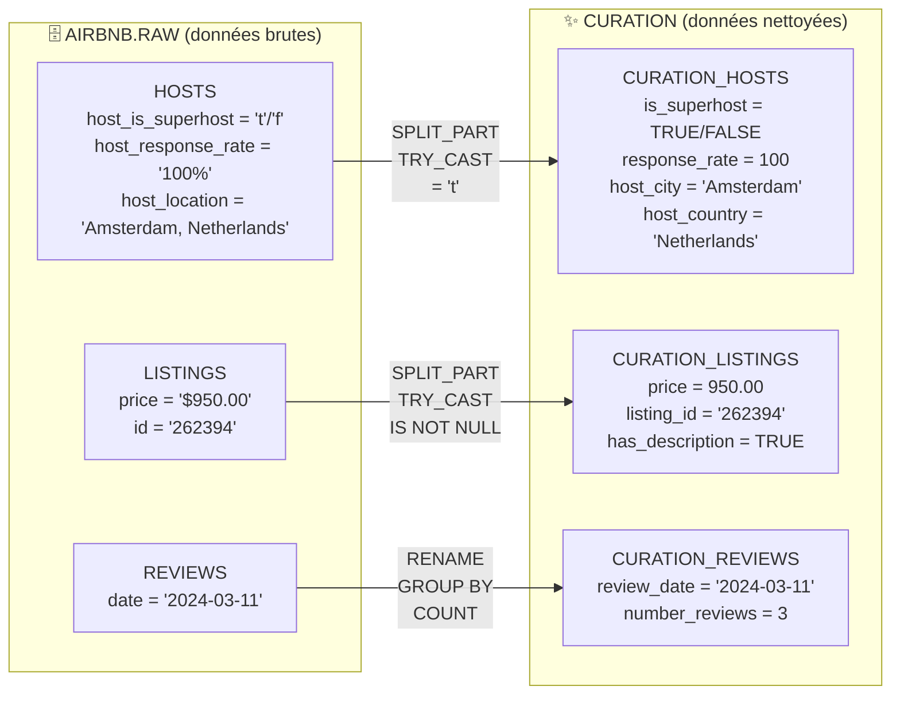
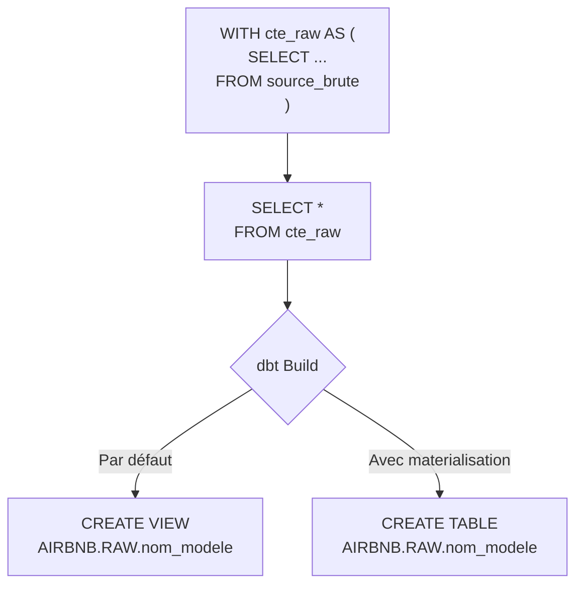
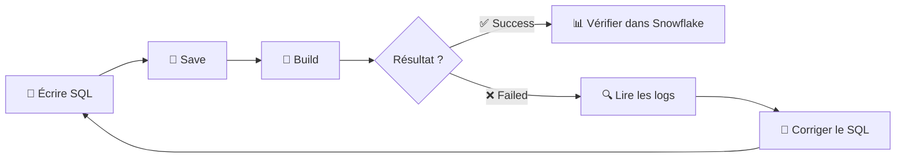

# Guide Complet dbt — Créer son premier modèle

> **Document pédagogique complet** — Modèles dbt, CTE, Jinja, transformations, workflow dbt Cloud.
> Basé sur le cours QuantikDataStudio · Jeu de données : Airbnb Amsterdam, 11 mars 2024.

---

## Table des matières

1. [Introduction au langage Jinja](#1-introduction-au-langage-jinja)
2. [Introduction aux modèles dbt](#2-introduction-aux-modèles-dbt)
3. [Introduction aux CTE](#3-introduction-aux-cte)
4. [Création du premier modèle — curation_hosts](#4-création-du-premier-modèle--curation_hosts)
5. [Workflow dbt Cloud — Save, Build, Debug](#5-workflow-dbt-cloud--save-build-debug)
6. [Création du modèle curation_listings](#6-création-du-modèle-curation_listings)
7. [Exercice — Créer le modèle curation_reviews](#7-exercice--créer-le-modèle-curation_reviews)
8. [Points de vigilance et erreurs fréquentes](#8-points-de-vigilance-et-erreurs-fréquentes)
9. [Historique commentaire — Échange pédagogique](#9-historique-commentaire--échange-pédagogique)
10. [Exercices pratiques et drills](#10-exercices-pratiques-et-drills)
11. [Quiz d'auto-évaluation](#11-quiz-dauto-évaluation)
12. [Flashcards — Ancrage mémoire](#12-flashcards--ancrage-mémoire)
13. [Résumé visuel — Diagrammes Mermaid](#13-résumé-visuel--diagrammes-mermaid)
14. [Récap en 10 points](#14-récap-en-10-points)

---

## 1. Introduction au langage Jinja

Jinja est un **moteur de template** utilisé par le **langage Python**. Créé et distribué sous licence BSD, il **fournit des expressions Python** et évalue les **templates** dans une sandbox. C'est un **langage orienté texte** qui peut ainsi être utilisé pour **générer** n'importe quel type de fichier pouvant être **balisé**.

### Pourquoi Jinja dans dbt ?

dbt utilise Jinja pour rendre le SQL **dynamique**. Sans Jinja, chaque requête SQL est statique. Avec Jinja, on peut boucler, conditionner, paramétrer, et surtout **réutiliser** du code SQL via les macros.

> Voir le notebook Jinja joint (`Copie_de_Intro_a_Jinja.ipynb`) pour les exemples pratiques de boucles, conditions et macros SQL paramétrées.

---

## 2. Introduction aux modèles dbt

### Définition

Les modèles sont les **ingrédients essentiels** de dbt :

- Ils permettent de définir les **tables, vues**, etc.
- Ils sont stockés dans des **fichiers .sql** sous le dossier `models/`
- Les modèles peuvent **se référencer entre eux**, utiliser des templates et des macros

> **Les modèles dbt sont des fichiers qui contiennent des requêtes SQL qui servent à définir des tables, vues, ou de simples parties d'une requête plus large.**

### Sommaire du chapitre

Ce chapitre couvre trois sujets : l'introduction aux modèles, l'introduction aux CTE, et la création de nos premiers modèles.

---

## 3. Introduction aux CTE

### Qu'est-ce qu'une CTE ?

Une **CTE** (Common Table Expression) est une sous-requête nommée qui existe le temps d'une requête. Elle se déclare avec le mot-clé `WITH` et permet de structurer les requêtes complexes de façon lisible.

### Syntaxe générale d'une CTE

```sql
WITH
-- ↑ Mot-clé SQL qui ouvre le bloc de CTE.
-- Tout ce qui suit jusqu'au SELECT final sont des "sous-requêtes nommées".

    expression_1 AS (
    -- ↑ Déclare une CTE nommée "expression_1".
    -- AS ( ... ) contient la requête qui définit cette CTE.
    -- C'est comme créer une table temporaire, mais sans la stocker physiquement.
        SELECT ...
        -- ↑ La requête SQL qui produit les données de cette CTE.
    ),
    -- ↑ La virgule sépare les CTE entre elles. OBLIGATOIRE entre chaque CTE.

    expression_2 AS (
    -- ↑ 2ème CTE : elle est indépendante de expression_1.
        SELECT ...
    ),
    -- ↑ Virgule : il y a encore une CTE après.

    expression_3 AS (
    -- ↑ 3ème CTE : celle-ci UTILISE expression_1 comme source.
    -- Une CTE peut référencer les CTE déclarées AVANT elle.
        SELECT ...
        FROM expression_1
        -- ↑ On lit depuis expression_1 comme si c'était une table.
        -- C'est ça la puissance des CTE : elles se chaînent.
    )
    -- ↑ Pas de virgule après la dernière CTE.

-- Requête finale : elle utilise les CTE définies plus haut.
SELECT ...
-- ↑ Le SELECT final qui produit le résultat.
FROM expression_2
-- ↑ On lit depuis expression_2.
JOIN expression_3
-- ↑ On joint avec expression_3.
ON ...
-- ↑ Condition de jointure.
```

### Pourquoi les CTE sont importantes dans dbt ?

Dans dbt, les CTE sont le **pattern standard** pour structurer les modèles. La convention est :

1. **CTE "source"** : lit les données brutes
2. **CTE(s) de transformation** : applique les nettoyages
3. **SELECT final** : produit le résultat du modèle

### Exemple concret avec nos données Airbnb

```sql
WITH listings_raw AS (
-- ↑ CTE nommée "listings_raw" : on lit les données brutes de la table listings.
-- Convention : suffixe "_raw" pour indiquer que ce sont les données non transformées.
    SELECT
        id,
        -- ↑ Identifiant du listing.
        listing_url,
        -- ↑ URL de l'annonce Airbnb.
        name,
        -- ↑ Titre de l'annonce.
        description,
        -- ↑ Description longue.
        neighbourhood_overview,
        -- ↑ Description du quartier.
        host_id,
        -- ↑ Clé étrangère vers la table hosts.
        latitude,
        -- ↑ Coordonnée GPS (latitude).
        longitude,
        -- ↑ Coordonnée GPS (longitude).
        property_type,
        -- ↑ Type de propriété (ex: "Entire rental unit").
        room_type,
        -- ↑ Type de chambre (ex: "Private room").
        accommodates,
        -- ↑ Nombre de voyageurs max.
        bathrooms,
        -- ↑ Nombre de salles de bain.
        bedrooms,
        -- ↑ Nombre de chambres.
        beds,
        -- ↑ Nombre de lits.
        amenities,
        -- ↑ Liste JSON des équipements.
        price,
        -- ↑ Prix au format "$XXX.XX" (string brute).
        minimum_nights,
        -- ↑ Séjour minimum en nuits.
        maximum_nights
        -- ↑ Séjour maximum en nuits.
    FROM airbnb.raw.listings
    -- ↑ On lit depuis la table brute AIRBNB.RAW.LISTINGS.
)

SELECT *
-- ↑ Le SELECT final récupère TOUTES les colonnes de la CTE.
FROM listings_raw
-- ↑ On lit depuis notre CTE "listings_raw".
WHERE minimum_nights > 0
-- ↑ Filtrage : on ne garde que les listings avec un séjour minimum > 0.
-- C'est un exemple de transformation simple appliquée via la CTE.
```

---

## 4. Création du premier modèle — curation_hosts

### Le concept de "curation"

Le cours utilise le terme **curation** pour désigner la couche de transformation des données brutes. C'est l'équivalent du **staging** dans la convention dbt standard.

```
RAW (données brutes)  ──→  CURATION (données nettoyées)
━━━━━━━━━━━━━━━━━━━━       ━━━━━━━━━━━━━━━━━━━━━━━━━━━
Listings                    Listings
Hosts                       Hosts
Reviews                     Reviews
```

### Le modèle curation_hosts.sql

Ce modèle applique plusieurs transformations à la table brute `AIRBNB.RAW.HOSTS`.

**Fichier : `models/curation/curation_hosts.sql`**

```sql
WITH hosts_raw AS (
-- ↑ CTE "hosts_raw" : lit les données brutes de la table hosts.
-- On y applique TOUTES les transformations de nettoyage.
    SELECT
        host_id,
        -- ↑ Identifiant de l'hôte : gardé tel quel (déjà propre).

        CASE WHEN len(host_name) = 1 THEN 'Anonyme' ELSE host_name END AS host_name,
        -- ↑ NETTOYAGE du nom de l'hôte :
        --   len(host_name) = 1 → teste si le nom fait 1 seul caractère.
        --   Si oui → on le remplace par 'Anonyme' (nom trop court = probablement invalide).
        --   ELSE host_name → sinon on garde le nom original.
        --   END AS host_name → le résultat garde le nom de colonne "host_name".
        --   CASE WHEN ... END est un "switch" SQL pour appliquer des conditions.

        host_since,
        -- ↑ Date d'inscription : gardée telle quelle (déjà en type DATE).

        host_location,
        -- ↑ Localisation complète : gardée pour référence (ex: "Amsterdam, Netherlands").

        SPLIT_PART(host_location, ',', 1) AS host_city,
        -- ↑ EXTRACTION de la ville depuis host_location.
        --   SPLIT_PART(texte, séparateur, position) découpe une chaîne.
        --   host_location = "Amsterdam, Netherlands"
        --   séparateur = ','
        --   position = 1 → prend la 1ère partie = "Amsterdam"
        --   AS host_city → on nomme la nouvelle colonne "host_city".

        SPLIT_PART(host_location, ',', 2) AS host_country,
        -- ↑ EXTRACTION du pays depuis host_location.
        --   position = 2 → prend la 2ème partie = " Netherlands"
        --   Note : il y aura un espace en début (" Netherlands"). On pourrait le TRIM.
        --   ⚠️ Limite : si host_location n'a PAS de virgule (ex: juste "Netherlands"),
        --   host_city contiendra "Netherlands" et host_country sera vide.
        --   Ce problème sera traité plus tard dans les tests unitaires.

        TRY_CAST(REPLACE(host_response_rate, '%', '') AS INTEGER) AS response_rate,
        -- ↑ NETTOYAGE du taux de réponse :
        --   Étape 1 : REPLACE(host_response_rate, '%', '') supprime le symbole %.
        --             "100%" → "100"
        --   Étape 2 : TRY_CAST(... AS INTEGER) convertit en entier.
        --             "100" → 100
        --   TRY_CAST (et non CAST) = si la conversion échoue, retourne NULL au lieu d'une erreur.
        --   Utile car certaines valeurs peuvent être vides ou invalides.
        --   AS response_rate → renomme la colonne (plus court que host_response_rate).

        host_is_superhost = 't' AS is_superhost,
        -- ↑ CONVERSION booléenne :
        --   host_is_superhost = 't' est une expression qui retourne TRUE ou FALSE.
        --   Si host_is_superhost vaut 't' → TRUE. Sinon → FALSE.
        --   AS is_superhost → renomme sans le préfixe "host_".
        --   C'est plus concis qu'un CASE WHEN et produit le même résultat.

        host_neighbourhood,
        -- ↑ Quartier de l'hôte : gardé tel quel.

        host_identity_verified = 't' AS is_identity_verified
        -- ↑ Même logique que is_superhost : 't' → TRUE, sinon FALSE.
        --   Renommé de host_identity_verified → is_identity_verified.

    FROM airbnb.raw.hosts
    -- ↑ Source : la table brute des hôtes dans le schéma RAW.
)

SELECT *
-- ↑ SELECT final : récupère TOUTES les colonnes de la CTE hosts_raw.
-- Dans dbt, c'est cette requête finale qui définit le résultat du modèle.
FROM hosts_raw
-- ↑ Pas de point-virgule ! (voir section erreurs fréquentes)
```

### Résumé des transformations appliquées

| Colonne source | Transformation | Colonne résultat |
|---------------|----------------|------------------|
| `host_id` | Aucune | `host_id` |
| `host_name` | Remplace noms de 1 caractère par "Anonyme" | `host_name` |
| `host_since` | Aucune | `host_since` |
| `host_location` | Gardée + découpée en 2 | `host_location` |
| `host_location` | `SPLIT_PART(..., ',', 1)` | `host_city` (nouvelle) |
| `host_location` | `SPLIT_PART(..., ',', 2)` | `host_country` (nouvelle) |
| `host_response_rate` | Supprime `%` + cast en INTEGER | `response_rate` |
| `host_is_superhost` | `= 't'` → boolean | `is_superhost` |
| `host_neighbourhood` | Aucune | `host_neighbourhood` |
| `host_identity_verified` | `= 't'` → boolean | `is_identity_verified` |

---

## 5. Workflow dbt Cloud — Save, Build, Debug

### Étape préalable importante

Avant d'exécuter un modèle, vérifier que le **rôle Snowflake** est bien configuré :

1. Cliquer sur son nom en bas à gauche de l'écran dbt Cloud
2. Cliquer sur **Profile**
3. Aller dans **Connection**
4. Dans la section "Optional settings", vérifier que le rôle est **`transform`**
5. Si ce n'est pas le cas, cliquer sur **Edit** en haut à droite pour corriger

### Créer le fichier dans dbt Cloud

1. Dans le **File explorer** (panneau gauche), clic droit sur le dossier `models/`
2. Choisir **Create folder** → nommer le dossier `curation`
3. Clic droit sur `curation/` → **Create file** → nommer `curation_hosts.sql`
4. Le fichier **doit** avoir l'extension `.sql` (sinon dbt ne le reconnaît pas)
5. Supprimer le dossier `example/` par défaut (clic droit → Delete)

### Le cycle Save → Build → Vérifier

```
┌──────────┐     ┌──────────┐     ┌──────────┐     ┌──────────┐
│  Écrire  │ ──→ │   Save   │ ──→ │  Build   │ ──→ │ Vérifier │
│  le SQL  │     │  (Ctrl+S)│     │ (bouton) │     │ dans SF  │
└──────────┘     └──────────┘     └──────────┘     └──────────┘
```

1. **Save** : enregistre le fichier (bouton Save en haut à droite ou Ctrl+S)
2. **Build** : exécute la commande `dbt build --select curation_hosts` — dbt compile le SQL, l'envoie à Snowflake, et crée la vue/table
3. **Vérifier dans Snowflake** : `SELECT * FROM AIRBNB.RAW.CURATION_HOSTS LIMIT 10;`

### Ce que dbt crée par défaut

Par défaut, dbt crée des **vues** (pas des tables). On peut changer ce comportement via les matérialisations, mais pour l'instant on garde les vues.

Dans Snowflake, après le build, on retrouve :
- `AIRBNB.RAW.CURATION_HOSTS` → vue créée par dbt
- `AIRBNB.RAW.CURATION_LISTINGS` → vue créée par dbt

### L'onglet Lineage

L'onglet **Lineage** dans dbt Cloud montre le **graphe de dépendances** (DAG) du modèle. Pour `curation_hosts`, on voit un nœud unique car ce modèle n'a pas de dépendances vers d'autres modèles (il lit directement depuis `airbnb.raw.hosts`).

---

## 6. Création du modèle curation_listings

On répète le même procédé : créer un fichier SQL dans le dossier `curation/`, y coller le SQL, puis Save + Build.

**Fichier : `models/curation/curation_listings.sql`**

```sql
WITH listings_raw AS
-- ↑ CTE "listings_raw" : lit et transforme les données brutes de listings.
(SELECT
    id AS listing_id,
    -- ↑ RENOMMAGE : "id" est trop générique → on le renomme "listing_id" pour plus de clarté.
    -- C'est une bonne pratique : les noms de colonnes doivent être auto-descriptifs.

    listing_url,
    -- ↑ URL de l'annonce Airbnb : gardée telle quelle.

    name,
    -- ↑ Titre de l'annonce : gardé tel quel.

    description,
    -- ↑ Description longue : gardée telle quelle.

    description IS NOT NULL AS has_description,
    -- ↑ COLONNE CALCULÉE booléenne :
    --   "description IS NOT NULL" retourne TRUE si la description existe, FALSE sinon.
    --   AS has_description → nouvelle colonne qui indique si l'annonce a une description.
    --   Utile pour filtrer ou compter les annonces avec/sans description.

    neighbourhood_overview,
    -- ↑ Description du quartier : gardée telle quelle.

    neighbourhood_overview IS NOT NULL AS has_neighbourhood_description,
    -- ↑ Même logique : booléen indiquant si le quartier est décrit ou non.

    host_id,
    -- ↑ FK vers la table hosts : gardée telle quelle.

    latitude,
    -- ↑ Latitude GPS : gardée telle quelle (encore en STRING ici).

    longitude,
    -- ↑ Longitude GPS : gardée telle quelle.

    property_type,
    -- ↑ Type de propriété : gardé tel quel.

    room_type,
    -- ↑ Type de chambre : gardé tel quel.

    accommodates,
    -- ↑ Capacité max : gardée telle quelle (déjà en INTEGER).

    bathrooms,
    -- ↑ Nombre de salles de bain : gardé tel quel (FLOAT).

    bedrooms,
    -- ↑ Nombre de chambres : gardé tel quel.

    beds,
    -- ↑ Nombre de lits : gardé tel quel.

    amenities,
    -- ↑ Liste JSON des équipements : gardée telle quelle.

    TRY_CAST(SPLIT_PART(price, '$', 2) AS FLOAT) AS price,
    -- ↑ NETTOYAGE DU PRIX — Technique alternative au REPLACE :
    --   Étape 1 : SPLIT_PART(price, '$', 2)
    --     Découpe "$950.00" autour du symbole '$'.
    --     Partie 1 (avant le $) = "" (vide)
    --     Partie 2 (après le $) = "950.00"
    --     On prend la partie 2.
    --   Étape 2 : TRY_CAST(... AS FLOAT)
    --     Convertit "950.00" (string) en 950.00 (nombre décimal).
    --     TRY_CAST = retourne NULL si la conversion échoue (au lieu d'une erreur).
    --   AS price → on garde le même nom de colonne, mais maintenant c'est un nombre.

    minimum_nights,
    -- ↑ Séjour minimum : gardé tel quel.

    maximum_nights
    -- ↑ Séjour maximum : gardé tel quel.

FROM airbnb.raw.listings)
-- ↑ Source : table brute des listings.

SELECT *
-- ↑ SELECT final : toutes les colonnes de la CTE.
FROM listings_raw
-- ↑ Pas de point-virgule à la fin.
```

### Résumé des transformations appliquées

| Colonne source | Transformation | Colonne résultat |
|---------------|----------------|------------------|
| `id` | Renommage | `listing_id` |
| `listing_url` | Aucune | `listing_url` |
| `name` | Aucune | `name` |
| `description` | Aucune + ajout flag | `description` + `has_description` (nouvelle) |
| `neighbourhood_overview` | Aucune + ajout flag | `neighbourhood_overview` + `has_neighbourhood_description` (nouvelle) |
| `host_id` | Aucune | `host_id` |
| `latitude`, `longitude` | Aucune | `latitude`, `longitude` |
| `property_type`, `room_type` | Aucune | `property_type`, `room_type` |
| `accommodates` → `beds` | Aucune | Idem |
| `amenities` | Aucune | `amenities` |
| `price` | `SPLIT_PART` + `TRY_CAST` en FLOAT | `price` (numérique) |
| `minimum_nights`, `maximum_nights` | Aucune | Idem |

---

## 7. Exercice — Créer le modèle curation_reviews

### Consignes

Créer un modèle `curation_reviews.sql` dans le dossier `models/curation/` avec les transformations suivantes :

1. Renommer la colonne `date` en `review_date`
2. Ajouter une colonne `number_reviews` : le nombre de reviews que chaque listing a reçu **par jour**

### Indices

- Il faut un `GROUP BY` pour compter les reviews par listing et par jour
- La fonction `COUNT(*)` compte les lignes
- La CTE devrait s'appeler `reviews_raw` (pour garder la cohérence avec les autres modèles)

<details>
<summary>💡 Solution</summary>

```sql
WITH reviews_raw AS (
-- ↑ CTE "reviews_raw" : lit les données brutes de reviews.
-- Nom cohérent avec hosts_raw et listings_raw des autres modèles.
    SELECT
        listing_id,
        -- ↑ FK vers le listing : gardée telle quelle.
        date AS review_date,
        -- ↑ RENOMMAGE : "date" est un mot réservé SQL, on le renomme "review_date".
        -- C'est plus descriptif et évite les conflits avec le mot-clé DATE.
        COUNT(*) AS number_reviews
        -- ↑ AGRÉGATION : compte le nombre de reviews par listing et par jour.
        --   COUNT(*) = nombre de lignes dans chaque groupe.
        --   AS number_reviews = nom de la colonne résultat.
        --   Ex: si le listing 262394 a reçu 3 reviews le 2023-05-15,
        --       number_reviews = 3 pour cette ligne.
    FROM airbnb.raw.reviews
    -- ↑ Source : table brute des reviews.
    GROUP BY listing_id, date
    -- ↑ GROUP BY : regroupe les lignes par combinaison (listing_id, date).
    --   Obligatoire quand on utilise une fonction d'agrégation (COUNT, SUM, AVG...).
    --   Sans GROUP BY, COUNT(*) compterait TOUTES les lignes en une seule valeur.
)

SELECT *
-- ↑ SELECT final : toutes les colonnes de la CTE.
FROM reviews_raw
-- ↑ Résultat : une ligne par combinaison (listing, date) avec le nombre de reviews.
```

</details>

---

## 8. Points de vigilance et erreurs fréquentes

### 1. Pas de point-virgule dans les modèles dbt

```sql
-- ❌ MAUVAIS : le point-virgule provoque une erreur dans dbt
SELECT * FROM hosts_raw;

-- ✅ BON : pas de point-virgule
SELECT * FROM hosts_raw
```

**Pourquoi ?** Un modèle dbt contient **une seule requête SQL**. dbt enveloppe cette requête dans un `CREATE VIEW AS (...)` ou `CREATE TABLE AS SELECT (...)`. Le point-virgule coupe la requête prématurément et produit du SQL invalide.

### 2. Toujours sauvegarder avant de Build

Le bouton **Build** exécute la dernière version **sauvegardée**. Si vous modifiez le SQL mais ne sauvegardez pas, dbt exécutera l'ancienne version.

### 3. Vérifier le rôle dans les Optional Settings

Le build échoue avec une erreur de permissions si le rôle n'est pas `transform`. C'est la cause d'erreur #1 chez les débutants.

### 4. L'extension doit être `.sql`

dbt ne reconnaît que les fichiers `.sql` dans le dossier `models/`. Un fichier `.txt` ou sans extension sera ignoré silencieusement.

### 5. dbt crée des vues par défaut (pas des tables)

Après un build, dans Snowflake on retrouve les résultats sous `Views`, pas sous `Tables`. On pourra changer ce comportement avec les matérialisations (chapitre suivant).

### 6. Attention au schéma de destination

Par défaut, dbt crée les vues dans le même schéma que celui configuré (`RAW`). On se retrouve donc avec les tables brutes ET les vues de curation dans `AIRBNB.RAW`. Ce n'est pas idéal (on mélange raw et curation) — ce sera corrigé plus tard dans le cours.

---

## 9. Historique commentaire — Échange pédagogique

Un échange intéressant entre un étudiant et l'instructeur Adam est inclus dans le document. Il illustre deux points importants :

### Point 1 — Nommage de la CTE

L'étudiant a remarqué que pour garder la cohérence avec `hosts_raw` et `listings_raw`, la CTE du modèle reviews aurait dû s'appeler `reviews_raw`. **Adam confirme** que c'est un meilleur choix.

### Point 2 — Problème du SPLIT_PART sur host_location

L'étudiant a identifié un problème réel : quand `host_location` ne contient **pas de virgule** (ex: juste "Netherlands" sans ville), le `SPLIT_PART` met le pays dans `host_city` au lieu de `host_country`. L'étudiant a proposé d'utiliser `POSITION` et `CASE` pour corriger.

**Adam répond** que le problème sera traité plus tard dans les **tests unitaires**, mais félicite l'étudiant pour son analyse proactive. Il conseille toutefois de suivre l'implémentation du cours pour voir les mêmes résultats que dans les vidéos.

> **Leçon** : Explorer les données et anticiper les cas limites est une excellente pratique en data engineering. Les tests unitaires dbt servent justement à détecter et documenter ces problèmes.

---

## 10. Exercices pratiques et drills

### Exercice 1 — Corriger les erreurs

Le SQL suivant contient 3 erreurs. Trouvez-les :

```sql
WITH hosts_raw AS (
    SELECT
        host_id,
        host_name,
        SPLIT_PART(host_location, ',', 1) AS host_city,
        host_response_rate AS response_rate,
        host_is_superhost AS is_superhost
    FROM airbnb.raw.hosts
)

SELECT *
FROM hosts_raw;
```

<details>
<summary>💡 Solution</summary>

**Erreur 1 :** `host_response_rate AS response_rate` ne fait aucun nettoyage — il faut supprimer le `%` et caster en INTEGER :
`TRY_CAST(REPLACE(host_response_rate, '%', '') AS INTEGER) AS response_rate`

**Erreur 2 :** `host_is_superhost AS is_superhost` garde la valeur 't'/'f' en texte — il faut la convertir en booléen :
`host_is_superhost = 't' AS is_superhost`

**Erreur 3 :** Le point-virgule `;` à la fin — interdit dans un modèle dbt.

</details>

### Exercice 2 — Écrire un modèle de curation complet

Créez un modèle `curation_listings_v2.sql` qui, en plus des transformations existantes, ajoute :

1. Une colonne `price_category` : 'budget' si price < 100, 'mid' si 100–300, 'premium' si > 300
2. Une colonne `is_entire_home` : TRUE si room_type = 'Entire home/apt'

<details>
<summary>💡 Solution</summary>

```sql
WITH listings_raw AS (
-- ↑ CTE source avec toutes les transformations.
    SELECT
        id AS listing_id,
        -- ↑ Renommage de l'ID.
        listing_url,
        name,
        description,
        description IS NOT NULL AS has_description,
        -- ↑ Flag booléen : annonce a une description ?
        host_id,
        room_type,
        room_type = 'Entire home/apt' AS is_entire_home,
        -- ↑ NOUVELLE COLONNE : TRUE si c'est un logement entier, FALSE sinon.
        --   Utilise la syntaxe booléenne Snowflake (expression = valeur → TRUE/FALSE).
        accommodates,
        TRY_CAST(SPLIT_PART(price, '$', 2) AS FLOAT) AS price,
        -- ↑ Nettoyage du prix : supprime $ et convertit en nombre.
        CASE
            WHEN TRY_CAST(SPLIT_PART(price, '$', 2) AS FLOAT) < 100 THEN 'budget'
            -- ↑ Prix < 100€ → catégorie 'budget'.
            WHEN TRY_CAST(SPLIT_PART(price, '$', 2) AS FLOAT) <= 300 THEN 'mid'
            -- ↑ Prix entre 100 et 300€ → catégorie 'mid'.
            ELSE 'premium'
            -- ↑ Prix > 300€ → catégorie 'premium'.
        END AS price_category,
        -- ↑ NOUVELLE COLONNE calculée avec un CASE.
        minimum_nights,
        maximum_nights
    FROM airbnb.raw.listings
    -- ↑ Source brute.
)

SELECT *
FROM listings_raw
-- ↑ Pas de point-virgule.
```

</details>

### Exercice 3 — Analyser les résultats

Après avoir exécuté les modèles, écrivez les requêtes SQL Snowflake pour :

1. Compter le nombre de superhosts
2. Trouver le prix moyen par type de chambre
3. Trouver les 5 listings avec le plus de reviews

<details>
<summary>💡 Solution</summary>

```sql
-- 1. Nombre de superhosts
SELECT COUNT(*) AS nb_superhosts
-- ↑ COUNT(*) compte toutes les lignes qui passent le WHERE.
FROM AIRBNB.RAW.CURATION_HOSTS
-- ↑ On lit depuis la vue de curation (pas la table brute).
WHERE is_superhost = TRUE
-- ↑ Filtre sur le booléen is_superhost (déjà nettoyé par notre modèle).
```

```sql
-- 2. Prix moyen par type de chambre
SELECT
    room_type,
    -- ↑ Le type de chambre (groupé).
    ROUND(AVG(price), 2) AS avg_price
    -- ↑ AVG(price) = moyenne des prix. ROUND(..., 2) = arrondi à 2 décimales.
    --   Possible car on a converti price en FLOAT dans curation_listings.
FROM AIRBNB.RAW.CURATION_LISTINGS
GROUP BY room_type
-- ↑ On groupe par type de chambre pour avoir la moyenne de chaque type.
ORDER BY avg_price DESC
-- ↑ Tri par prix moyen décroissant.
```

```sql
-- 3. Top 5 listings par nombre de reviews
SELECT
    listing_id,
    -- ↑ Identifiant du listing.
    SUM(number_reviews) AS total_reviews
    -- ↑ SUM car number_reviews est déjà un comptage par jour.
    --   On somme sur tous les jours pour avoir le total.
FROM AIRBNB.RAW.CURATION_REVIEWS
GROUP BY listing_id
-- ↑ On groupe par listing.
ORDER BY total_reviews DESC
-- ↑ Tri décroissant pour avoir le plus reviewé en premier.
LIMIT 5
-- ↑ On ne garde que les 5 premiers.
```

</details>

---

## 11. Quiz d'auto-évaluation

**Q1.** Qu'est-ce qu'un modèle dbt ?

<details><summary>Réponse</summary>
Un fichier .sql dans le dossier models/ qui contient une requête SQL. dbt l'exécute pour créer une table ou une vue dans le data warehouse.
</details>

**Q2.** Que signifie CTE et pourquoi l'utiliser ?

<details><summary>Réponse</summary>
Common Table Expression. C'est une sous-requête nommée déclarée avec WITH. Elle améliore la lisibilité, permet de chaîner les transformations, et est le pattern standard dans dbt.
</details>

**Q3.** Pourquoi ne pas mettre de point-virgule dans un modèle dbt ?

<details><summary>Réponse</summary>
dbt enveloppe la requête du modèle dans un CREATE VIEW/TABLE AS. Le point-virgule coupe la requête prématurément, ce qui produit du SQL invalide et un build en erreur.
</details>

**Q4.** Quelle est la différence entre `CAST` et `TRY_CAST` ?

<details><summary>Réponse</summary>
CAST provoque une erreur si la conversion échoue. TRY_CAST retourne NULL si la conversion échoue. TRY_CAST est plus sûr pour les données brutes qui peuvent contenir des valeurs invalides.
</details>

**Q5.** Que fait `SPLIT_PART(host_location, ',', 1)` ?

<details><summary>Réponse</summary>
Découpe la chaîne host_location autour de la virgule et retourne la 1ère partie. Ex: "Amsterdam, Netherlands" → "Amsterdam".
</details>

**Q6.** Comment `host_is_superhost = 't'` se comporte comme un booléen ?

<details><summary>Réponse</summary>
En SQL, une expression de comparaison retourne TRUE ou FALSE. Si host_is_superhost vaut 't', l'expression retourne TRUE. Sinon, FALSE. C'est plus concis qu'un CASE WHEN.
</details>

**Q7.** Que crée dbt par défaut : une table ou une vue ?

<details><summary>Réponse</summary>
Une vue (CREATE VIEW). On peut changer ce comportement avec les matérialisations (table, incremental, ephemeral).
</details>

**Q8.** Pourquoi le nom de CTE `reviews_raw` est meilleur que `source` dans ce contexte ?

<details><summary>Réponse</summary>
Pour la cohérence avec les autres modèles qui utilisent hosts_raw et listings_raw. La convention de nommage cohérente améliore la lisibilité du projet.
</details>

**Q9.** Quel est le problème potentiel du SPLIT_PART sur host_location ?

<details><summary>Réponse</summary>
Si host_location ne contient pas de virgule (ex: "Netherlands" seul), SPLIT_PART renvoie toute la chaîne dans host_city et une chaîne vide dans host_country. Le pays se retrouve dans la mauvaise colonne.
</details>

**Q10.** Quelle commande dbt exécute-t-on pour construire un seul modèle ?

<details><summary>Réponse</summary>
`dbt build --select nom_du_modele` (ex: `dbt build --select curation_hosts`). Le flag --select permet de cibler un modèle spécifique au lieu de tout construire.
</details>

---

## 12. Flashcards — Ancrage mémoire

| # | Recto (Question) | Verso (Réponse) |
|---|-----------------|-----------------|
| 1 | Un modèle dbt = ? | Un fichier .sql dans models/ qui définit une table/vue |
| 2 | CTE = ? | Common Table Expression : sous-requête nommée avec WITH |
| 3 | `WITH x AS (SELECT ...)` | Déclare une CTE nommée "x" |
| 4 | `TRY_CAST` vs `CAST` | TRY_CAST retourne NULL si erreur, CAST plante |
| 5 | `SPLIT_PART(text, sep, n)` | Découpe text autour de sep, retourne la n-ème partie |
| 6 | `col = 't'` comme booléen | Expression de comparaison → retourne TRUE ou FALSE |
| 7 | Pas de `;` dans dbt | dbt wrappe le SQL dans CREATE VIEW/TABLE, le ; le casse |
| 8 | dbt crée par défaut... | Des vues (pas des tables) |
| 9 | `dbt build --select X` | Construit uniquement le modèle X |
| 10 | Suffixe `_raw` dans CTE | Convention pour les données brutes non transformées |
| 11 | `description IS NOT NULL` | Expression booléenne : TRUE si valeur existe |
| 12 | `REPLACE(col, '%', '')` | Supprime le caractère % de la colonne |
| 13 | `TRY_CAST(SPLIT_PART(price,'$',2) AS FLOAT)` | Nettoie "$950.00" → 950.00 |
| 14 | `CASE WHEN len(x)=1 THEN 'Anonyme' ELSE x END` | Remplace les noms trop courts |
| 15 | Dossier `models/curation/` | Couche de nettoyage des données brutes |
| 16 | Lineage dans dbt Cloud | Graphe visuel des dépendances du modèle |
| 17 | Extension `.sql` obligatoire | dbt ignore les fichiers sans cette extension |
| 18 | Le rôle doit être `transform` | Sinon erreur de permissions au build |
| 19 | `GROUP BY` + `COUNT(*)` | Compte les lignes par groupe |
| 20 | `COUNT(*)` vs `SUM(col)` | COUNT = nombre de lignes, SUM = somme des valeurs |

---

## 13. Résumé visuel — Diagrammes Mermaid

### Pipeline de transformation RAW → CURATION



### Structure d'un modèle dbt



### Workflow dbt Cloud



---

## 14. Récap en 10 points

1. **Un modèle dbt** = un fichier `.sql` dans `models/` contenant une seule requête SQL qui définit une vue ou une table.

2. **Les CTE** (Common Table Expressions) sont le pattern standard dans dbt : on déclare des sous-requêtes nommées avec `WITH`, puis on les utilise dans le SELECT final.

3. **La couche "curation"** (ou staging) nettoie les données brutes : renommages, conversions de types, calculs booléens, découpage de chaînes.

4. **`TRY_CAST`** est préférable à `CAST` pour les données brutes car il retourne NULL en cas d'erreur au lieu de faire planter la requête.

5. **`SPLIT_PART`** découpe une chaîne autour d'un séparateur — utile pour extraire ville/pays depuis `host_location` ou le prix numérique depuis `$950.00`.

6. **Pas de point-virgule** dans les modèles dbt — un modèle = une seule requête, dbt l'enveloppe dans `CREATE VIEW/TABLE AS`.

7. **dbt crée des vues par défaut** — on peut changer ce comportement avec les matérialisations (table, incremental, ephemeral).

8. **Le workflow** est : écrire → Save → Build → vérifier dans Snowflake → corriger si erreur dans les logs.

9. **La cohérence de nommage** est importante : `hosts_raw`, `listings_raw`, `reviews_raw` pour les CTE, et `curation_hosts`, `curation_listings`, `curation_reviews` pour les modèles.

10. **Toujours vérifier le rôle `transform`** dans les Optional Settings de dbt Cloud avant le premier build, sinon erreur de permissions garantie.

---

> **Auteur :** Généré à partir du cours dbt de QuantikDataStudio
> **Données :** Inside Airbnb — Amsterdam, 11 mars 2024
> **Outils :** dbt Cloud · Snowflake · Jinja · Git
