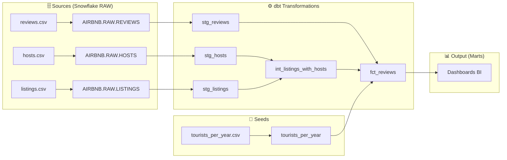
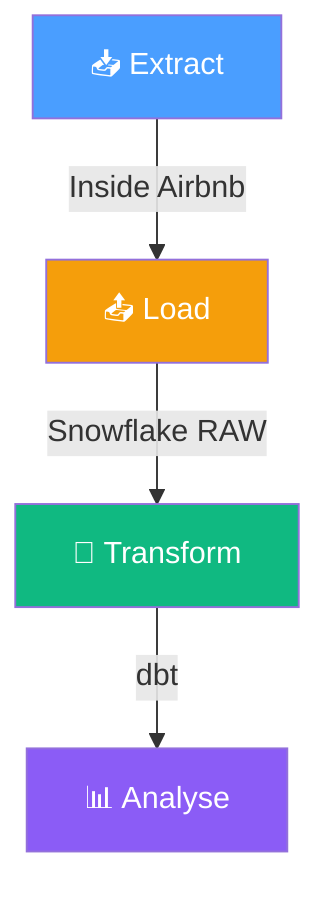
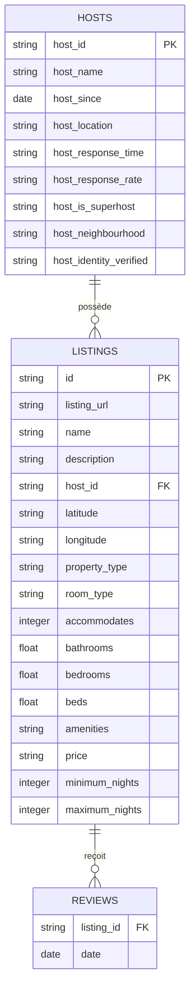

# Guide Complet dbt — Airbnb Amsterdam

> **Document pédagogique complet** — Introduction à dbt, architecture, SQL, Jinja, Snowflake, bonnes pratiques et exercices.
> Basé sur le cours QuantikDataStudio · Jeu de données : Inside Airbnb, Amsterdam, 11 mars 2024.

---

## Table des matières

1. [Introduction — C'est quoi dbt ?](#1-introduction--cest-quoi-dbt-)
2. [Pourquoi apprendre dbt ?](#2-pourquoi-apprendre-dbt-)
3. [Architecture dbt — Core vs Cloud](#3-architecture-dbt--core-vs-cloud)
4. [Le jeu de données Airbnb Amsterdam](#4-le-jeu-de-données-airbnb-amsterdam)
5. [Chapitre 1 — Mise en place de l'environnement](#5-chapitre-1--mise-en-place-de-lenvironnement)
6. [Le SQL Snowflake expliqué ligne par ligne](#6-le-sql-snowflake-expliqué-ligne-par-ligne)
7. [Introduction à Jinja — Le moteur de templates de dbt](#7-introduction-à-jinja--le-moteur-de-templates-de-dbt)
8. [Méthodologie professionnelle — Workflow entreprise](#8-méthodologie-professionnelle--workflow-entreprise)
9. [Exercices pratiques et drills](#9-exercices-pratiques-et-drills)
10. [Quiz d'auto-évaluation](#10-quiz-dauto-évaluation)
11. [Flashcards — Ancrage mémoire](#11-flashcards--ancrage-mémoire)
12. [Résumé visuel — Diagrammes Mermaid](#12-résumé-visuel--diagrammes-mermaid)
13. [Récap en 10 points](#13-récap-en-10-points)

---

## 1. Introduction — C'est quoi dbt ?

**dbt** (data build tool) est un outil SQL puissant qui permet :

- Aux DA/DE d'écrire les **transformations** de leurs données en SQL
- Aux DA/DE de **ne pas répéter** leur code SQL grâce à la **modularisation** et à la **paramétrisation**
- Aux DA/DE de **tester** leur code SQL en isolation mais aussi de voir comment il s'intègre à la plateforme analytique
- Aux entreprises de s'assurer de la **fiabilité des données**
- Aux entreprises d'appliquer les bonnes règles de **data gouvernance**

### Exemple concret

dbt transforme des requêtes SQL isolées en un **graphe de dépendances** (DAG — Directed Acyclic Graph). Chaque nœud du graphe est un modèle SQL. dbt comprend l'ordre d'exécution, les dépendances entre modèles, et orchestre le tout automatiquement.

### En une phrase

> dbt est le **"T" de l'ELT** : il ne charge pas les données (c'est le rôle de l'EL), il les **transforme** une fois qu'elles sont dans le data warehouse.

---

## 2. Pourquoi apprendre dbt ?

dbt est devenu un outil **indispensable** dans le travail des **professionnels** de la Data. Ceci est d'autant plus vrai avec l'essor du rôle d'**Analytics Engineer**, ce rôle hybride entre analyste et ingénieur des données. On s'attend à ce que la demande des entreprises pour cette technologie **croisse** dans les années à venir.

### Organisation et objectifs du cours

Le cours couvre les sujets suivants :

| # | Module | Compétence clé |
|---|--------|----------------|
| 1 | Introduction à dbt Cloud et Core + environnement | Setup complet |
| 2 | Introduction au langage Jinja | Templating SQL |
| 3 | Développer des modèles dbt | Modélisation |
| 4 | Gérer les matérialisations sous dbt | Performance |
| 5 | Créer des seeds et des snapshots dbt | Données de référence + historique |
| 6 | Écrire des tests unitaires | Qualité des données |
| 7 | Écrire des macros | Réutilisabilité |
| 8 | Documenter ses modèles | Gouvernance |
| 9 | Développer des analyses avec SQL | Analytique |
| 10 | Travailler avec les variables sous dbt | Paramétrisation |

---

## 3. Architecture dbt — Core vs Cloud

|  | **dbt Core** | **dbt Cloud** |
|--|-------------|--------------|
| **Accès payant/gratuit** | Open source, gratuit | Payant, dans le cloud |
| **Requiert une infrastructure** | Oui, pour exécuter le code | Non, tout est géré par dbt Cloud |
| **Fonctionnalités essentielles** | Oui | Oui + fonctionnalités payantes* |

> *Pour ce cours, on utilise **dbt Cloud** qui offre un accès gratuit sans limite de temps.*

### Quand utiliser dbt ?

L'intérêt d'utiliser dbt **croît avec la complexité** de la plateforme analytique de l'entreprise :

- Un simple `SELECT *` ne nécessite probablement **pas** la mise en place de dbt
- Par contre, si on a un **grand nombre de SQL complexes interdépendants**, dbt permettra d'économiser beaucoup de temps

**Règle empirique :** Si vous avez plus de ~10 requêtes SQL qui dépendent les unes des autres, dbt commence à apporter une vraie valeur.

---

## 4. Le jeu de données Airbnb Amsterdam

### Source

Les données proviennent de [Inside Airbnb](https://insideairbnb.com/get-the-data/) — ville d'**Amsterdam**, extrait du **11 mars 2024**.

### Traitement des données

Le fichier original `listings.csv.gz` a été divisé en fichiers distincts :

**Fichier 1 — `listings.csv`** (8 943 lignes)
Contient les données propres à chaque annonce (sans les données hôte ni revues) :

| Colonne | Type | Description |
|---------|------|-------------|
| `id` | STRING | Identifiant unique du listing |
| `listing_url` | STRING | URL Airbnb de l'annonce |
| `name` | STRING | Titre de l'annonce |
| `description` | STRING | Description longue |
| `neighborhood_overview` | STRING | Description du quartier |
| `host_id` | STRING | FK vers la table hosts |
| `latitude` / `longitude` | STRING | Coordonnées GPS |
| `property_type` | STRING | Type de propriété |
| `room_type` | STRING | Type de chambre |
| `accommodates` | INTEGER | Nombre de voyageurs max |
| `bathrooms` | FLOAT | Nombre de salles de bain |
| `bedrooms` | FLOAT | Nombre de chambres |
| `beds` | FLOAT | Nombre de lits |
| `amenities` | STRING | Liste JSON des équipements |
| `price` | STRING | Prix (format `$XXX.XX`) |
| `minimum_nights` | INTEGER | Séjour minimum |
| `maximum_nights` | INTEGER | Séjour maximum |

**Fichier 2 — `hosts.csv`** (7 815 lignes)
Contient les informations sur les hôtes :

| Colonne | Type | Description |
|---------|------|-------------|
| `host_id` | STRING | Identifiant unique de l'hôte |
| `host_name` | STRING | Prénom de l'hôte |
| `host_since` | DATE | Date d'inscription |
| `host_location` | STRING | Localisation déclarée |
| `host_response_time` | STRING | Délai de réponse |
| `host_response_rate` | STRING | Taux de réponse (%) |
| `host_is_superhost` | STRING | Statut superhost (t/f) |
| `host_neighbourhood` | STRING | Quartier de l'hôte |
| `host_identity_verified` | STRING | Identité vérifiée (t/f) |

**Fichier 3 — `reviews.csv`** (402 663 lignes)
Contient les revues résumées :

| Colonne | Type | Description |
|---------|------|-------------|
| `listing_id` | STRING | FK vers la table listings |
| `date` | DATE | Date du commentaire |

Exemple : les lignes `262394,2012-04-11` et `262394,2012-04-25` indiquent que le listing 262394 a reçu 2 commentaires, le 11 et le 25 avril 2012.

**Fichier bonus — `tourists_per_year.csv`** (12 lignes)
Nombre de touristes à Amsterdam par année (2012–2023) :

| Année | Touristes | Tendance |
|-------|-----------|----------|
| 2012 | 5 738 000 | — |
| 2013 | 6 024 000 | ↑ |
| 2014 | 6 670 000 | ↑ |
| 2015 | 6 826 000 | ↑ |
| 2016 | 7 270 000 | ↑ |
| 2017 | 8 260 000 | ↑ |
| 2018 | 8 577 000 | ↑ |
| 2019 | 9 209 000 | ↑ pic pré-COVID |
| 2020 | 2 959 000 | ↓ COVID |
| 2021 | 2 887 000 | ↓ COVID |
| 2022 | 7 413 000 | ↑ reprise |
| 2023 | 8 868 000 | ↑ quasi retour au pic |

### Statistiques clés du jeu de données

| Métrique | Valeur |
|----------|--------|
| Nombre de listings | 8 943 |
| Nombre d'hôtes uniques | 7 815 |
| Nombre de reviews | 402 663 |
| Superhosts | 1 178 (15,1%) |
| Types de logement principaux | Entire home/apt: 7 087 · Private room: 1 761 · Hotel: 53 · Shared: 42 |
| Période des reviews | 2009-03-30 → 2024-03-11 |

### Relations entre les tables

```
listings.host_id  ──→  hosts.host_id       (N:1)
reviews.listing_id ──→  listings.id         (N:1)
```

Un hôte peut avoir **plusieurs** listings. Un listing peut avoir **plusieurs** reviews.

---

## 5. Chapitre 1 — Mise en place de l'environnement

### Étape 1 : Créer un compte Snowflake

Snowflake propose un essai gratuit. C'est le data warehouse dans lequel dbt viendra transformer les données.

### Étape 2 : Configurer Snowflake pour dbt

Voici le script SQL complet à exécuter dans Snowflake, expliqué section par section :

```sql
-- ============================================================
-- SECTION 1 : Rôles et permissions
-- ============================================================

USE ROLE ACCOUNTADMIN;
-- ↑ On se connecte avec le rôle ACCOUNTADMIN (= super-admin Snowflake).
-- C'est le seul rôle qui a le droit de créer d'autres rôles et utilisateurs.

CREATE ROLE IF NOT EXISTS transform;
-- ↑ On crée un rôle custom appelé "transform".
-- Ce rôle sera assigné à l'utilisateur dbt pour limiter ses permissions.
-- IF NOT EXISTS = ne plante pas si le rôle existe déjà.

GRANT ROLE TRANSFORM TO ROLE ACCOUNTADMIN;
-- ↑ On rend le rôle "transform" accessible depuis ACCOUNTADMIN.
-- Sans ça, même l'admin ne pourrait pas "devenir" transform.

-- ============================================================
-- SECTION 2 : Warehouse (moteur de calcul)
-- ============================================================

CREATE WAREHOUSE IF NOT EXISTS COMPUTE_WH;
-- ↑ On crée un warehouse (= cluster de calcul virtuel).
-- Attention : un warehouse Snowflake ne STOCKE PAS de données.
-- C'est uniquement du CPU/RAM pour exécuter les requêtes.
-- COMPUTE_WH = nom par défaut, taille XS (la plus petite).

GRANT OPERATE ON WAREHOUSE COMPUTE_WH TO ROLE TRANSFORM;
-- ↑ On donne au rôle "transform" le droit d'UTILISER ce warehouse.
-- OPERATE = démarrer, arrêter, et exécuter des requêtes dessus.

-- ============================================================
-- SECTION 3 : Utilisateur dbt
-- ============================================================

CREATE USER IF NOT EXISTS dbt
-- ↑ On crée un utilisateur Snowflake dédié à dbt.
  PASSWORD='MotDePasseDBT123@'
  -- ↑ Mot de passe de connexion (à changer en production !).
  LOGIN_NAME='dbt'
  -- ↑ Identifiant de connexion (ce qu'on tape pour se logger).
  TYPE=LEGACY_SERVICE
  -- ↑ Indique que c'est un compte de SERVICE (pas un humain).
  -- Un compte service ne peut pas se connecter à l'interface web Snowflake.
  MUST_CHANGE_PASSWORD=FALSE
  -- ↑ Pas de changement de mot de passe au 1er login (c'est un service).
  DEFAULT_WAREHOUSE='COMPUTE_WH'
  -- ↑ Warehouse utilisé par défaut quand dbt se connecte.
  DEFAULT_ROLE='transform'
  -- ↑ Rôle activé par défaut à la connexion.
  DEFAULT_NAMESPACE='AIRBNB.RAW'
  -- ↑ Database.Schema par défaut → évite de taper AIRBNB.RAW. à chaque requête.
  COMMENT='Utilisateur DBT pour la transformation des données';
  -- ↑ Description textuelle pour la documentation.

GRANT ROLE transform TO USER dbt;
-- ↑ On assigne le rôle "transform" à l'utilisateur "dbt".
-- Sans cette ligne, l'utilisateur dbt existe mais n'a AUCUN droit.

-- ============================================================
-- SECTION 4 : Base de données et schéma
-- ============================================================

CREATE DATABASE IF NOT EXISTS AIRBNB;
-- ↑ Crée la base de données "AIRBNB" = conteneur de 1er niveau.
-- Toutes nos tables seront à l'intérieur.

CREATE SCHEMA IF NOT EXISTS AIRBNB.RAW;
-- ↑ Crée le schéma "RAW" dans la database AIRBNB.
-- RAW = convention pour les données brutes (non transformées).
-- Hiérarchie Snowflake : DATABASE → SCHEMA → TABLE.

-- ============================================================
-- SECTION 5 : Permissions complètes pour le rôle transform
-- ============================================================

GRANT ALL ON WAREHOUSE COMPUTE_WH TO ROLE transform;
-- ↑ Donne TOUS les droits sur le warehouse au rôle transform.
-- Inclut : OPERATE, USAGE, MODIFY, MONITOR.

GRANT ALL ON DATABASE AIRBNB TO ROLE transform;
-- ↑ Donne tous les droits sur la database AIRBNB.
-- Inclut : CREATE SCHEMA, USAGE, MODIFY.

GRANT ALL ON ALL SCHEMAS IN DATABASE AIRBNB TO ROLE transform;
-- ↑ Donne tous les droits sur TOUS les schémas EXISTANTS dans AIRBNB.
-- "ALL SCHEMAS" = ceux qui existent au moment où on exécute cette ligne.

GRANT ALL ON FUTURE SCHEMAS IN DATABASE AIRBNB TO ROLE transform;
-- ↑ Donne tous les droits sur les schémas qui seront CRÉÉS PLUS TARD.
-- FUTURE = anticipation. Sans ça, chaque nouveau schéma serait inaccessible.

GRANT ALL ON ALL TABLES IN SCHEMA AIRBNB.RAW TO ROLE transform;
-- ↑ Donne tous les droits sur les tables EXISTANTES dans RAW.

GRANT ALL ON FUTURE TABLES IN SCHEMA AIRBNB.RAW TO ROLE transform;
-- ↑ Donne tous les droits sur les tables FUTURES dans RAW.
-- Essentiel pour dbt qui crée/recrée des tables dynamiquement.
-- Sans cette ligne, dbt pourrait créer une table mais pas la relire !
```

### Étape 3 : Configurer dbt Cloud

1. Créer un compte sur [getdbt.com](https://www.getdbt.com/)
2. Connecter dbt Cloud à Snowflake en renseignant : account URL, utilisateur `dbt`, mot de passe, warehouse `COMPUTE_WH`, database `AIRBNB`, schema `RAW`
3. Configurer le repository Git (dbt Cloud propose un repo géré)
4. Initialiser le projet avec "Commit and sync" — ce qui crée les dossiers `analyses/`, `macros/`, et le fichier `my_first_dbt_model.sql`

### Étape 4 : Charger les données dans Snowflake

```sql
USE WAREHOUSE COMPUTE_WH;
-- ↑ Active le warehouse COMPUTE_WH comme moteur de calcul.
-- Toutes les requêtes suivantes utiliseront ce warehouse.

USE DATABASE AIRBNB;
-- ↑ Sélectionne la database AIRBNB comme contexte courant.
-- Équivalent d'un "cd" dans un dossier.

USE SCHEMA RAW;
-- ↑ Sélectionne le schéma RAW dans AIRBNB.
-- Maintenant on peut écrire "HOSTS" au lieu de "AIRBNB.RAW.HOSTS".

-- ============================================================
-- Connexion au dépôt GitHub contenant les données
-- ============================================================

CREATE OR REPLACE API INTEGRATION integration_jeu_de_donnees_github
-- ↑ Crée une "intégration API" = un pont entre Snowflake et une API externe.
-- OR REPLACE = si elle existe déjà, on l'écrase.
  api_provider = git_https_api
  -- ↑ Type de fournisseur API : ici c'est un repo Git accessible en HTTPS.
  api_allowed_prefixes = ('https://github.com/QuantikDataStudio')
  -- ↑ Sécurité : on n'autorise QUE les URLs commençant par ce préfixe.
  -- Snowflake refuse toute URL hors de ce périmètre.
  enabled = true;
  -- ↑ Active l'intégration (si false, elle existe mais est désactivée).

CREATE OR REPLACE GIT REPOSITORY jeu_de_donnees_airbnb
-- ↑ Crée un objet "Git Repository" dans Snowflake.
-- Snowflake va cloner ce repo et exposer ses fichiers comme un stage.
  api_integration = integration_jeu_de_donnees_github
  -- ↑ Utilise l'intégration API créée juste avant pour s'authentifier.
  origin = 'https://github.com/QuantikDataStudio/dbt.git';
  -- ↑ URL du repo Git à cloner (celui qui contient nos CSV).

CREATE OR REPLACE FILE FORMAT format_jeu_de_donnees
-- ↑ Crée un "format de fichier" = un ensemble de règles de parsing.
-- Snowflake l'utilisera pour savoir comment lire les CSV.
  type = csv
  -- ↑ Le fichier est de type CSV (comma-separated values).
  skip_header = 1
  -- ↑ Ignore la 1ère ligne du CSV (c'est l'en-tête avec les noms de colonnes).
  -- Sans ça, Snowflake essaierait d'insérer "host_id,host_name,..." comme données.
  field_optionally_enclosed_by = '"';
  -- ↑ Les champs PEUVENT être entourés de guillemets doubles.
  -- Nécessaire quand une valeur contient des virgules, ex: "Amsterdam, Netherlands".

-- ============================================================
-- Table HOSTS — informations sur les hôtes Airbnb
-- ============================================================

CREATE TABLE AIRBNB.RAW.HOSTS (
-- ↑ Crée la table HOSTS dans le schéma AIRBNB.RAW.
-- On utilise le chemin complet (database.schema.table) par clarté.
  host_id                 STRING,
  -- ↑ Identifiant unique de l'hôte. STRING et non INT car c'est un ID, pas un nombre de calcul.
  host_name               STRING,
  -- ↑ Prénom de l'hôte (ex: "Martin", "Marco").
  host_since              DATE,
  -- ↑ Date d'inscription de l'hôte sur Airbnb. Type DATE pour pouvoir calculer l'ancienneté.
  host_location           STRING,
  -- ↑ Localisation déclarée par l'hôte (ex: "Amsterdam, Netherlands").
  host_response_time      STRING,
  -- ↑ Délai de réponse moyen (ex: "within an hour", "within a day"). Catégoriel → STRING.
  host_response_rate      STRING,
  -- ↑ Taux de réponse (ex: "100%", "75%"). STRING car contient le symbole %.
  host_is_superhost       STRING,
  -- ↑ Statut superhost : "t" (true) ou "f" (false). STRING car c'est du texte brut.
  -- On le convertira en BOOLEAN dans le modèle dbt staging.
  host_neighbourhood      STRING,
  -- ↑ Quartier de l'hôte (ex: "De Wallen", "Museumkwartier").
  host_identity_verified  STRING
  -- ↑ Identité vérifiée : "t" ou "f". Même logique que host_is_superhost.
);

INSERT INTO AIRBNB.RAW.HOSTS (
-- ↑ Insère des données dans la table HOSTS qu'on vient de créer.
  SELECT $1 AS host_id,
  -- ↑ $1 = la 1ère colonne du fichier CSV. On lui donne l'alias "host_id".
  -- La notation $N est spécifique à Snowflake pour lire les fichiers depuis un stage.
         $2 AS host_name,
         -- ↑ $2 = 2ème colonne du CSV → host_name
         $3 AS host_since,
         -- ↑ $3 = 3ème colonne → host_since (Snowflake la convertit auto en DATE)
         $4 AS host_location,
         -- ↑ $4 = 4ème colonne → host_location
         $5 AS host_response_time,
         -- ↑ $5 = 5ème colonne → host_response_time
         $6 AS host_response_rate,
         -- ↑ $6 = 6ème colonne → host_response_rate
         $7 AS host_is_superhost,
         -- ↑ $7 = 7ème colonne → host_is_superhost
         $8 AS host_neighbourhood,
         -- ↑ $8 = 8ème colonne → host_neighbourhood
         $9 AS host_identity_verified
         -- ↑ $9 = 9ème et dernière colonne → host_identity_verified
  FROM @jeu_de_donnees_airbnb/branches/main/dataset/hosts.csv
  -- ↑ @ = stage Snowflake. Ici c'est le stage auto-créé par le Git Repository.
  -- /branches/main/ = branche Git "main"
  -- /dataset/hosts.csv = chemin vers le fichier dans le repo.
  (FILE_FORMAT => 'format_jeu_de_donnees')
  -- ↑ On applique le format de parsing créé plus haut.
  -- => est l'opérateur d'assignation dans ce contexte Snowflake.
);

-- ============================================================
-- Table LISTINGS — les annonces Airbnb
-- ============================================================

CREATE TABLE AIRBNB.RAW.LISTINGS (
-- ↑ Crée la table des annonces Airbnb.
  id                      STRING,
  -- ↑ Identifiant unique du listing (ex: "262394"). STRING par convention pour les IDs.
  listing_url             STRING,
  -- ↑ URL complète de l'annonce (ex: "https://www.airbnb.com/rooms/262394").
  name                    STRING,
  -- ↑ Titre de l'annonce (ex: "Charming Studio with Roof Terrace").
  description             STRING,
  -- ↑ Description longue rédigée par l'hôte. Peut contenir des retours à la ligne et du HTML.
  neighbourhood_overview  STRING,
  -- ↑ Description du quartier par l'hôte (peut être NULL si non renseigné).
  host_id                 STRING,
  -- ↑ Clé étrangère (FK) vers la table HOSTS. Permet de faire la jointure.
  latitude                STRING,
  -- ↑ Latitude GPS du listing. STRING car donnée brute (on convertira en FLOAT dans dbt).
  longitude               STRING,
  -- ↑ Longitude GPS. Même logique que latitude.
  property_type           STRING,
  -- ↑ Type de propriété (ex: "Private room in rental unit", "Entire rental unit").
  room_type               STRING,
  -- ↑ Type de chambre. 4 valeurs possibles : Entire home/apt, Private room, Hotel room, Shared room.
  accommodates            INTEGER,
  -- ↑ Nombre max de voyageurs. Déjà un entier propre dans le CSV → INTEGER directement.
  bathrooms               FLOAT,
  -- ↑ Nombre de salles de bain. FLOAT car peut être 1.5 (salle de bain + toilettes séparées).
  bedrooms                FLOAT,
  -- ↑ Nombre de chambres. FLOAT car peut contenir des valeurs NULL (converties en 0.0).
  beds                    FLOAT,
  -- ↑ Nombre de lits. Même logique que bedrooms.
  amenities               STRING,
  -- ↑ Liste des équipements au format JSON (ex: '["Wifi", "Kitchen", ...]').
  -- STRING car c'est du texte brut à parser plus tard.
  price                   STRING,
  -- ↑ Prix par nuit au format "$950.00". STRING car contient le symbole $.
  -- On le nettoiera dans un modèle dbt avec REPLACE('$','') puis CAST en FLOAT.
  minimum_nights          INTEGER,
  -- ↑ Nombre minimum de nuits pour réserver (ex: 2, 3, 30). Entier propre.
  maximum_nights          INTEGER
  -- ↑ Nombre maximum de nuits autorisé (ex: 30, 90, 365). Entier propre.
);

INSERT INTO AIRBNB.RAW.LISTINGS (
-- ↑ Insère les données du CSV listings dans la table LISTINGS.
  SELECT $1  AS id,
         -- ↑ Colonne 1 du CSV → id du listing
         $2  AS listing_url,
         -- ↑ Colonne 2 → URL Airbnb
         $3  AS name,
         -- ↑ Colonne 3 → titre de l'annonce
         $4  AS description,
         -- ↑ Colonne 4 → description longue
         $5  AS neighbourhood_overview,
         -- ↑ Colonne 5 → description du quartier
         $6  AS host_id,
         -- ↑ Colonne 6 → ID de l'hôte (FK vers HOSTS)
         $7  AS latitude,
         -- ↑ Colonne 7 → latitude GPS
         $8  AS longitude,
         -- ↑ Colonne 8 → longitude GPS
         $9  AS property_type,
         -- ↑ Colonne 9 → type de propriété
         $10 AS room_type,
         -- ↑ Colonne 10 → type de chambre
         $11 AS accommodates,
         -- ↑ Colonne 11 → capacité max voyageurs
         $12 AS bathrooms,
         -- ↑ Colonne 12 → nombre de salles de bain
         $13 AS bedrooms,
         -- ↑ Colonne 13 → nombre de chambres
         $14 AS beds,
         -- ↑ Colonne 14 → nombre de lits
         $15 AS amenities,
         -- ↑ Colonne 15 → liste des équipements (JSON en STRING)
         $16 AS price,
         -- ↑ Colonne 16 → prix (format "$XXX.XX")
         $17 AS minimum_nights,
         -- ↑ Colonne 17 → séjour minimum
         $18 AS maximum_nights
         -- ↑ Colonne 18 → séjour maximum
  FROM @jeu_de_donnees_airbnb/branches/main/dataset/listings.csv
  -- ↑ Même stage Git, mais cette fois on pointe vers listings.csv.
  (FILE_FORMAT => 'format_jeu_de_donnees')
  -- ↑ Même format de parsing CSV (skip header + guillemets).
);

-- ============================================================
-- Table REVIEWS — les commentaires laissés par les voyageurs
-- ============================================================

CREATE TABLE AIRBNB.RAW.REVIEWS (
-- ↑ Crée la table des reviews. C'est la plus simple : seulement 2 colonnes.
  listing_id  STRING,
  -- ↑ Clé étrangère vers LISTINGS.id. Identifie QUEL listing a reçu le commentaire.
  date        DATE
  -- ↑ Date à laquelle le commentaire a été laissé.
  -- On n'a PAS le texte du commentaire ici (c'est un résumé).
);

INSERT INTO AIRBNB.RAW.REVIEWS (
-- ↑ Charge les 402 663 reviews depuis le CSV.
  SELECT $1 AS listing_id,
         -- ↑ Colonne 1 du CSV → listing_id (FK)
         $2 AS date
         -- ↑ Colonne 2 → date du commentaire (Snowflake convertit auto en DATE)
  FROM @jeu_de_donnees_airbnb/branches/main/dataset/reviews.csv
  -- ↑ Stage Git → fichier reviews.csv
  (FILE_FORMAT => 'format_jeu_de_donnees')
  -- ↑ Même format CSV.
);
-- Résultat attendu : 402 663 lignes insérées
```

---

## 6. Le SQL Snowflake expliqué ligne par ligne

### 6.1 Concepts Snowflake utilisés

| Concept | Explication |
|---------|-------------|
| `ROLE` | Un ensemble de permissions. `ACCOUNTADMIN` est le super-admin. `transform` est un rôle custom pour dbt. |
| `WAREHOUSE` | Le moteur de calcul (CPU/mémoire). Ne stocke pas de données — c'est un cluster de calcul virtuel. |
| `DATABASE` | Le conteneur logique de premier niveau. Ici : `AIRBNB`. |
| `SCHEMA` | Un sous-conteneur dans une database. Ici : `RAW` (données brutes). |
| `USER` | Le compte de service dbt. `TYPE=LEGACY_SERVICE` indique un compte non-interactif. |
| `API INTEGRATION` | Permet à Snowflake de se connecter à des APIs externes (ici GitHub). |
| `GIT REPOSITORY` | Snowflake peut cloner un repo Git directement — on charge les CSV depuis le repo. |
| `FILE FORMAT` | Définit comment Snowflake parse les fichiers CSV (`skip_header`, guillemets, etc.). |
| `@repo/path` | Le `@` désigne un **stage** — ici le stage automatique créé par le Git Repository. |
| `$1, $2, ...` | Notation positionnelle des colonnes dans un fichier CSV (colonne 1, colonne 2, ...). |

### 6.2 Le pattern `GRANT ALL ON FUTURE`

```sql
GRANT ALL ON FUTURE TABLES IN SCHEMA AIRBNB.RAW TO ROLE transform;
-- ↑ GRANT ALL       = donne TOUTES les permissions (SELECT, INSERT, UPDATE, DELETE, etc.)
--   ON FUTURE TABLES = sur les tables qui N'EXISTENT PAS ENCORE (seront créées plus tard)
--   IN SCHEMA AIRBNB.RAW = dans le schéma RAW de la database AIRBNB
--   TO ROLE transform = au rôle "transform" (celui utilisé par dbt)
-- Sans cette ligne, quand dbt crée une nouvelle table, le rôle transform
-- ne pourrait pas la lire ni la modifier → erreur "insufficient privileges".
```

Cette commande donne les permissions **non seulement sur les tables existantes**, mais aussi sur **toutes les tables qui seront créées à l'avenir** dans ce schéma. C'est essentiel pour dbt qui crée des tables/vues dynamiquement.

### 6.3 Pourquoi `STRING` et pas `INTEGER` pour `host_id` ?

Même si `host_id` ressemble à un entier, on le stocke en `STRING` car :
- C'est un **identifiant**, pas un nombre sur lequel on fait des calculs
- Cela évite les problèmes de dépassement de capacité avec de grands IDs
- C'est une bonne pratique en data engineering

### 6.4 Pourquoi `price` est en `STRING` ?

Le prix est au format `$950.00` (avec symbole dollar). Il faudra le **nettoyer** dans un modèle dbt pour le convertir en `FLOAT` — c'est justement le type de transformation que dbt gère bien.

---

## 7. Introduction à Jinja — Le moteur de templates de dbt

Jinja est le langage de **templating** utilisé par dbt pour rendre le SQL dynamique. Comprendre Jinja est fondamental pour écrire des macros et des modèles dbt paramétrés.

### 7.1 Les bases de Jinja

Jinja utilise 3 types de délimiteurs :

| Syntaxe | Usage | Exemple |
|---------|-------|---------|
| `{{ ... }}` | **Expression** — affiche une valeur | `{{ user.nom }}` |
| `` | **Statement** — logique (boucle, condition) | `` |
| `{# ... #}` | **Commentaire** — ignoré à l'exécution | `{# Ceci est un commentaire #}` |

### 7.2 Exemple 1 — Boucles et conditions

Ce premier exemple (tiré du notebook Jinja) montre l'usage de boucles `for` et de conditions `if-elif-else`, exactement comme en Python :

```python
from jinja2 import Environment, BaseLoader
# ↑ On importe les 2 classes nécessaires depuis la bibliothèque jinja2 :
#   - Environment : le moteur de rendu Jinja
#   - BaseLoader  : un loader minimal (pas besoin de fichiers, on charge depuis un string)

# Définition du template Jinja (c'est une string multi-lignes Python)
jinja_template = """
  
    {# ↑ Boucle FOR : itère sur chaque élément de la liste "users".
         Chaque élément est un dictionnaire Python, stocké dans la variable "user". #}
    
      {# ↑ Condition IF : teste si la clé "pays" du dictionnaire vaut "Espagne".
           user.pays est l'équivalent de user["pays"] en Python. #}
      {{ user.nom }} vive en españa
      {# ↑ {{ }} = expression : affiche la valeur de user.nom dans le résultat.
           Le texte "vive en españa" est du texte brut, copié tel quel. #}
    
      {# ↑ ELIF : si la 1ère condition est fausse, on teste celle-ci. #}
      {{ user.nom }} is in the USA
    
      {{ user.nom }} vit en France
    
      {# ↑ ELSE : si aucune condition précédente n'est vraie. #}
      {{ user.nom }} vit ailleurs
    
    {# ↑ ENDIF : obligatoire pour fermer le bloc if.
         En Python on utilise l'indentation, en Jinja il faut explicitement fermer. #}
  
  {# ↑ ENDFOR : obligatoire pour fermer la boucle for. #}
"""

rtemplate = Environment(loader=BaseLoader).from_string(jinja_template)
# ↑ Ligne décomposée :
#   1. Environment(loader=BaseLoader) → crée un moteur Jinja avec un loader minimal
#   2. .from_string(jinja_template)   → compile notre string en un objet template
#   Le résultat "rtemplate" est un template prêt à être rendu avec des données.

# Données d'entrée : une liste de 3 dictionnaires Python
data = [
    {"nom": "Adam",   "occupation": "enseignant",    "ville": "Barcelone",    "pays": "Espagne"},
    # ↑ Dictionnaire 1 : Adam, pays = Espagne → passera dans le 
    {"nom": "Paul",   "occupation": "etudiant",      "ville": "Paris",        "pays": "France"},
    # ↑ Dictionnaire 2 : Paul, pays = France → passera dans le 
    {"nom": "Thomas", "occupation": "data analyste", "ville": "New York City","pays": "USA"},
    # ↑ Dictionnaire 3 : Thomas, pays = USA → passera dans le 
]

print(rtemplate.render(users=data))
# ↑ .render(users=data) exécute le template en passant la variable "users" = notre liste.
#   Jinja remplace les {{ }} par les valeurs, exécute les , et retourne le texte final.
#   print() affiche le résultat dans la console.
```

**Sortie :**

```
Adam vive en españa
Paul vit en France
Thomas is in the USA
```

**Décortiquons :**

- `` → itère sur chaque dictionnaire de la liste
- `` → condition sur la clé `pays`
- `{{ user.nom }}` → affiche la valeur de la clé `nom`
- `` / `` → ferment les blocs (obligatoire en Jinja, contrairement à l'indentation Python)

### 7.3 Exemple 2 — Macro Jinja pour SQL paramétrisé

Cet exemple, plus proche de l'usage réel dans dbt, génère dynamiquement des `CASE` statements SQL :

```python
sql_parametrise = """

{# ↑ MACRO : déclare une fonction Jinja réutilisable appelée "case_statement".
     Elle prend 1 paramètre : "liste_colonnes" (une liste Python de noms de colonnes).
     Le - après {% supprime le whitespace APRÈS cette ligne dans le résultat. #}
  
  {# ↑ Boucle FOR : itère sur chaque nom de colonne dans la liste.
       Ex: si liste_colonnes = ['colonne_2', 'colonne_3'], on boucle 2 fois. #}
  , case
    {# ↑ Virgule en début de ligne : technique SQL "leading comma".
         Permet d'ajouter proprement des colonnes après colonne_1 dans le SELECT. #}
    when {{ colonne }} > 0 then 'positif'
    {# ↑ {{ colonne }} est remplacé par le nom réel de la colonne (ex: "colonne_2").
         Génère : when colonne_2 > 0 then 'positif' #}
    when {{ colonne }} < 0 then 'negatif'
    {# ↑ 2ème condition du CASE : si la valeur est négative. #}
    else 'nulle'
    {# ↑ Cas par défaut : si la valeur est 0 (ni > 0 ni < 0). #}
  end as signe_{{ colonne }}
  {# ↑ END ferme le CASE statement.
       AS signe_{{ colonne }} crée un alias dynamique.
       Ex: si colonne = "colonne_2", l'alias sera "signe_colonne_2". #}
  
  {# ↑ Fin de la boucle : on a généré un CASE pour chaque colonne de la liste. #}

{# ↑ ENDMACRO : ferme la définition de la macro.
     Le - avant %} supprime le whitespace AVANT cette ligne. #}

SELECT
  colonne_1
  {# ↑ Première colonne du SELECT, écrite en dur (pas dynamique). #}
  {{ case_statement(liste_colonnes) }}
  {# ↑ APPEL de la macro : Jinja exécute case_statement() avec la variable liste_colonnes.
       Le résultat (les CASE statements générés) est injecté ici dans le SQL.
       Note : liste_colonnes est une variable passée au moment du .render(). #}
FROM my_table
{# ↑ Table source (fixe dans cet exemple). #}
"""

template_sql = Environment(loader=BaseLoader).from_string(sql_parametrise)
# ↑ Compile le template SQL+Jinja en un objet template prêt à être rendu.

print(template_sql.render(liste_colonnes=['colonne_2', 'colonne_3']))
# ↑ Exécute le template en passant la variable liste_colonnes = ['colonne_2', 'colonne_3'].
#   Jinja va boucler 2 fois dans la macro et générer 2 CASE statements.
#   Le résultat est un SQL valide prêt à être exécuté.
```

**Sortie SQL générée :**

```sql
SELECT
  colonne_1
  , case
    when colonne_2 > 0 then 'positif'
    when colonne_2 < 0 then 'negatif'
    else 'nulle'
  end as signe_colonne_2
  , case
    when colonne_3 > 0 then 'positif'
    when colonne_3 < 0 then 'negatif'
    else 'nulle'
  end as signe_colonne_3
FROM my_table
```

**Points clés :**

| Élément | Rôle |
|---------|------|
| `` | Déclare une **macro** (= fonction réutilisable) |
| `` | Le `-` **supprime les espaces blancs** autour du bloc |
| `{{ colonne }}` | Injecte le nom de la colonne dans le SQL |
| `signe_{{ colonne }}` | Crée un alias dynamique : `signe_colonne_2`, `signe_colonne_3` |
| `{{ case_statement(liste_colonnes) }}` | **Appelle** la macro avec la variable `liste_colonnes` |

### 7.4 Jinja dans dbt — Ce qui change

Dans dbt, on n'utilise pas `Environment(loader=BaseLoader)`. dbt intègre Jinja nativement. Les macros se placent dans le dossier `macros/` et sont appelées directement dans les modèles SQL :

```sql
-- models/mon_modele.sql
-- ↑ Ce fichier se place dans le dossier models/ du projet dbt.
-- Chaque fichier .sql dans models/ = un modèle dbt = une table ou vue dans le warehouse.

SELECT
  colonne_1,
  -- ↑ Colonne classique, écrite en SQL pur.
  {{ case_statement(['colonne_2', 'colonne_3']) }}
  -- ↑ Appel de notre macro Jinja "case_statement" définie dans macros/.
  -- dbt la trouve automatiquement (pas besoin d'import).
  -- ['colonne_2', 'colonne_3'] est une liste Jinja passée en paramètre.
  -- À la compilation, dbt remplacera cette ligne par les CASE statements générés.
FROM {{ ref('ma_table_source') }}
-- ↑ ref() est une FONCTION JINJA SPÉCIFIQUE À dbt (n'existe pas en Jinja pur).
-- Elle fait 2 choses :
--   1. Remplace {{ ref('ma_table_source') }} par le nom complet de la table
--      (ex: AIRBNB.DEV.ma_table_source)
--   2. Enregistre une DÉPENDANCE dans le DAG : ce modèle dépend de ma_table_source.
--      dbt sait donc qu'il faut exécuter ma_table_source AVANT ce modèle.
```

La fonction `ref()` est une fonction Jinja spécifique à dbt qui crée automatiquement la dépendance entre modèles dans le DAG.

---

## 8. Méthodologie professionnelle — Workflow entreprise

### 8.1 Structure d'un projet dbt

```
mon_projet_dbt/
├── dbt_project.yml          # Fichier de config principal : nom du projet, version, profil de connexion
├── models/                  # Dossier central : chaque fichier .sql = un modèle = une table/vue
│   ├── staging/             # Couche STAGING : nettoyage 1:1 des tables brutes (RAW)
│   │   ├── stg_hosts.sql    #   → nettoie AIRBNB.RAW.HOSTS (cast t/f en boolean, etc.)
│   │   ├── stg_listings.sql #   → nettoie AIRBNB.RAW.LISTINGS (enlève $, cast types, etc.)
│   │   └── stg_reviews.sql  #   → nettoie AIRBNB.RAW.REVIEWS
│   ├── intermediate/        # Couche INTERMEDIATE : jointures et logique métier
│   │   └── int_listings_with_hosts.sql  # → joint listings + hosts
│   └── marts/               # Couche MARTS : tables finales consommées par la BI
│       └── fct_reviews.sql  #   → table de faits agrégée pour les dashboards
├── macros/                  # Fonctions Jinja réutilisables (ex: clean_price.sql)
├── seeds/                   # Petits fichiers CSV chargés via "dbt seed"
│   └── tourists_per_year.csv  # → devient une table dans le warehouse
├── snapshots/               # Capture d'historique (SCD = Slowly Changing Dimensions)
├── tests/                   # Tests de qualité custom (en plus des tests YAML)
└── analyses/                # Requêtes SQL ad-hoc (non matérialisées, juste exploratoires)
```

### 8.2 Convention de nommage

| Préfixe | Couche | Usage |
|---------|--------|-------|
| `stg_` | Staging | Nettoyage 1:1 des tables sources |
| `int_` | Intermediate | Jointures et logique métier |
| `fct_` | Marts (faits) | Tables de faits pour la BI |
| `dim_` | Marts (dimensions) | Tables de dimensions |

### 8.3 Les matérialisations dbt

| Type | SQL généré | Quand l'utiliser |
|------|-----------|------------------|
| `view` | `CREATE VIEW` | Modèles légers, staging |
| `table` | `CREATE TABLE AS SELECT` | Modèles lourds, marts |
| `incremental` | `INSERT` / `MERGE` | Très grandes tables (ajout de lignes) |
| `ephemeral` | CTE (sous-requête) | Modèles intermédiaires non matérialisés |

### 8.4 Bonnes pratiques

1. **Un modèle = une transformation** — pas de requête de 500 lignes
2. **Toujours utiliser `ref()`** — jamais de nom de table en dur
3. **Tester ses données** — `unique`, `not_null`, `accepted_values`, `relationships`
4. **Documenter** — chaque modèle a une description dans un fichier `schema.yml`
5. **Versionner** — tout le code est dans Git
6. **Seeds pour les petites tables de référence** — comme `tourists_per_year.csv`
7. **Ne jamais modifier les données RAW** — les transformations se font dans les couches staging/marts

---

## 9. Exercices pratiques et drills

### Exercice 1 — Correction d'erreurs SQL

Le SQL suivant contient 3 erreurs. Trouvez-les et corrigez-les :

```sql
CREATE TABLE AIRBNB.RAW.HOSTS
(
  host_id           INT,
  host_name         VARCHAR,
  host_since        STRING,
  host_is_superhost BOOLEAN
);

INSERT INTO AIRBNB.RAW.HOSTS
SELECT $1, $2, $3, $7
FROM @jeu_de_donnees_airbnb/branches/main/dataset/hosts.csv;
```

<details>
<summary>💡 Solution</summary>

**Erreur 1 :** `host_id` devrait être `STRING` (pas `INT`) — c'est un identifiant, et les grands IDs peuvent dépasser la capacité INT.

**Erreur 2 :** `host_since` est déclaré `STRING` mais devrait être `DATE` pour permettre les calculs temporels.

**Erreur 3 :** Le `FILE_FORMAT` est manquant — sans lui, Snowflake ne sait pas comment parser le CSV (ignorer le header, gérer les guillemets).

```sql
CREATE TABLE AIRBNB.RAW.HOSTS
(
  host_id           STRING,
  -- ↑ Corrigé : INT → STRING (un ID n'est pas un nombre de calcul)
  host_name         STRING,
  host_since        DATE,
  -- ↑ Corrigé : STRING → DATE (permet les calculs temporels comme l'ancienneté)
  host_is_superhost STRING
);

INSERT INTO AIRBNB.RAW.HOSTS
SELECT $1, $2, $3, $7
-- ↑ On sélectionne les colonnes 1, 2, 3 et 7 du CSV (pas toutes les colonnes)
FROM @jeu_de_donnees_airbnb/branches/main/dataset/hosts.csv
(FILE_FORMAT => 'format_jeu_de_donnees');
-- ↑ Corrigé : ajout du FILE_FORMAT manquant. Sans lui, Snowflake ne sait pas
--   qu'il faut ignorer le header ni comment gérer les guillemets.
```
</details>

### Exercice 2 — Écrire un template Jinja

Écrivez un template Jinja qui génère un SQL `SELECT` avec un `WHERE` dynamique. Le template reçoit une liste de `filtres` (dictionnaires avec `colonne` et `valeur`).

Résultat attendu pour `filtres = [{"colonne": "room_type", "valeur": "Entire home/apt"}, {"colonne": "accommodates", "valeur": "4"}]` :

```sql
SELECT * FROM listings
WHERE room_type = 'Entire home/apt'
  AND accommodates = '4'
```

<details>
<summary>💡 Solution</summary>

```python
template = """
SELECT * FROM listings
{# ↑ Début du SELECT classique. #}

{# ↑ On vérifie que la liste "filtres" existe et n'est pas vide.
     Si elle est vide, on ne génère PAS de clause WHERE. #}
WHERE 
  {# ↑ On boucle sur chaque filtre. Chaque "f" est un dictionnaire
       avec les clés "colonne" et "valeur". #}
  {{ f.colonne }} = '{{ f.valeur }}'
  {# ↑ Génère : room_type = 'Entire home/apt' (par exemple).
       {{ f.colonne }} → nom de la colonne
       {{ f.valeur }}  → valeur à filtrer, entre guillemets simples SQL. #}
   AND 
  {# ↑ loop.last = variable spéciale Jinja, True à la DERNIÈRE itération.
       "not loop.last" = on est PAS au dernier élément → on ajoute AND.
       Au dernier élément, on n'ajoute rien (pas de AND en trop). #}

{# ↑ Fin de la boucle sur les filtres. #}

{# ↑ Fin du bloc if. #}
"""
```

Note : `loop.last` est une variable spéciale Jinja qui est `True` à la dernière itération.
</details>

### Exercice 3 — Macro dbt pour nettoyer les prix

Écrivez une macro dbt qui transforme la colonne `price` (format `$950.00`) en nombre décimal.

<details>
<summary>💡 Solution</summary>

```sql
-- macros/clean_price.sql
-- ↑ Ce fichier va dans le dossier macros/ du projet dbt.


-- ↑ Déclare une macro Jinja appelée "clean_price".
--   Paramètre : column_name = le nom de la colonne à nettoyer (ex: 'price').
  CAST(
  -- ↑ CAST : convertit le résultat final en FLOAT (nombre décimal).
    REPLACE(
    -- ↑ REPLACE extérieur : supprime les virgules (milliers). "$1,200.00" → "$1200.00"
      REPLACE({{ column_name }}, '$', ''),
      -- ↑ REPLACE intérieur : supprime le symbole $. "$950.00" → "950.00"
      -- {{ column_name }} est remplacé par le nom de colonne passé en paramètre.
      ',', ''
      -- ↑ 2ème REPLACE : supprime les virgules. "1200.00" → "1200.00"
    )
    AS FLOAT
    -- ↑ Résultat final : "950.00" (string) → 950.00 (float)
  )

-- ↑ Fin de la macro. Elle est maintenant disponible dans tout le projet dbt.
```

Usage dans un modèle :
```sql
-- models/staging/stg_listings.sql
-- ↑ Modèle staging qui nettoie la table brute listings.

SELECT
  id,
  -- ↑ On garde l'ID tel quel.
  name,
  -- ↑ On garde le nom de l'annonce tel quel.
  {{ clean_price('price') }} AS price_clean
  -- ↑ On APPELLE la macro clean_price avec la colonne 'price'.
  --   dbt remplacera cette ligne par : CAST(REPLACE(REPLACE(price, '$', ''), ',', '') AS FLOAT)
  --   AS price_clean = on renomme le résultat en "price_clean".
FROM {{ source('airbnb', 'listings') }}
-- ↑ source() = fonction dbt qui pointe vers une table source (RAW).
--   'airbnb' = nom de la source défini dans schema.yml
--   'listings' = nom de la table dans cette source.
--   dbt remplacera par : AIRBNB.RAW.LISTINGS
```
</details>

### Exercice 4 — Modèle staging

Écrivez le modèle `stg_hosts.sql` qui nettoie la table `AIRBNB.RAW.HOSTS` :
- Convertir `host_is_superhost` de `'t'/'f'` en `BOOLEAN`
- Renommer les colonnes en snake_case propre
- Filtrer les hôtes dont le `host_name` est `NULL`

<details>
<summary>💡 Solution</summary>

```sql
-- models/staging/stg_hosts.sql
-- ↑ Modèle staging pour la table des hôtes. Convention : préfixe stg_ + nom de la source.

WITH source AS (
-- ↑ CTE (Common Table Expression) : on nomme "source" le résultat de cette sous-requête.
-- C'est un pattern classique en dbt : d'abord on lit la source, ensuite on transforme.
    SELECT * FROM {{ source('airbnb', 'hosts') }}
    -- ↑ source() pointe vers AIRBNB.RAW.HOSTS (défini dans un fichier schema.yml).
    --   On récupère TOUTES les colonnes de la table brute avec SELECT *.
)

SELECT
    host_id,
    -- ↑ On garde l'ID hôte tel quel (déjà propre, pas de nettoyage nécessaire).
    host_name,
    -- ↑ On garde le nom tel quel.
    host_since,
    -- ↑ On garde la date d'inscription telle quelle (déjà en type DATE).
    host_location,
    -- ↑ On garde la localisation telle quelle.
    host_response_time,
    -- ↑ On garde le délai de réponse tel quel.
    host_response_rate,
    -- ↑ On garde le taux de réponse tel quel (on pourrait aussi enlever le % et caster en FLOAT).
    CASE
        WHEN host_is_superhost = 't' THEN TRUE
        ELSE FALSE
    END AS is_superhost,
    -- ↑ NETTOYAGE : on convertit le texte 't'/'f' en vrai BOOLEAN (TRUE/FALSE).
    --   On renomme aussi : host_is_superhost → is_superhost (plus propre, sans le préfixe host_).
    --   CASE WHEN est du SQL standard pour faire des transformations conditionnelles.
    host_neighbourhood,
    -- ↑ On garde le quartier tel quel.
    CASE
        WHEN host_identity_verified = 't' THEN TRUE
        ELSE FALSE
    END AS is_identity_verified
    -- ↑ Même nettoyage que pour superhost : 't'/'f' → TRUE/FALSE.
    --   Renommage : host_identity_verified → is_identity_verified.
FROM source
-- ↑ On lit depuis notre CTE "source" définie plus haut.
WHERE host_name IS NOT NULL
-- ↑ FILTRAGE : on exclut les hôtes sans nom.
--   IS NOT NULL = la valeur existe (n'est pas vide).
--   C'est un nettoyage classique en staging : éliminer les lignes incohérentes.
```
</details>

### Exercice 5 — Créer un seed

Le fichier `tourists_per_year.csv` est un bon candidat pour un **seed** dbt. Expliquez :
1. Où le placer dans le projet
2. Comment le charger
3. Comment l'utiliser dans un modèle

<details>
<summary>💡 Solution</summary>

1. Placer le fichier dans `seeds/tourists_per_year.csv`
2. Exécuter `dbt seed` — dbt crée une table `tourists_per_year` dans le warehouse
3. L'utiliser avec `ref()` :

```sql
SELECT
    r.listing_id,
    -- ↑ ID du listing depuis la table stg_reviews (alias "r").
    YEAR(r.date) AS review_year,
    -- ↑ YEAR() extrait l'année de la date du commentaire.
    --   Ex: '2023-05-15' → 2023. On renomme en "review_year".
    t.tourists
    -- ↑ Nombre de touristes cette année-là, depuis le seed (alias "t").
FROM {{ ref('stg_reviews') }} r
-- ↑ ref('stg_reviews') pointe vers le modèle staging des reviews.
--   "r" est un alias court pour ne pas écrire "stg_reviews" à chaque colonne.
--   ref() crée automatiquement la dépendance dans le DAG.
LEFT JOIN {{ ref('tourists_per_year') }} t
-- ↑ LEFT JOIN : on joint avec le seed tourists_per_year.
--   ref() fonctionne aussi pour les seeds (pas que pour les modèles).
--   LEFT JOIN = on garde TOUTES les reviews, même si pas de données touristes pour cette année.
    ON YEAR(r.date) = t.year
    -- ↑ Condition de jointure : l'année de la review = l'année dans le fichier touristes.
    --   Ex: review de 2023 → on associe les 8 868 000 touristes de 2023.
```
</details>

---

## 10. Quiz d'auto-évaluation

**Q1.** Que signifie le "T" dans ELT ? Quel est le rôle de dbt dans ce paradigme ?

<details><summary>Réponse</summary>
T = Transform. dbt gère la couche transformation — il prend les données déjà chargées dans le warehouse (par l'EL) et les transforme en modèles analytiques via du SQL.
</details>

**Q2.** Quelle est la différence entre `GRANT ALL ON ALL TABLES` et `GRANT ALL ON FUTURE TABLES` ?

<details><summary>Réponse</summary>
`ON ALL TABLES` donne les permissions sur les tables existantes au moment de l'exécution. `ON FUTURE TABLES` donne les permissions sur les tables qui seront créées ultérieurement. Les deux sont nécessaires pour dbt.
</details>

**Q3.** À quoi sert `FILE_FORMAT` dans Snowflake ?

<details><summary>Réponse</summary>
Il définit comment Snowflake parse un fichier : type (csv), nombre de lignes de header à ignorer (`skip_header`), caractère d'encapsulation des champs (`field_optionally_enclosed_by`), etc.
</details>

**Q4.** Dans Jinja, quelle est la différence entre `{{ }}` et `` ?

<details><summary>Réponse</summary>
`{{ }}` = expression, affiche une valeur. `` = statement, exécute de la logique (boucle, condition, macro) sans rien afficher directement.
</details>

**Q5.** Pourquoi utilise-t-on `$1`, `$2`, etc. dans Snowflake ?

<details><summary>Réponse</summary>
C'est la notation positionnelle pour référencer les colonnes d'un fichier CSV dans un stage. `$1` = première colonne, `$2` = deuxième, etc.
</details>

**Q6.** Qu'est-ce qu'un `@stage` dans Snowflake ?

<details><summary>Réponse</summary>
Un stage est un emplacement de stockage (interne ou externe) où Snowflake peut lire/écrire des fichiers. `@jeu_de_donnees_airbnb` est un stage automatique créé à partir du Git Repository.
</details>

**Q7.** Pourquoi stocker `host_id` en `STRING` plutôt qu'en `INTEGER` ?

<details><summary>Réponse</summary>
C'est un identifiant, pas un nombre pour des calculs. Le stocker en STRING évite les erreurs de dépassement de capacité et suit les bonnes pratiques data engineering.
</details>

**Q8.** Qu'est-ce qu'une macro Jinja et comment l'utilise-t-on dans dbt ?

<details><summary>Réponse</summary>
Une macro est une fonction réutilisable définie avec `...`. Dans dbt, elle se place dans le dossier `macros/` et s'appelle dans les modèles avec `{{ nom_macro(params) }}`.
</details>

**Q9.** Que fait `` (avec les tirets) dans Jinja ?

<details><summary>Réponse</summary>
Les tirets suppriment les espaces blancs (whitespace) autour du bloc Jinja. `-` à gauche supprime les espaces avant, `-` à droite supprime les espaces après. Utile pour générer du SQL propre.
</details>

**Q10.** Quel est le rôle de la fonction `ref()` dans dbt ?

<details><summary>Réponse</summary>
`ref()` crée une référence vers un autre modèle dbt. Elle gère automatiquement le nom complet de la table (database.schema.table) ET enregistre la dépendance dans le DAG, ce qui permet à dbt de connaître l'ordre d'exécution.
</details>

---

## 11. Flashcards — Ancrage mémoire

| # | Recto (Question) | Verso (Réponse) |
|---|-----------------|-----------------|
| 1 | dbt = ? | data build tool — outil de transformation SQL |
| 2 | ELT vs ETL — rôle de dbt ? | dbt = le T de ELT (Transform dans le warehouse) |
| 3 | `{{ }}` en Jinja | Affiche une expression/valeur |
| 4 | `` en Jinja | Exécute un statement (logique) |
| 5 | `ref()` dans dbt | Crée une dépendance entre modèles dans le DAG |
| 6 | `GRANT ALL ON FUTURE TABLES` | Permissions sur les tables pas encore créées |
| 7 | `@stage` dans Snowflake | Emplacement de fichiers pour chargement |
| 8 | `$1, $2, $3` dans Snowflake | Colonnes positionnelles d'un fichier CSV |
| 9 | `...` | Déclare une fonction Jinja réutilisable |
| 10 | `` (tirets) | Supprime le whitespace autour du bloc |
| 11 | 4 matérialisations dbt | view, table, incremental, ephemeral |
| 12 | `stg_`, `int_`, `fct_`, `dim_` | Staging, Intermediate, Facts, Dimensions |
| 13 | `FILE_FORMAT` Snowflake | Définit le parsing CSV (header, guillemets, etc.) |
| 14 | `TYPE=LEGACY_SERVICE` | Compte utilisateur non-interactif (service) |
| 15 | `loop.last` en Jinja | Variable spéciale — True à la dernière itération |
| 16 | Pourquoi `host_id` en STRING ? | C'est un identifiant, pas un nombre de calcul |
| 17 | dbt Core vs dbt Cloud | Core = open source local · Cloud = SaaS géré |
| 18 | DAG | Directed Acyclic Graph — graphe de dépendances |
| 19 | `seeds/` dans dbt | Petits fichiers CSV chargés comme tables de ref |
| 20 | `dbt seed` | Commande CLI pour charger les seeds |

---

## 12. Résumé visuel — Diagrammes Mermaid

### Architecture globale du projet



### Flux ELT



### Relations entre les tables



---

## 13. Récap en 10 points

1. **dbt = data build tool** — le "T" de l'ELT, il transforme les données déjà chargées dans le warehouse via du SQL + Jinja.

2. **dbt Cloud vs Core** — Cloud est un SaaS géré (gratuit pour commencer), Core est open source et nécessite une infrastructure locale.

3. **Snowflake** est le data warehouse utilisé ici — on y crée un rôle `transform`, un utilisateur `dbt`, une database `AIRBNB` et un schema `RAW`.

4. **Le jeu de données** vient d'Inside Airbnb Amsterdam (mars 2024) : 8 943 listings, 7 815 hôtes, 402 663 reviews.

5. **Jinja** est le moteur de templating de dbt — `{{ }}` affiche, `` exécute, les macros sont des fonctions SQL réutilisables.

6. **Le DAG** (Directed Acyclic Graph) est le cœur de dbt — il comprend les dépendances entre modèles grâce à `ref()` et orchestre l'exécution.

7. **Les conventions de nommage** (`stg_`, `int_`, `fct_`, `dim_`) structurent le projet en couches claires : raw → staging → intermediate → marts.

8. **Les matérialisations** (view, table, incremental, ephemeral) permettent de choisir comment dbt crée les modèles selon le besoin de performance.

9. **Les seeds** permettent de charger de petits fichiers CSV de référence (comme `tourists_per_year.csv`) directement dans le warehouse via `dbt seed`.

10. **Les bonnes pratiques** : un modèle = une transformation, toujours `ref()`, tester ses données, documenter, versionner dans Git, ne jamais toucher au RAW.

---

> **Auteur :** Généré à partir du cours dbt de QuantikDataStudio
> **Données :** Inside Airbnb — Amsterdam, 11 mars 2024
> **Outils :** dbt Cloud · Snowflake · Jinja · Git

