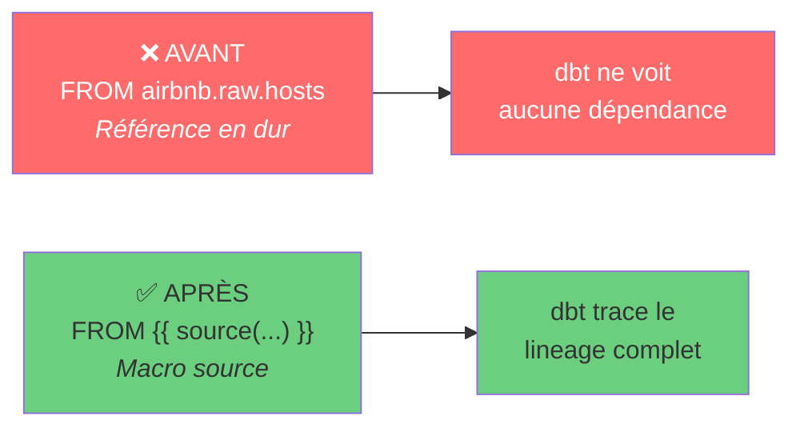
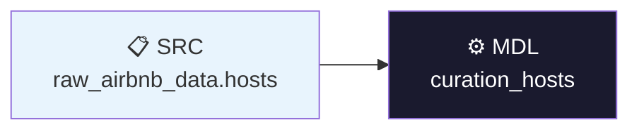
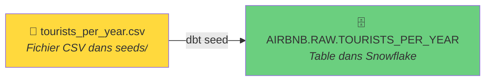
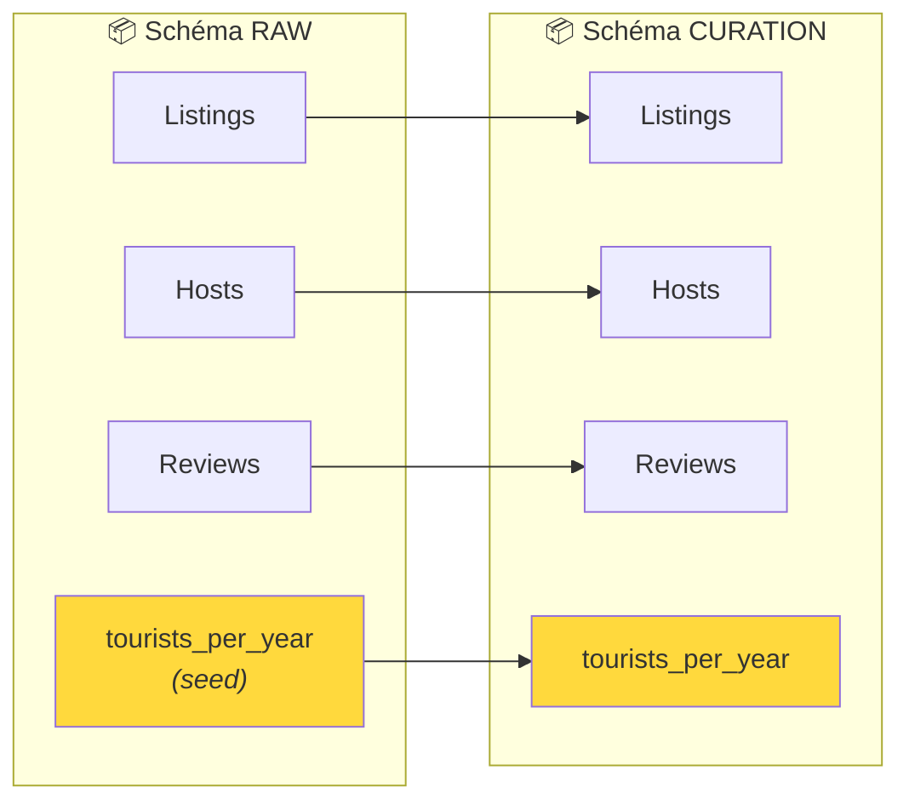
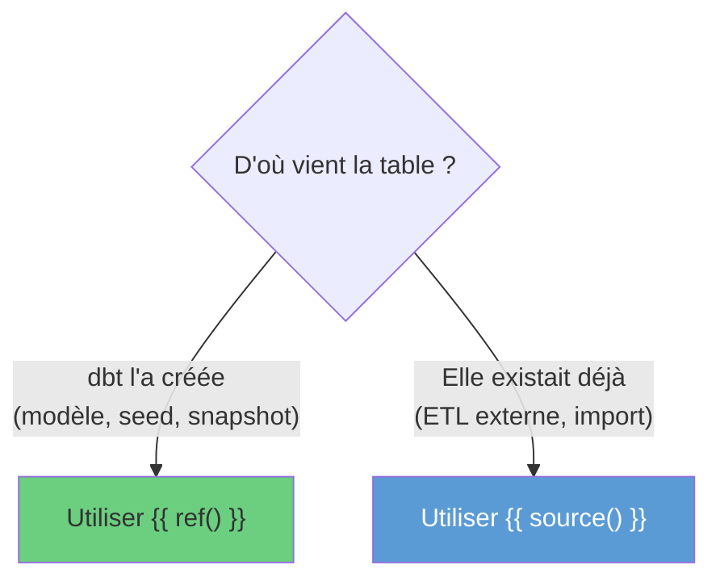
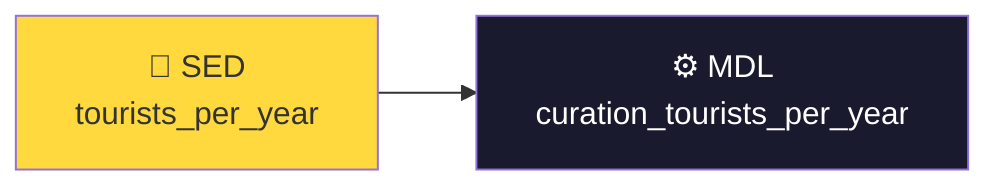
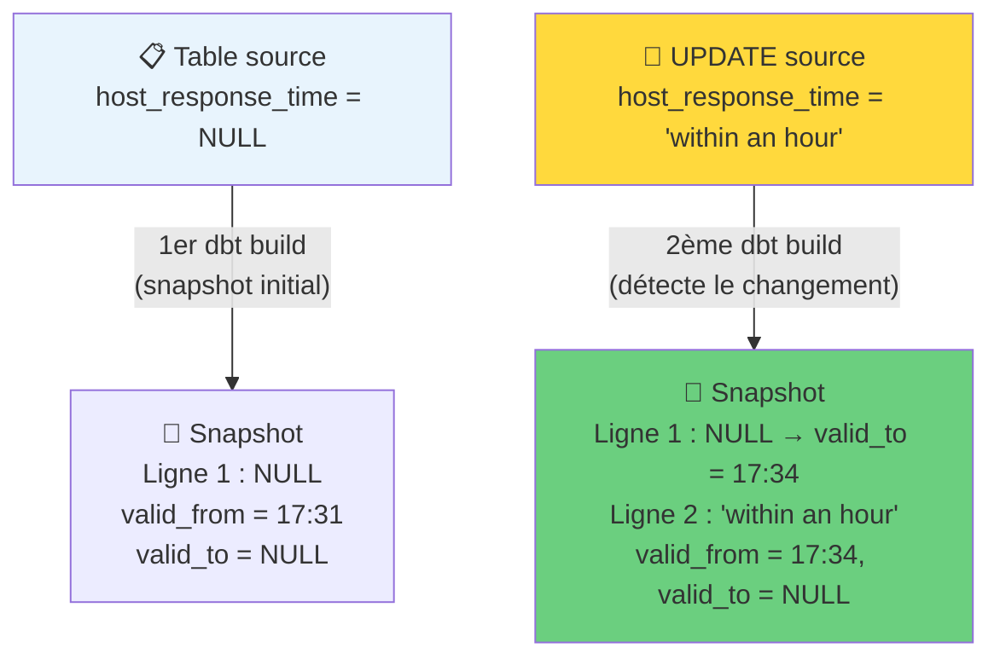
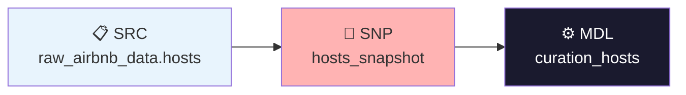
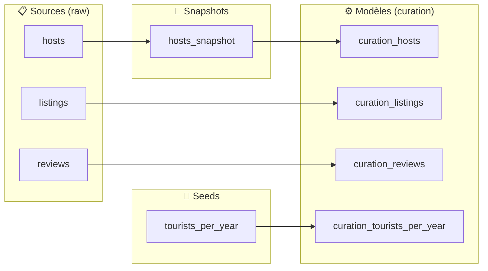

# dbt — Sources, Seeds, Snapshots et Lineage

## Chapitre 5 — Guide Pédagogique Complet

---

## Introduction

### Contexte

Jusqu'ici, vos modèles dbt fonctionnent, mais ils sont **isolés** : chaque fichier SQL contient des références directes en dur vers les tables sources (par exemple `FROM airbnb.raw.hosts`). dbt ne sait pas d'où viennent vos données, ne peut pas tracer les dépendances entre vos modèles, et ne peut pas vous montrer le **lineage** — c'est-à-dire le chemin complet que suivent vos données, de la source brute au tableau de bord final.

Ce chapitre 5 introduit les mécanismes fondamentaux qui transforment un ensemble de fichiers SQL disparates en un **pipeline de données traçable, documenté et historisé** :

- Les **sources** pour déclarer formellement d'où viennent vos données
- Les **seeds** pour intégrer de petits jeux de données ad hoc (fichiers CSV)
- Les macros **`source()`** et **`ref()`** pour tisser le graphe de dépendances
- Les **snapshots** pour conserver l'historique des changements (modélisation SCD Type 2)

Le projet utilisé est toujours l'analyse de données **Airbnb Amsterdam**, avec les tables `hosts`, `listings` et `reviews` dans le schéma `raw`, et les modèles transformés dans le dossier `curation`.

### Objectifs

À la fin de ce chapitre, vous serez capable de :

- Déclarer les sources de vos modèles dans un fichier `sources.yaml`
- Utiliser la macro `{{ source() }}` pour référencer les tables sources
- Créer et configurer une seed (fichier CSV) dans votre projet dbt
- Utiliser la macro `{{ ref() }}` pour référencer des modèles et des seeds
- Comprendre et lire le lineage (graphe de dépendances) dans dbt Cloud
- Créer un snapshot pour historiser les données au format SCD Type 2
- Tester le mécanisme SCD2 en modifiant des données sources
- Mettre à jour vos modèles pour lire depuis les snapshots

### Prérequis

- Avoir suivi les chapitres 1 à 4 (installation, premier projet, modèles SQL, matérialisations)
- Un projet dbt fonctionnel avec un dossier `models/curation/` contenant `curation_hosts.sql`, `curation_listings.sql`, `curation_reviews.sql`
- La macro `generate_schema_name.sql` dans `macros/` (chapitre 4)
- Accès à dbt Cloud et à un entrepôt Snowflake
- Notions de base en SQL et en YAML

---

## 1. Définir les Sources des Modèles

### 1.1 — Le problème : les références en dur

Regardons le modèle `curation_hosts.sql` tel qu'il existe actuellement :

```sql
WITH hosts_raw AS (
    SELECT
        host_id,
        CASE WHEN len(host_name) = 1 THEN 'Anonyme' ELSE host_name END AS host_name,
        host_since,
        host_location,
        SPLIT_PART(host_location, ',', 1) AS host_city,
        SPLIT_PART(host_location, ',', 2) AS host_country,
        TRY_CAST(REPLACE(host_response_rate, '%', '') AS INTEGER) AS response_rate,
        host_is_superhost = 't' AS is_superhost,
        host_neighbourhood,
        host_identity_verified = 't' AS is_identity_verified
    FROM airbnb.raw.hosts
)
SELECT *
FROM hosts_raw
```

Le problème est à la **ligne 13** : `FROM airbnb.raw.hosts`. Cette référence est écrite "en dur" (hardcodée). Trois conséquences négatives en découlent. Premièrement, **pas de lineage** : dbt ne sait pas que ce modèle dépend de la table `hosts`. Deuxièmement, **pas de portabilité** : si la base de données change de nom (par exemple de `airbnb` à `airbnb_prod`), il faut modifier manuellement chaque fichier. Troisièmement, **pas de documentation** : dbt ne peut pas générer de documentation automatique sur les sources.

### 1.2 — Qu'est-ce qu'une source dans dbt ?

Une **source** est une déclaration formelle dans un fichier YAML qui dit à dbt : "voici les tables brutes qui alimentent mon projet, et voici où les trouver dans la base de données."

Cette déclaration permet à dbt de tracer le lineage, de vérifier que les sources existent, et de documenter automatiquement les relations entre les données.



### 1.3 — Créer le fichier `sources.yaml`

Le fichier de déclaration des sources se place dans le même dossier que les modèles qui les utilisent. Ici : `models/curation/sources.yaml`.

**Procédure dans dbt Cloud** :

1. Créez une branche Git (exemple : `definition-sources`)
2. Faites un clic droit sur le dossier `models/curation/`
3. Cliquez sur **"Create file"**
4. Nommez le fichier `sources.yaml`
5. Collez le contenu suivant

### 1.4 — Contenu du fichier `sources.yaml`

```yaml
version: 2

sources:
  - name: raw_airbnb_data
    database: airbnb
    schema: raw
    tables:
      - name: hosts
      - name: listings
      - name: reviews
```

#### Explication ligne par ligne

**Ligne 1** — `version: 2`

Numéro de version de la syntaxe YAML utilisée par dbt. La version 2 est le standard actuel et doit toujours être présente en première ligne. C'est obligatoire dans tous les fichiers YAML de configuration dbt (sources, tests, documentation, etc.).

**Ligne 3** — `sources:`

Début de la section de déclaration des sources. C'est une liste YAML (chaque source commence par un tiret `-`).

**Ligne 4** — `- name: raw_airbnb_data`

Nom logique que vous donnez à cette source. Ce nom sera utilisé dans la macro `{{ source() }}` pour identifier la source. Il n'a pas besoin de correspondre au nom d'un objet dans la base de données : c'est un **alias** que vous choisissez librement. Ici, `raw_airbnb_data` indique clairement que ce sont les données brutes Airbnb.

**Ligne 5** — `database: airbnb`

Le nom de la **base de données** (database) dans Snowflake où se trouvent les tables sources. Dans Snowflake, la hiérarchie est `DATABASE.SCHEMA.TABLE`. Ici, la database s'appelle `airbnb`.

**Ligne 6** — `schema: raw`

Le nom du **schéma** qui contient les tables sources. Combiné avec la ligne précédente, dbt sait que les tables sont dans `airbnb.raw`.

**Ligne 7** — `tables:`

Début de la liste des tables à déclarer comme sources dans ce schéma.

**Lignes 8 à 10** — `- name: hosts`, `- name: listings`, `- name: reviews`

Chaque ligne déclare une table source. Le `name` doit correspondre **exactement** au nom de la table dans la base de données (sensible à la casse dans certaines configurations). Après cette déclaration, dbt sait que la table `airbnb.raw.hosts` existe et peut être référencée dans les modèles.

#### Pièges possibles

| Piège | Conséquence | Solution |
|-------|------------|----------|
| Oublier `version: 2` en première ligne | Erreur de compilation dbt | Toujours commencer par `version: 2` |
| Indentation incorrecte | Erreur YAML (syntaxe invalide) | Utiliser 2 espaces par niveau, jamais de tabulations |
| Nom de table incorrect (casse) | dbt ne trouve pas la source | Vérifier le nom exact dans Snowflake |
| Fichier placé au mauvais endroit | dbt ne le détecte pas | Le placer dans `models/` ou un sous-dossier |

### 1.5 — Utiliser la macro `{{ source() }}` dans les modèles

Maintenant que les sources sont déclarées, il faut modifier les modèles pour les utiliser. Dans `curation_hosts.sql`, remplacez la ligne 13 :

**AVANT** :

```sql
    FROM airbnb.raw.hosts )
```

**APRÈS** :

```sql
    FROM {{ source("raw_airbnb_data", "hosts") }} )
```

#### Anatomie de la macro `source()`

```
{{ source("raw_airbnb_data", "hosts") }}
   │         │                    │
   │         │                    └── Nom de la TABLE (doit correspondre
   │         │                        au "name" dans sources.yaml → tables)
   │         │
   │         └── Nom de la SOURCE (doit correspondre
   │             au "name" dans sources.yaml → sources)
   │
   └── Délimiteurs Jinja (expression)
```

La macro `source()` prend **deux arguments** dans cet ordre précis : le nom de la source (défini à la ligne `- name:` sous `sources:`), puis le nom de la table (défini à la ligne `- name:` sous `tables:`).

Lors de la compilation, dbt remplace `{{ source("raw_airbnb_data", "hosts") }}` par la référence complète `airbnb.raw.hosts` en se basant sur les informations du fichier `sources.yaml`.

### 1.6 — Modèle complet après modification

```sql
WITH hosts_raw AS (
    SELECT
        host_id,
        CASE WHEN len(host_name) = 1 THEN 'Anonyme' ELSE host_name END AS host_name,
        host_since,
        host_location,
        SPLIT_PART(host_location, ',', 1) AS host_city,
        SPLIT_PART(host_location, ',', 2) AS host_country,
        TRY_CAST(REPLACE(host_response_rate, '%', '') AS INTEGER) AS response_rate,
        host_is_superhost = 't' AS is_superhost,
        host_neighbourhood,
        host_identity_verified = 't' AS is_identity_verified
    FROM {{ source("raw_airbnb_data", "hosts") }}
)
SELECT *
FROM hosts_raw
```

La seule modification est à la ligne 13 : le passage de `airbnb.raw.hosts` à `{{ source("raw_airbnb_data", "hosts") }}`.

### 1.7 — Le lineage apparaît

Après cette modification, ouvrez l'onglet **"Lineage"** en bas de l'éditeur dbt Cloud. Vous verrez le graphe suivant :



Le nœud **SRC** (source) représente la table brute `hosts`. Le nœud **MDL** (model) représente votre modèle `curation_hosts`. La flèche montre la dépendance : le modèle lit depuis la source.

> **Exercice** : Faites la même modification pour `curation_listings.sql` (remplacer `FROM airbnb.raw.listings` par `FROM {{ source("raw_airbnb_data", "listings") }}`) et pour `curation_reviews.sql` (remplacer `FROM airbnb.raw.reviews` par `FROM {{ source("raw_airbnb_data", "reviews") }}`).

---

## 2. Rajouter un Dataset Adhoc avec les Seeds

### 2.1 — Qu'est-ce qu'un seed ?

Un **seed** est un fichier CSV versionné dans votre projet dbt qui est chargé directement dans la base de données sous forme de table.

Pensez-y comme un petit classeur Excel que vous transformez en table de base de données, sans avoir besoin de pipeline ETL externe. Le fichier CSV vit dans le dossier `seeds/` de votre projet et est versionné avec Git.



#### Quand utiliser un seed ?

| Cas d'usage | Exemple | Adapté ? |
|-------------|---------|----------|
| Petits jeux de données de référence | Liste de pays, codes postaux | ✅ Oui |
| Données pour analyse ad hoc | Statistiques touristiques annuelles | ✅ Oui |
| Tables de mapping / correspondance | Codes produits ↔ noms | ✅ Oui |
| Données volumineuses (> 1000 lignes) | Données transactionnelles | ❌ Non (utiliser un ETL) |
| Données fréquemment mises à jour | Flux temps réel | ❌ Non (utiliser une source) |

### 2.2 — Le dataset `tourists_per_year.csv`

Pour enrichir notre analyse Airbnb, nous allons intégrer des données sur le nombre de touristes visitant Amsterdam chaque année. Ces données proviennent de l'office statistique néerlandais (CBS) : `https://opendata.cbs.nl`.

Le fichier CSV est disponible sur le dépôt GitHub du cours :
`https://github.com/QuantikDataStudio/dbt/blob/main/dataset/tourists_per_year.csv`

Contenu du fichier :

```csv
year,tourists
2012,5738000
2013,6024000
2014,6670000
2015,6826000
2016,7270000
2017,8260000
2018,8577000
2019,9209000
2020,2959000
2021,2887000
2022,7413000
2023,8868000
```

On peut noter la chute spectaculaire en 2020-2021 (impact COVID-19) suivie d'une forte reprise.

### 2.3 — Créer le fichier seed dans dbt Cloud

1. Créez une branche Git (exemple : `seeds_visiteurs_amsterdam`)
2. Dans le **File explorer**, faites un clic droit sur le dossier `seeds/`
3. Cliquez sur **"Create file"**
4. Nommez le fichier `tourists_per_year.csv`
5. Collez le contenu CSV ci-dessus
6. Sauvegardez

Le fichier apparaît maintenant dans l'arborescence : `seeds/tourists_per_year.csv`.

### 2.4 — Configurer le seed dans `dbt_project.yml`

Pour que le seed soit chargé dans le bon schéma, ajoutez la configuration suivante à la fin de votre `dbt_project.yml` :

```yaml
seeds:
  analyse_airbnb:
    tourists_per_year:
      +enabled: true
      +database: airbnb
      +schema: raw
```

#### Explication ligne par ligne

**Ligne 1** — `seeds:`

Début de la section de configuration des seeds. Fonctionne exactement comme la section `models:` vue au chapitre 4.

**Ligne 2** — `analyse_airbnb:`

Nom du projet (doit correspondre à la valeur de `name` dans `dbt_project.yml`). Même logique que pour la configuration des modèles.

**Ligne 3** — `tourists_per_year:`

Nom du seed ciblé. Doit correspondre **exactement** au nom du fichier CSV (sans l'extension `.csv`). Ici, le fichier s'appelle `tourists_per_year.csv`, donc le nom de la configuration est `tourists_per_year`.

**Ligne 4** — `+enabled: true`

Active le chargement de ce seed. Si vous mettez `false`, dbt ignorera ce fichier CSV lors de `dbt seed`. Le `+` indique que c'est une configuration (pas un sous-dossier).

**Ligne 5** — `+database: airbnb`

Spécifie la base de données cible où la table sera créée. Sans cette ligne, dbt utiliserait la base de données par défaut de votre profil.

**Ligne 6** — `+schema: raw`

Spécifie le schéma cible. La table sera créée dans `airbnb.raw.tourists_per_year`. On la place dans le schéma `raw` car ce sont des données brutes de référence.

> **Rappel** : Si vous avez créé la macro `generate_schema_name` au chapitre 4, le schéma sera exactement `raw` (pas de préfixe). Sinon, il pourrait être concaténé avec le schéma par défaut.

### 2.5 — Exécuter et vérifier

Après avoir sauvegardé les deux fichiers, exécutez dans le terminal dbt :

```bash
dbt seed
```

Cette commande lit tous les fichiers CSV du dossier `seeds/` et les charge comme tables dans la base de données. Vous pouvez aussi utiliser `dbt build` qui inclut les seeds.

Vérification dans Snowflake : la table `AIRBNB.RAW.TOURISTS_PER_YEAR` doit apparaître avec 12 lignes et 2 colonnes (`YEAR` de type `NUMBER(38,0)` et `TOURISTS` de type `NUMBER(38,0)`).

### 2.6 — Committer les changements

Committez avec un message descriptif :

```
cree la seed tourists per year
```

Les 2 fichiers modifiés seront : `tourists_per_year.csv` [A] et `dbt_project.yml` [M].

---

## 3. La Macro `ref` : Référencer les Modèles et Seeds

### 3.1 — Le schéma de transformation du projet

Avec l'ajout du seed `tourists_per_year`, notre pipeline de données s'enrichit :



Nous devons maintenant créer un modèle `curation_tourists_per_year.sql` qui lit les données du seed et les transforme.

### 3.2 — La différence fondamentale entre `source()` et `ref()`

C'est l'un des concepts les plus importants de dbt. Confondre les deux est une erreur très courante chez les débutants.

| Critère | `{{ source() }}` | `{{ ref() }}` |
|---------|-----------------|--------------|
| **Sert à référencer** | Les tables **externes** à dbt (données brutes, non gérées par dbt) | Les objets **internes** à dbt (modèles, seeds, snapshots) |
| **Déclaration requise** | Oui, dans un fichier `sources.yaml` | Non, dbt détecte automatiquement les fichiers `.sql` et `.csv` |
| **Nombre d'arguments** | 2 : nom de la source + nom de la table | 1 : nom du modèle/seed/snapshot |
| **Syntaxe** | `{{ source("raw_airbnb_data", "hosts") }}` | `{{ ref("tourists_per_year") }}` |
| **Construit le lineage ?** | Oui (nœud SRC) | Oui (nœud MDL ou SED) |
| **Exemple d'usage** | Lire les données brutes d'un ETL externe | Lire les résultats d'un autre modèle dbt |

**Règle simple à retenir** : si dbt a créé l'objet (via un modèle `.sql`, un seed `.csv` ou un snapshot), utilisez `ref()`. Si l'objet existait déjà avant dbt (table chargée par un ETL externe), utilisez `source()`.



### 3.3 — Créer le modèle `curation_tourists_per_year.sql`

1. Créez une branche Git (exemple : `tourists_per_year_curation`)
2. Faites un clic droit sur le dossier `models/curation/`
3. Cliquez sur **"Create file"**
4. Nommez le fichier `curation_tourists_per_year` (dbt ajoute automatiquement `.sql`)
5. Collez le code suivant

### 3.4 — Code du modèle avec `{{ ref() }}`

```sql
with tourists_per_year as (
    SELECT year, tourists
    from {{ ref("tourists_per_year") }}
)
SELECT
    DATE(year || '-12-31') as year,
    tourists
from tourists_per_year
```

#### Explication ligne par ligne

**Ligne 1** — `with tourists_per_year as (`

Début d'une CTE (Common Table Expression) nommée `tourists_per_year`. Cette sous-requête temporaire va lire les données brutes du seed.

**Ligne 2** — `SELECT year, tourists`

Sélection des deux colonnes du seed : `year` (l'année) et `tourists` (le nombre de touristes).

**Ligne 3** — `from {{ ref("tourists_per_year") }}`

C'est la ligne clé. La macro `{{ ref("tourists_per_year") }}` référence le **seed** nommé `tourists_per_year`. dbt va automatiquement résoudre cette référence vers la table `airbnb.raw.tourists_per_year` (en fonction de la configuration du seed).

L'argument est le **nom du fichier** sans extension : le fichier s'appelle `tourists_per_year.csv`, donc on écrit `ref("tourists_per_year")`.

> **Point important** : `ref()` ne prend qu'**un seul argument** (contrairement à `source()` qui en prend deux). dbt sait où trouver l'objet car il gère lui-même les seeds, modèles et snapshots.

**Ligne 4** — `)`

Fin de la CTE.

**Ligne 5** — `SELECT`

Début de la requête finale qui transforme les données.

**Ligne 6** — `DATE(year || '-12-31') as year,`

Cette ligne effectue une transformation importante. Analysons-la en détail :

- `year` : la colonne contient un nombre entier (ex : `2012`)
- `||` : opérateur de **concaténation** en SQL (équivalent de `+` pour les chaînes en d'autres langages). Il assemble deux valeurs en une chaîne
- `'-12-31'` : chaîne fixe représentant le 31 décembre
- `year || '-12-31'` : produit une chaîne comme `'2012-12-31'`
- `DATE(...)` : fonction Snowflake qui convertit cette chaîne en type **DATE**
- `as year` : renomme la colonne résultante en `year`

Le résultat transforme `2012` (nombre entier) en `2012-12-31` (date). Cela permet de faire des analyses temporelles et de créer des graphiques avec un axe de dates.

**Ligne 7** — `tourists`

Sélection directe de la colonne `tourists`, sans transformation.

**Ligne 8** — `from tourists_per_year`

Lecture depuis la CTE définie plus haut.

#### Pièges possibles

| Piège | Conséquence | Solution |
|-------|------------|----------|
| Écrire `ref("tourists_per_year.csv")` | Erreur : dbt ne trouve pas le modèle | Ne jamais inclure l'extension `.csv` |
| Écrire `source("...", "tourists_per_year")` | Erreur si le seed n'est pas déclaré dans `sources.yaml` | Utiliser `ref()` pour les seeds, pas `source()` |
| Oublier les guillemets dans `ref()` | Erreur de syntaxe Jinja | Toujours écrire `ref("nom")` avec guillemets |
| Confondre `\|\|` avec `+` | `+` fait une addition numérique, pas une concaténation | Utiliser `\|\|` pour concaténer en SQL |

### 3.5 — Vérification du lineage complet

Après avoir exécuté `dbt build`, le lineage du modèle `curation_tourists_per_year` montre :



Le nœud **SED** (seed) est connecté au nœud **MDL** (model), montrant que le modèle dépend du seed.

---

## 4. Transformer les Données au Format SCD2 avec les Snapshots

### 4.1 — Le problème : les données sources changent sans laisser de trace

Dans notre table `airbnb.raw.hosts`, les données sont mises à jour en place. Si un hôte change son temps de réponse de "within a few hours" à "within an hour", l'ancienne valeur est **écrasée**. On perd l'historique.

Pour de nombreux cas d'usage analytiques, cet historique est précieux : comprendre l'évolution du comportement des hôtes, auditer les changements, analyser les tendances temporelles.

### 4.2 — Qu'est-ce que le SCD Type 2 ?

**SCD** signifie **Slowly Changing Dimension** (dimension à évolution lente). C'est un concept de data warehousing qui gère les changements dans les données de référence.

Le **Type 2** est la méthode la plus courante : au lieu d'écraser l'ancienne valeur, on **crée une nouvelle ligne** pour chaque version de l'enregistrement, avec des dates de validité.

Exemple concret avec l'hôte `host_id = 1376607` (Martin) :

**Table source brute** (une seule ligne, la dernière version) :

| host_id | host_name | host_response_time | host_response_rate |
|---------|-----------|--------------------|--------------------|
| 1376607 | Martin | within an hour | 100% |

**Table snapshot SCD2** (deux lignes, l'historique complet) :

| host_id | host_name | host_response_time | host_response_rate | dbt_valid_from | dbt_valid_to |
|---------|-----------|--------------------|--------------------|----------------|--------------|
| 1376607 | Martin | null | null | 2024-07-12 17:31 | 2024-07-12 17:34 |
| 1376607 | Martin | within an hour | 100% | 2024-07-12 17:34 | **null** |

La ligne avec `dbt_valid_to = null` est la **version courante** (encore valide). La ligne avec une date dans `dbt_valid_to` est une **version historique** (remplacée).



### 4.3 — Créer le fichier snapshot

1. Créez une branche Git (exemple : `snapshot`)
2. Faites un clic droit sur le dossier `snapshots/`
3. Cliquez sur **"Create file"**
4. Nommez le fichier `snapshot_hosts.sql`

### 4.4 — Code du snapshot `hosts_snapshot`

```sql


    {{
        config(
          target_database='airbnb',
          target_schema='snapshots',
          strategy='check',
          check_cols='all',
          unique_key='host_id'
        )
    }}

    select * from {{ source('raw_airbnb_data', 'hosts') }}


```

#### Explication ligne par ligne détaillée

**Ligne 1** — ``

```
  → Déclaration d'un bloc snapshot (instruction Jinja)
hosts_snapshot      → Nom du snapshot. Ce nom sera :
                      - le nom de la TABLE créée dans la BDD
                      - le nom à utiliser avec ref() plus tard
                      Convention : <nom_de_la_source>_snapshot
```

Les blocs `...` remplacent les blocs `` utilisés pour les macros. C'est une structure Jinja spécifique aux snapshots dbt.

**Lignes 3-11** — Bloc `{{ config(...) }}`

Le bloc `{{ config() }}` est identique dans son principe à celui utilisé dans les modèles (chapitre 4), mais avec des paramètres spécifiques aux snapshots :

**Ligne 5** — `target_database='airbnb',`

La base de données où la table snapshot sera **créée**. Notez que c'est `target_database` et non `database` : le préfixe `target_` indique que c'est la destination du snapshot (qui peut être différente de la source).

**Ligne 6** — `target_schema='snapshots',`

Le schéma de destination. Ici, un schéma dédié `snapshots` sera automatiquement créé dans Snowflake s'il n'existe pas. Cela garde les snapshots séparés des données brutes (`raw`) et des données curatées (`curation`).

**Ligne 7** — `strategy='check',`

La **stratégie de détection des changements**. C'est un paramètre crucial. La stratégie `check` compare les valeurs des colonnes entre l'exécution actuelle et la version précédente pour détecter si quelque chose a changé.

**Ligne 8** — `check_cols='all',`

Quelles colonnes comparer pour détecter les changements. Avec `'all'`, dbt compare **toutes les colonnes** de la table. Si n'importe quelle colonne a changé, une nouvelle version est créée. On peut aussi spécifier une liste de colonnes : `check_cols=['host_response_time', 'host_response_rate']`.

**Ligne 9** — `unique_key='host_id'`

La **clé primaire** de la table source. C'est le champ qui identifie de manière unique chaque enregistrement. dbt utilise cette clé pour savoir quelle ligne comparer avec quelle autre. **Sans clé primaire, le snapshot est impossible.**

> **Point critique** : la table `listings` d'Airbnb n'a pas de clé primaire clairement définie, ce qui rend la création d'un snapshot difficile voire impossible pour cette table. Le snapshot nécessite impérativement un `unique_key` fiable.

**Ligne 13** — `select * from {{ source('raw_airbnb_data', 'hosts') }}`

La requête SQL qui définit les données à capturer. Ici, on sélectionne **toutes les colonnes** de la source `hosts`. On utilise `{{ source() }}` (et non `ref()`) car `hosts` est une table externe chargée par un ETL, pas un objet dbt.

**Ligne 15** — ``

Fin du bloc snapshot. Tout ce qui est entre `` et `` constitue la définition du snapshot.

### 4.5 — Les deux stratégies de snapshot

| Critère | Stratégie `check` | Stratégie `timestamp` |
|---------|-------------------|----------------------|
| **Principe** | Compare les valeurs des colonnes | Vérifie une colonne de date de modification |
| **Configuration** | `strategy='check'` + `check_cols` | `strategy='timestamp'` + `updated_at` |
| **Détecte les changements via** | Comparaison valeur par valeur | Colonne `updated_at` plus récente |
| **Performance** | Plus lent (compare toutes les colonnes) | Plus rapide (compare une seule date) |
| **Fiabilité** | Très fiable (détecte tout changement) | Dépend de la fiabilité de la colonne `updated_at` |
| **Cas d'usage** | Quand il n'y a pas de colonne `updated_at` | Quand la source a une colonne `updated_at` fiable |

Exemple de configuration avec la stratégie `timestamp` :

```sql
{{
    config(
      strategy='timestamp',
      updated_at='last_modified_date',
      unique_key='host_id'
    )
}}
```

### 4.6 — Exécuter le snapshot et vérifier

Exécutez `dbt build` (le bouton "Build" dans dbt Cloud). dbt va créer la table `AIRBNB.SNAPSHOTS.HOSTS_SNAPSHOT` dans Snowflake.

Vérifiez dans Snowflake :

```sql
select * from AIRBNB.SNAPSHOTS.HOSTS_SNAPSHOT limit 10;
```

### 4.7 — Les colonnes de métadonnées SCD2

dbt ajoute automatiquement **4 colonnes de métadonnées** à la table snapshot :

| Colonne | Type | Description |
|---------|------|-------------|
| `DBT_SCD_ID` | VARCHAR | Identifiant unique de chaque version (hash). Chaque version d'une ligne a un `dbt_scd_id` différent. |
| `DBT_UPDATED_AT` | TIMESTAMP | Date à laquelle dbt a détecté/enregistré cette version. |
| `DBT_VALID_FROM` | TIMESTAMP | Date de début de validité de cette version. Correspond au moment où cette version est devenue la version courante. |
| `DBT_VALID_TO` | TIMESTAMP | Date de fin de validité. **`NULL` signifie que c'est la version courante** (encore valide). Une date signifie que cette version a été remplacée. |

> **Règle d'or** : pour obtenir uniquement les données les plus récentes d'un snapshot, filtrez avec `WHERE dbt_valid_to IS NULL`.

### 4.8 — Tester le mécanisme SCD2

Pour prouver que le snapshot fonctionne, nous allons modifier une ligne dans la table source, puis re-exécuter le snapshot.

**Étape 1** : Exécuter une modification dans Snowflake :

```sql
UPDATE airbnb.raw.hosts
SET host_response_time='within an hour', host_response_rate='100%'
WHERE host_id='1376607';
```

#### Explication de la requête UPDATE

**`UPDATE airbnb.raw.hosts`** : indique quelle table modifier. On modifie directement la table source brute.

**`SET host_response_time='within an hour', host_response_rate='100%'`** : définit les nouvelles valeurs. On met à jour deux colonnes simultanément pour l'hôte ciblé : son temps de réponse et son taux de réponse.

**`WHERE host_id='1376607'`** : la clause WHERE cible uniquement l'hôte Martin (host_id 1376607). Sans cette clause, TOUTES les lignes seraient modifiées (erreur catastrophique).

> **Attention** : cette requête modifie directement les données de production. En situation réelle, ce type de modification est fait par l'application source, pas manuellement. Ici, c'est un test pédagogique.

**Étape 2** : Re-exécuter `dbt build` dans dbt Cloud.

**Étape 3** : Vérifier dans Snowflake :

```sql
select * from AIRBNB.SNAPSHOTS.HOSTS_SNAPSHOT
where host_id = '1376607';
```

Vous verrez maintenant **2 lignes** pour le même `host_id` :

- **Ligne 1** (version historique) : les anciennes valeurs, avec `dbt_valid_to` contenant une date (elle n'est plus valide)
- **Ligne 2** (version courante) : les nouvelles valeurs (`within an hour`, `100%`), avec `dbt_valid_to = NULL`

C'est le SCD Type 2 en action : l'historique est préservé.

---

## 5. Utiliser les Snapshots dans les Modèles

### 5.1 — Pourquoi lire depuis le snapshot ?

Un étudiant du cours a posé une excellente question : "pourquoi utiliser le snapshot au lieu de la source brute directement ?"

La réponse est claire : les snapshots organisent les données au format SCD2. On peut donc facilement identifier quelle version d'une ligne est la plus récente grâce à la colonne `dbt_valid_to`. Les données sources brutes, elles, ne conservent pas cet historique.

En pratique, une fois les snapshots en place, vos modèles de curation doivent être **mis à jour** pour lire depuis les snapshots au lieu des sources brutes.

### 5.2 — Modifier `curation_hosts.sql`

**AVANT** (lecture depuis la source brute) :

```sql
    FROM {{ source("raw_airbnb_data", "hosts") }}
```

**APRÈS** (lecture depuis le snapshot) :

```sql
    FROM {{ ref('hosts_snapshot') }}
    WHERE dbt_valid_to IS NULL
```

Deux changements importants ici. Premièrement, `source()` est remplacé par `ref()`, car le snapshot est un objet géré par dbt (pas une source externe). Deuxièmement, le filtre `WHERE dbt_valid_to IS NULL` ne conserve que les **lignes courantes** (la dernière version de chaque hôte). Sans ce filtre, vous obtiendriez toutes les versions historiques, ce qui doublerait/triplerait le nombre de lignes.

### 5.3 — Le lineage mis à jour

Après cette modification, le lineage évolue pour montrer la chaîne complète :



La source alimente le snapshot, qui alimente le modèle. Trois niveaux, une traçabilité complète.

### 5.4 — Contrainte : les snapshots nécessitent une clé primaire

Le document du cours contient une note importante : **la table `listings` n'a pas de clé primaire, donc on ne peut pas créer de snapshot pour cette table**.

Un snapshot a besoin d'un `unique_key` pour identifier chaque ligne de manière unique et comparer les versions successives. Sans clé primaire, dbt ne sait pas quelle ligne "avant" correspond à quelle ligne "après".

Si vous essayez de créer un snapshot pour `listings` avec `unique_key='id'` mais que la colonne `id` n'est pas véritablement unique ou n'existe pas, le snapshot produira des résultats incohérents.

> **Bonne pratique** : avant de créer un snapshot, vérifiez toujours que la colonne `unique_key` est réellement unique dans la table source avec : `SELECT unique_key, COUNT(*) FROM table GROUP BY unique_key HAVING COUNT(*) > 1`. Si le résultat retourne des lignes, cette colonne n'est pas une bonne clé.

---

## 6. Le Lineage Complet du Projet

### 6.1 — Vue d'ensemble

À ce stade, le lineage complet de notre projet Airbnb ressemble à ceci :



### 6.2 — Lire le lineage dans dbt Cloud

Dans l'onglet **Lineage** de dbt Cloud, chaque nœud a une icône et un label :

| Icône | Label | Signification |
|-------|-------|---------------|
| 📋 SRC | Source | Table externe déclarée dans `sources.yaml` |
| ⚙️ MDL | Model | Modèle SQL dans `models/` |
| 🌱 SED | Seed | Fichier CSV dans `seeds/` |
| 📸 SNP | Snapshot | Snapshot dans `snapshots/` |

---

## 7. Méthodologie Générale

### Étape 1 : déclarer les sources

Pour chaque table brute que votre projet consomme, créez un fichier `sources.yaml` dans le dossier des modèles concernés. Listez toutes les tables avec leur database et schema.

### Étape 2 : remplacer les références en dur

Dans tous vos modèles, remplacez les références en dur (`database.schema.table`) par `{{ source("nom_source", "nom_table") }}`.

### Étape 3 : ajouter les seeds si nécessaire

Pour les petits datasets de référence (< 1000 lignes, mise à jour rare), créez des fichiers CSV dans `seeds/` et configurez-les dans `dbt_project.yml`.

### Étape 4 : créer les snapshots pour les tables nécessitant un historique

Pour chaque table source qui change dans le temps et qui possède une clé primaire, créez un fichier de snapshot dans `snapshots/`.

### Étape 5 : utiliser `ref()` partout en interne

Tous les modèles qui consomment des seeds, d'autres modèles ou des snapshots doivent utiliser `{{ ref() }}`, jamais de références en dur.

### Étape 6 : mettre à jour les modèles pour lire depuis les snapshots

Remplacez les `{{ source() }}` par `{{ ref('snapshot_name') }}` et ajoutez `WHERE dbt_valid_to IS NULL` pour ne garder que les données courantes.

---

## 8. Tableaux Pratiques

### Erreurs fréquentes et solutions

| Erreur | Cause probable | Solution |
|--------|---------------|----------|
| `Source raw_airbnb_data not found` | Fichier `sources.yaml` absent ou mal placé | Vérifier que le fichier est dans `models/` ou un sous-dossier |
| `Model tourists_per_year not found` | Utilisation de `ref()` mais le seed n'existe pas | Vérifier que le CSV est dans `seeds/` et que `dbt seed` a été exécuté |
| `Compilation Error in snapshot` | Syntaxe incorrecte du bloc `` | Vérifier les balises `` et `` |
| Le snapshot crée des doublons | `unique_key` non unique dans la source | Vérifier l'unicité de la colonne avec une requête GROUP BY |
| Le lineage n'apparaît pas | Référence en dur au lieu de `source()` ou `ref()` | Remplacer toutes les références en dur |
| `Schema 'snapshots' does not exist` | Normal : dbt le crée automatiquement au premier `build` | Exécuter `dbt build` une première fois |
| Le seed ne se charge pas | `+enabled: false` ou nom incorrect dans `dbt_project.yml` | Vérifier la config et le nom du fichier (sans `.csv`) |

### Bonnes pratiques

| Pratique | Pourquoi |
|----------|----------|
| Toujours déclarer les sources dans `sources.yaml` | Active le lineage et la documentation automatique |
| Ne jamais écrire de références en dur dans les modèles | Portabilité et maintenabilité du projet |
| Nommer les snapshots avec le suffixe `_snapshot` | Clarté de l'arborescence et des références |
| Toujours ajouter `WHERE dbt_valid_to IS NULL` quand on lit un snapshot | Évite les doublons (versions historiques) |
| Vérifier l'unicité du `unique_key` avant de créer un snapshot | Évite les données incohérentes |
| Utiliser `dbt seed` uniquement pour les petits datasets | Les gros volumes doivent passer par un ETL dédié |
| Committer chaque fonctionnalité dans une branche dédiée | Isolation des changements et rollback facile |

### Commandes utiles

| Commande | Description |
|----------|-------------|
| `dbt seed` | Charge tous les fichiers CSV du dossier `seeds/` en tables |
| `dbt build` | Exécute seeds + modèles + tests + snapshots (tout-en-un) |
| `dbt snapshot` | Exécute uniquement les snapshots |
| `dbt build --select curation_hosts` | Exécute un modèle spécifique |
| `dbt build --select +curation_hosts` | Exécute un modèle et tous ses ancêtres (dont le snapshot) |
| `dbt compile` | Compile le SQL sans l'exécuter (utile pour vérifier les `source()` et `ref()`) |
| `dbt ls --resource-type source` | Liste toutes les sources déclarées |
| `dbt ls --resource-type snapshot` | Liste tous les snapshots déclarés |

---

## 9. Exercices Pratiques

### Exercice 1 — Compléter les sources dans les modèles

**Objectif** : remplacer toutes les références en dur restantes par `{{ source() }}`.

**Consigne** :

1. Ouvrez `curation_listings.sql`
2. Identifiez la référence en dur vers `airbnb.raw.listings`
3. Remplacez-la par `{{ source("raw_airbnb_data", "listings") }}`
4. Faites de même pour `curation_reviews.sql` avec `{{ source("raw_airbnb_data", "reviews") }}`
5. Exécutez `dbt build` et vérifiez le lineage

**Résultat attendu** : les 3 modèles de curation ont chacun une flèche depuis leur source dans le graphe de lineage.

### Exercice 2 — Créer un nouveau seed et son modèle de curation

**Objectif** : pratiquer le cycle complet seed → modèle avec `ref()`.

**Consigne** :

1. Créez un fichier `seeds/exchange_rates.csv` avec le contenu suivant :
   ```csv
   year,eur_to_usd
   2020,1.14
   2021,1.18
   2022,1.05
   2023,1.08
   ```
2. Configurez le seed dans `dbt_project.yml` (database: airbnb, schema: raw)
3. Exécutez `dbt seed`
4. Créez un modèle `models/curation/curation_exchange_rates.sql` qui lit ce seed avec `{{ ref("exchange_rates") }}` et transforme la colonne `year` en date (comme pour `tourists_per_year`)
5. Exécutez `dbt build` et vérifiez dans Snowflake

### Exercice 3 — Créer le snapshot `reviews_snapshot`

**Objectif** : pratiquer la création d'un snapshot.

**Consigne** :

1. Vérifiez d'abord que la table `airbnb.raw.reviews` possède une colonne qui peut servir de clé unique (par exemple `review_id` ou `id`)
2. Créez le fichier `snapshots/snapshot_reviews.sql` avec la structure suivante :
   ```sql
   
       {{
           config(
             target_database='airbnb',
             target_schema='snapshots',
             strategy='check',
             check_cols='all',
             unique_key='...'  -- Remplacez par la bonne colonne
           )
       }}
       select * from {{ source('raw_airbnb_data', 'reviews') }}
   
   ```
3. Exécutez `dbt build`
4. Vérifiez dans Snowflake que la table `AIRBNB.SNAPSHOTS.REVIEWS_SNAPSHOT` existe

### Exercice 4 — Mettre à jour un modèle pour lire depuis un snapshot

**Objectif** : pratiquer la migration source → snapshot.

**Consigne** :

1. Modifiez `curation_hosts.sql` pour lire depuis `{{ ref('hosts_snapshot') }}` au lieu de `{{ source("raw_airbnb_data", "hosts") }}`
2. Ajoutez la condition `WHERE dbt_valid_to IS NULL` pour ne garder que les versions courantes
3. Exécutez `dbt build`
4. Vérifiez que le lineage montre la chaîne : source → snapshot → modèle
5. Vérifiez dans Snowflake que le nombre de lignes dans `curation_hosts` est identique à avant la modification

### Exercice 5 — Tester le SCD2 de bout en bout

**Objectif** : valider que le mécanisme SCD2 fonctionne.

**Consigne** :

1. Dans Snowflake, notez les valeurs actuelles pour `host_id = '1451657'` :
   ```sql
   select * from airbnb.raw.hosts where host_id = '1451657';
   ```
2. Modifiez les données :
   ```sql
   UPDATE airbnb.raw.hosts
   SET host_response_time='within a day'
   WHERE host_id='1451657';
   ```
3. Re-exécutez `dbt build` dans dbt Cloud
4. Vérifiez le snapshot :
   ```sql
   select host_id, host_response_time, dbt_valid_from, dbt_valid_to
   from AIRBNB.SNAPSHOTS.HOSTS_SNAPSHOT
   where host_id = '1451657'
   order by dbt_valid_from;
   ```
5. Combien de lignes voyez-vous ? Laquelle est la version courante ?

---

## 10. Section Drill — Entraînement Rapide

Répondez de mémoire avant de vérifier les réponses.

**Q1** : Quelle macro utilise-t-on pour référencer une table source brute (non gérée par dbt) ?

<details>
<summary>Réponse</summary>

`{{ source("nom_source", "nom_table") }}` — avec **deux** arguments.

</details>

**Q2** : Quelle macro utilise-t-on pour référencer un modèle, un seed ou un snapshot ?

<details>
<summary>Réponse</summary>

`{{ ref("nom_objet") }}` — avec **un seul** argument.

</details>

**Q3** : Dans quel dossier place-t-on le fichier `sources.yaml` ?

<details>
<summary>Réponse</summary>

Dans le dossier `models/` ou un de ses sous-dossiers (ex : `models/curation/sources.yaml`).

</details>

**Q4** : Quelle commande charge les fichiers CSV en tables dans la base de données ?

<details>
<summary>Réponse</summary>

`dbt seed` (ou `dbt build` qui inclut les seeds).

</details>

**Q5** : Que signifie `dbt_valid_to IS NULL` dans une table snapshot ?

<details>
<summary>Réponse</summary>

La ligne est la **version courante** (encore valide). Elle n'a pas été remplacée par une version plus récente.

</details>

**Q6** : Quelle est la différence entre `strategy='check'` et `strategy='timestamp'` dans un snapshot ?

<details>
<summary>Réponse</summary>

`check` compare les valeurs de toutes les colonnes spécifiées pour détecter les changements. `timestamp` compare une colonne de date de dernière modification. `check` est plus fiable mais plus lent.

</details>

**Q7** : Pourquoi ne peut-on pas créer de snapshot pour une table sans clé primaire ?

<details>
<summary>Réponse</summary>

Le snapshot a besoin d'un `unique_key` pour identifier chaque ligne et comparer les versions successives. Sans clé primaire, dbt ne sait pas quelle ligne "avant" correspond à quelle ligne "après".

</details>

**Q8** : Que produit l'expression SQL `2012 || '-12-31'` ?

<details>
<summary>Réponse</summary>

La chaîne `'2012-12-31'`. L'opérateur `||` concatène les deux valeurs.

</details>

**Q9** : Quelle est la première ligne obligatoire dans un fichier `sources.yaml` ?

<details>
<summary>Réponse</summary>

`version: 2` — c'est la version de la syntaxe YAML de dbt.

</details>

**Q10** : Si un seed s'appelle `tourists_per_year.csv`, comment l'écrire dans `{{ ref() }}` ?

<details>
<summary>Réponse</summary>

`{{ ref("tourists_per_year") }}` — **sans l'extension `.csv`**.

</details>

**Q11** : Combien de colonnes de métadonnées dbt ajoute-t-il automatiquement à une table snapshot ?

<details>
<summary>Réponse</summary>

**4 colonnes** : `dbt_scd_id`, `dbt_updated_at`, `dbt_valid_from`, `dbt_valid_to`.

</details>

**Q12** : Que faut-il ajouter au `WHERE` quand on lit depuis un snapshot dans un modèle ?

<details>
<summary>Réponse</summary>

`WHERE dbt_valid_to IS NULL` pour ne garder que les lignes de la version courante.

</details>

---

## 11. Ancrage Mémoriel

### 12 points clés à retenir

1. **Les sources se déclarent dans `sources.yaml`** avec `version: 2`, `sources:`, `database:`, `schema:`, `tables:`
2. **`source()` prend 2 arguments** : nom de la source + nom de la table
3. **`ref()` prend 1 argument** : nom du modèle, seed ou snapshot
4. **`source()` = tables externes**, **`ref()` = objets dbt internes**
5. **Un seed est un fichier CSV** dans le dossier `seeds/`, chargé via `dbt seed`
6. **Les seeds sont pour les petits datasets** de référence (< 1000 lignes)
7. **Un snapshot capture l'historique** des changements au format SCD Type 2
8. **Le snapshot nécessite un `unique_key`** (clé primaire dans la source)
9. **`dbt_valid_to IS NULL`** identifie la version courante dans un snapshot
10. **4 colonnes de métadonnées** sont ajoutées automatiquement aux snapshots
11. **Le lineage est le graphe de dépendances** entre sources, seeds, snapshots et modèles
12. **Ne jamais écrire de références en dur** dans les modèles — toujours `source()` ou `ref()`

### Résumé synthétique

Ce chapitre introduit les mécanismes de traçabilité et d'historisation de dbt. Les **sources** permettent de déclarer formellement les tables brutes dans un fichier YAML, activant le lineage. La macro **`source()`** référence ces tables externes, tandis que **`ref()`** référence les objets internes (modèles, seeds, snapshots). Les **seeds** sont de petits fichiers CSV versionnés dans le projet, idéaux pour les données de référence. Les **snapshots** capturent l'historique des changements au format SCD Type 2, en ajoutant des colonnes de validité (`dbt_valid_from`, `dbt_valid_to`). Ensemble, ces mécanismes transforment un ensemble de fichiers SQL isolés en un pipeline de données documenté, traçable et historisé.

### Flashcards de révision

| Recto (Question) | Verso (Réponse) |
|-------------------|-----------------|
| Macro pour référencer une table source brute ? | `{{ source("nom_source", "nom_table") }}` |
| Macro pour référencer un modèle, seed ou snapshot ? | `{{ ref("nom_objet") }}` |
| Nombre d'arguments de `source()` ? | 2 (nom source + nom table) |
| Nombre d'arguments de `ref()` ? | 1 (nom de l'objet) |
| Fichier de déclaration des sources ? | `sources.yaml` dans `models/` |
| Première ligne obligatoire de `sources.yaml` ? | `version: 2` |
| Commande pour charger les seeds ? | `dbt seed` |
| Dossier des fichiers CSV seeds ? | `seeds/` |
| Dossier des fichiers snapshot ? | `snapshots/` |
| Colonne snapshot pour identifier la version courante ? | `dbt_valid_to IS NULL` |
| Paramètre obligatoire du snapshot ? | `unique_key` (clé primaire) |
| 4 colonnes de métadonnées snapshot ? | `dbt_scd_id`, `dbt_updated_at`, `dbt_valid_from`, `dbt_valid_to` |
| Stratégie snapshot qui compare les valeurs ? | `strategy='check'` |
| Stratégie snapshot qui compare une date ? | `strategy='timestamp'` |
| SCD Type 2 signifie ? | Slowly Changing Dimension Type 2 (historisation par ajout de ligne) |
| Opérateur de concaténation SQL ? | `\|\|` (double pipe) |
| Quand utiliser un seed ? | Petits datasets de référence (< 1000 lignes) |
| Pourquoi `listings` ne peut pas avoir de snapshot ? | Pas de clé primaire fiable |

---

## Annexes

### A. Glossaire

| Terme | Définition |
|-------|------------|
| **Source** | Déclaration formelle d'une table brute externe dans un fichier YAML, permettant à dbt de la référencer et de tracer le lineage. |
| **Seed** | Fichier CSV versionné dans le projet dbt, chargé comme table dans la base de données via `dbt seed`. |
| **Snapshot** | Mécanisme dbt qui capture l'état des données à intervalles réguliers et conserve l'historique au format SCD2. |
| **Lineage** | Graphe de dépendances montrant le chemin complet des données, de la source brute au modèle final. |
| **SCD Type 2** | Slowly Changing Dimension Type 2. Technique de modélisation qui crée une nouvelle ligne à chaque modification, avec des dates de validité (valid_from, valid_to). |
| **`source()`** | Macro Jinja dbt pour référencer une table source externe (déclarée dans sources.yaml). Prend 2 arguments. |
| **`ref()`** | Macro Jinja dbt pour référencer un objet interne (modèle, seed, snapshot). Prend 1 argument. |
| **`unique_key`** | Colonne identifiant de manière unique chaque ligne dans la table source. Obligatoire pour les snapshots. |
| **`dbt_valid_from`** | Colonne ajoutée par dbt aux snapshots, indiquant la date de début de validité d'une version. |
| **`dbt_valid_to`** | Colonne ajoutée par dbt aux snapshots, indiquant la date de fin de validité. NULL = version courante. |
| **`dbt_scd_id`** | Identifiant unique (hash) de chaque version d'une ligne dans un snapshot. |
| **Stratégie `check`** | Stratégie de snapshot qui compare les valeurs des colonnes pour détecter les changements. |
| **Stratégie `timestamp`** | Stratégie de snapshot qui utilise une colonne de date de modification pour détecter les changements. |
| **CTE** | Common Table Expression. Sous-requête nommée avec `WITH ... AS (...)`. |
| **`\|\|`** | Opérateur de concaténation SQL. Assemble deux valeurs en une chaîne de caractères. |

### B. Arborescence finale du projet

```
dbt-cloud-projet-dbt/
├── analyses/
├── macros/
│   ├── .gitkeep
│   └── generate_schema_name.sql
├── models/
│   └── curation/
│       ├── curation_hosts.sql
│       ├── curation_listings.sql
│       ├── curation_reviews.sql
│       ├── curation_tourists_per_year.sql   ← NOUVEAU
│       └── sources.yaml                     ← NOUVEAU
├── seeds/
│   ├── .gitkeep
│   └── tourists_per_year.csv                ← NOUVEAU
├── snapshots/
│   ├── .gitkeep
│   ├── snapshot_hosts.sql                   ← NOUVEAU
│   └── snapshot_listings.sql                ← NOUVEAU
├── tests/
├── .gitignore
├── README.md
└── dbt_project.yml                          ← MODIFIÉ (ajout seeds config)
```

### C. Fichier `dbt_project.yml` complet (sections pertinentes)

```yaml
# ... (en-tête du projet inchangé)

models:
  analyse_airbnb:
    # Applies to all files under models/curation/
    curation:
      +materialized: table
      +schema: curation

seeds:
  analyse_airbnb:
    tourists_per_year:
      +enabled: true
      +database: airbnb
      +schema: raw
```

### D. Liens et ressources

| Ressource | URL |
|-----------|-----|
| Données touristiques Amsterdam (CBS) | `https://opendata.cbs.nl/#/CBS/en/dataset/82061ENG/table` |
| Dataset CSV sur GitHub | `https://github.com/QuantikDataStudio/dbt/blob/main/dataset/tourists_per_year.csv` |
| Documentation dbt — Sources | `https://docs.getdbt.com/docs/build/sources` |
| Documentation dbt — Seeds | `https://docs.getdbt.com/docs/build/seeds` |
| Documentation dbt — Snapshots | `https://docs.getdbt.com/docs/build/snapshots` |
| Documentation dbt — ref() | `https://docs.getdbt.com/reference/dbt-jinja-functions/ref` |
| Documentation dbt — source() | `https://docs.getdbt.com/reference/dbt-jinja-functions/source` |
| Documentation dbt — Configuring models | `https://docs.getdbt.com/docs/configuring-models` |
