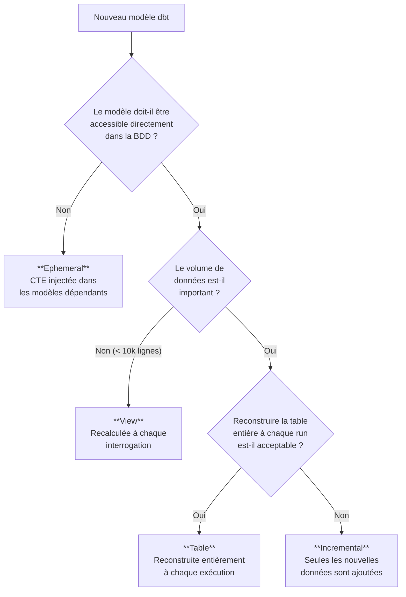
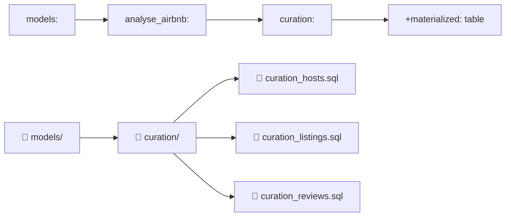
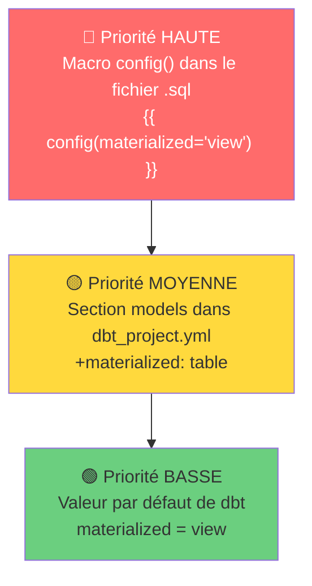
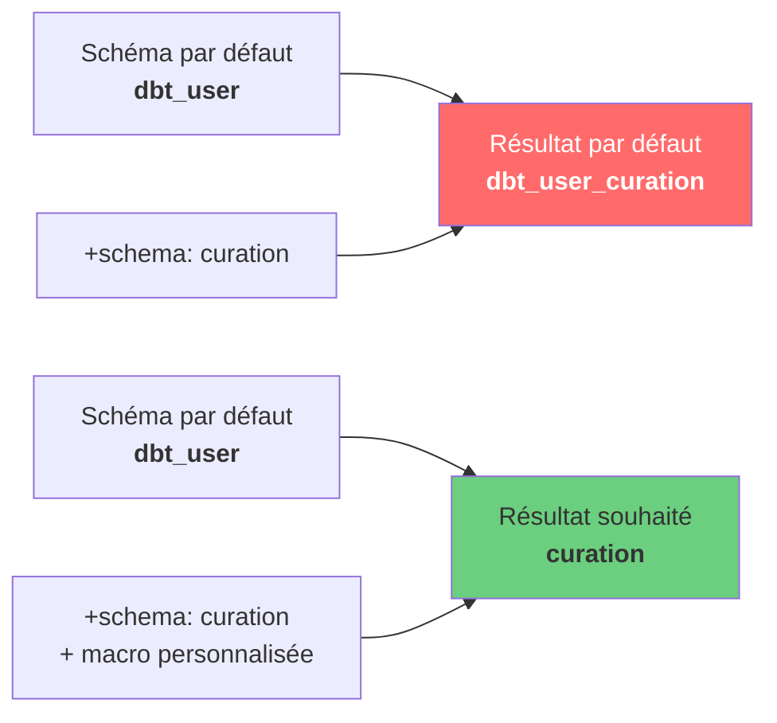

# dbt — Les Matérialisations et Configurations de Modèles

## Chapitre 4 — Guide Pédagogique Complet

---

## Introduction

### Contexte

Dans un projet dbt (Data Build Tool), chaque modèle SQL que vous écrivez est transformé en un **objet** dans votre base de données. Mais quel type d'objet ? Une vue ? Une table ? Quelque chose de temporaire ? C'est exactement ce que contrôle la **matérialisation**.

Ce chapitre est le 4ᵉ d'une série sur dbt. Il se concentre sur un concept fondamental : **comment dbt transforme vos fichiers SQL en objets concrets dans votre entrepôt de données** (ici Snowflake), et comment vous pouvez contrôler ce comportement à différents niveaux.

Le projet utilisé tout au long de ce chapitre est un projet d'analyse de données **Airbnb**, avec des modèles de transformation dans un dossier `curation`.

### Objectifs

À la fin de ce chapitre, vous serez capable de :

- Comprendre et différencier les 4 types de matérialisation dbt (view, table, incremental, ephemeral)
- Configurer la matérialisation au niveau du projet via `dbt_project.yml`
- Surcharger la matérialisation au niveau d'un modèle individuel via `{{ config() }}`
- Modifier le schéma de destination des tables avec une macro personnalisée
- Créer votre première macro dbt avec la syntaxe Jinja

### Prérequis

- Avoir suivi les chapitres 1 à 3 (installation dbt, premier projet, modèles SQL)
- Un projet dbt fonctionnel avec au moins un dossier `models/curation/` contenant des fichiers SQL
- Accès à dbt Cloud (ou dbt Core en local)
- Accès à un entrepôt Snowflake (ou autre base supportée)
- Notions de base en SQL (SELECT, FROM, WHERE, CTE)

---

## 1. Les Différentes Matérialisations dans dbt

### 1.1 — Qu'est-ce qu'une matérialisation ?

Une **matérialisation** définit **comment** dbt va traduire votre fichier SQL en objet dans la base de données.

Imaginez que vous écrivez une recette (votre fichier `.sql`). La matérialisation, c'est le **mode de cuisson** : vous pouvez servir le plat frais à chaque demande (view), le préparer à l'avance et le stocker au frigo (table), ne rajouter que les nouveaux ingrédients (incremental), ou simplement noter la recette pour l'intégrer dans un autre plat (ephemeral).

Concrètement, quand vous lancez `dbt build` ou `dbt run`, dbt prend chaque fichier `.sql` de votre projet et génère du code SQL adapté selon la matérialisation choisie. Par exemple :

- En mode **view** → dbt exécute `CREATE VIEW AS ...`
- En mode **table** → dbt exécute `CREATE TABLE AS ...`

### 1.2 — View (vue)

La **view** est la matérialisation **par défaut** dans dbt.

**Ce que fait dbt** : il crée (ou remplace) une **vue SQL** dans votre base de données. Une vue ne stocke pas les données : elle exécute la requête SQL à chaque fois qu'on l'interroge.

**Caractéristiques** :

- Espace de stockage minimal (la vue ne stocke que la définition de la requête)
- Les données sont recalculées à chaque interrogation
- Temps de réponse variable selon la complexité de la requête

**Quand l'utiliser** :

- Le volume de données traité est faible
- L'accès aux données n'est pas fréquent
- Vous voulez toujours voir les données les plus récentes
- En phase de développement / prototypage

**Exemple SQL généré par dbt** :

```sql
CREATE OR REPLACE VIEW schema.mon_modele AS (
    SELECT colonne1, colonne2
    FROM source
    WHERE condition = true
);
```

### 1.3 — Table

La matérialisation **table** crée une **table physique** dans la base de données.

**Ce que fait dbt** : il supprime la table existante, puis crée une nouvelle table contenant toutes les données résultant de votre requête SQL.

**Caractéristiques** :

- Stocke physiquement toutes les données (occupe de l'espace disque)
- Temps de réponse rapide (les données sont pré-calculées)
- Les données sont "gelées" au moment du dernier `dbt run`
- La table est entièrement reconstruite à chaque exécution

**Quand l'utiliser** :

- Le volume de données est important
- Vous avez besoin de réponses rapides de la base de données
- Les données sont consommées fréquemment (dashboards, rapports)
- La requête sous-jacente est lourde ou complexe

**Exemple SQL généré par dbt** :

```sql
CREATE OR REPLACE TABLE schema.mon_modele AS (
    SELECT colonne1, colonne2
    FROM source
    WHERE condition = true
);
```

### 1.4 — Incremental

La matérialisation **incremental** est une version optimisée de la table.

**Ce que fait dbt** : lors de la première exécution, il crée une table complète (comme `table`). Lors des exécutions suivantes, il n'insère que les **nouvelles lignes** ou les **lignes modifiées**.

**Caractéristiques** :

- Crée une table physique dans la base de données
- Ne recharge que les données nouvelles/modifiées après la première exécution
- Réduit considérablement le temps de traitement sur de gros volumes
- Nécessite une logique pour identifier les "nouvelles" données (colonne de date, ID, etc.)

**Quand l'utiliser** :

- Le volume de données est très important
- Vous voulez accélérer le temps de chargement
- Vos données ont une notion de "nouveauté" (date de création, ID incrémental)
- Reconstruire la table entière à chaque fois serait trop long ou coûteux

> **Note** : La matérialisation incremental est un sujet avancé qui sera traité en détail dans un chapitre ultérieur. Nous nous concentrons ici sur `view` et `table`.

### 1.5 — Ephemeral

La matérialisation **ephemeral** ne crée **aucun objet** dans la base de données.

**Ce que fait dbt** : il transforme votre modèle en **CTE** (Common Table Expression) qui est injectée dans les modèles qui y font référence.

**Caractéristiques** :

- Aucun objet créé dans la base de données (pas de vue, pas de table)
- Le code SQL est "copié-collé" comme CTE dans les modèles dépendants
- Impossible de requêter directement le modèle depuis la base
- Utile pour factoriser du code SQL réutilisé dans plusieurs modèles

**Quand l'utiliser** :

- Vous voulez réutiliser le même code SQL dans plusieurs autres modèles
- Le modèle n'a pas besoin d'être accessible directement
- Vous voulez éviter de créer trop d'objets dans votre base de données

**Ce qui se passe concrètement** :

```sql
-- Votre modèle ephemeral "calcul_intermediaire.sql"
SELECT id, montant * 1.2 AS montant_ttc FROM ventes

-- Un autre modèle qui référence le modèle ephemeral
-- dbt génère automatiquement :
WITH calcul_intermediaire AS (
    SELECT id, montant * 1.2 AS montant_ttc FROM ventes
)
SELECT * FROM calcul_intermediaire WHERE montant_ttc > 100
```

### 1.6 — Tableau comparatif des 4 matérialisations

| Critère | View | Table | Incremental | Ephemeral |
|---------|------|-------|-------------|-----------|
| **Objet créé dans la BDD** | Vue | Table | Table | Aucun (CTE) |
| **Stockage de données** | Non (requête à la volée) | Oui (toutes les données) | Oui (toutes les données) | Non |
| **Vitesse de lecture** | Lente (recalcul) | Rapide (pré-calculé) | Rapide (pré-calculé) | N/A |
| **Vitesse d'écriture (dbt run)** | Rapide | Moyenne | Rapide (après 1ère exécution) | Instantané |
| **Données toujours à jour** | Oui | Non (snapshot) | Partiellement | Oui |
| **Cas d'usage typique** | Dev, petits volumes | Dashboards, gros volumes | Très gros volumes | Code réutilisable |
| **Matérialisation par défaut** | ✅ Oui | Non | Non | Non |

### 1.7 — Arbre de décision : quelle matérialisation choisir ?



---

## 2. Configurer la Matérialisation au Niveau du Projet

### 2.1 — Le fichier `dbt_project.yml`

Le fichier `dbt_project.yml` est le **fichier de configuration principal** de tout projet dbt. Il se trouve à la racine du projet et définit les paramètres globaux : nom du projet, chemins des dossiers, profil de connexion et configuration des modèles.

C'est dans ce fichier que vous pouvez appliquer une matérialisation à **tous les modèles d'un dossier** en une seule ligne.

### 2.2 — Structure complète du fichier `dbt_project.yml`

Voici le fichier `dbt_project.yml` de notre projet Airbnb :

```yaml
# Ligne 1 : vide
# Ligne 2 à 4 : commentaires expliquant les conventions de nommage

# Nom du projet dbt. Doit contenir uniquement des minuscules et underscores.
name: 'my_new_project'

# Version du projet (format sémantique)
version: '1.0.0'

# Version de la syntaxe de configuration dbt (toujours 2 pour les projets récents)
config-version: 2

# Profil de connexion à utiliser (défini dans profiles.yml)
profile: 'default'

# Chemin vers le dossier contenant les modèles SQL
model-paths: ["models"]

# Chemin vers le dossier contenant les analyses
analysis-paths: ["analyses"]

# Chemin vers le dossier contenant les tests
test-paths: ["tests"]

# Chemin vers le dossier contenant les fichiers CSV (seeds)
seed-paths: ["seeds"]

# Chemin vers le dossier contenant les macros Jinja
macro-paths: ["macros"]

# Chemin vers le dossier contenant les snapshots
snapshot-paths: ["snapshots"]

# Dossier où dbt stocke les fichiers SQL compilés
target-path: "target"

# Dossiers supprimés lors d'un `dbt clean`
clean-targets:
  - "target"
  - "dbt_packages"
```

#### Explication ligne par ligne des propriétés clés

| Propriété | Valeur | Rôle |
|-----------|--------|------|
| `name` | `'my_new_project'` | Identifiant unique du projet. Utilisé dans la configuration des modèles. |
| `version` | `'1.0.0'` | Versionnage du projet (informatif). |
| `config-version` | `2` | Version de la syntaxe YAML de dbt. La version 2 est le standard actuel. |
| `profile` | `'default'` | Référence au profil de connexion défini dans `~/.dbt/profiles.yml`. |
| `model-paths` | `["models"]` | dbt cherche les fichiers `.sql` dans ce dossier. |
| `macro-paths` | `["macros"]` | dbt cherche les macros Jinja dans ce dossier. |
| `target-path` | `"target"` | dbt écrit les fichiers SQL compilés ici (utile pour le debug). |

> **Point clé** : la propriété `name` (ici `my_new_project`) sera réutilisée dans la section `models:` pour cibler les configurations. En production, remplacez-la par un nom significatif comme `analyse_airbnb`.

### 2.3 — Créer une branche Git dans dbt Cloud

Avant de modifier le projet, il est recommandé de créer une **branche Git** dédiée. Dans dbt Cloud :

1. Cliquez sur **"Change branch"** en haut à gauche
2. Cliquez sur **"Create branch"**
3. Nommez la branche (exemple : `materialisations`)
4. Cliquez sur **"Submit"**

Vous travaillez maintenant sur une copie isolée du projet. Vos modifications n'affecteront pas la branche `main` tant que vous n'aurez pas fusionné.

### 2.4 — Appliquer la matérialisation `table` au dossier `curation`

Ajoutons la configuration suivante à la fin du fichier `dbt_project.yml` :

```yaml
models:
  analyse_airbnb:
    # Applies to all files under models/curation/
    curation:
      +materialized: table
```

#### Explication ligne par ligne

| Ligne | Code | Explication |
|-------|------|-------------|
| 1 | `models:` | Début de la section de configuration des modèles. Tout ce qui suit concerne les fichiers dans `model-paths`. |
| 2 | `  analyse_airbnb:` | Nom du projet (doit correspondre exactement à la valeur de `name` dans le même fichier). L'indentation de 2 espaces signifie que c'est un enfant de `models`. |
| 3 | `    # Applies to all files...` | Commentaire YAML (ignoré par dbt). |
| 4 | `    curation:` | Nom du sous-dossier ciblé : `models/curation/`. L'indentation de 4 espaces signifie que c'est un enfant de `analyse_airbnb`. |
| 5 | `      +materialized: table` | Configuration appliquée : tous les modèles dans `models/curation/` seront matérialisés en **table**. L'indentation de 6 espaces signifie que c'est une propriété de `curation`. |

#### Le symbole `+` devant `materialized`

Le préfixe `+` est une convention dbt qui signifie que cette propriété est une **configuration** (et non un sous-dossier). Sans le `+`, dbt chercherait un dossier nommé `materialized` à l'intérieur de `curation`.

```yaml
# ✅ CORRECT : +materialized est une configuration
curation:
  +materialized: table

# ❌ INCORRECT : dbt cherche un dossier "materialized" dans "curation"
curation:
  materialized: table
```

> **Attention à l'indentation** : en YAML, l'indentation définit la hiérarchie. Chaque niveau utilise **2 espaces** (jamais de tabulations). Une erreur d'indentation provoquera une erreur de compilation dbt.

#### Correspondance entre indentation YAML et arborescence des dossiers



La hiérarchie YAML reflète l'arborescence des dossiers : `models` → nom du projet → sous-dossier → configuration.

### 2.5 — Exécuter `dbt build` et vérifier les résultats

Après avoir sauvegardé le fichier `dbt_project.yml`, exécutez la commande suivante dans le terminal dbt :

```bash
dbt build
```

#### Qu'est-ce que `dbt build` ?

La commande `dbt build` est la commande **tout-en-un** de dbt. Elle exécute dans l'ordre :

1. Les **seeds** (chargement des fichiers CSV)
2. Les **modèles** (exécution des fichiers SQL)
3. Les **tests** (vérification de la qualité des données)
4. Les **snapshots** (capture de l'état des données)

Après exécution, vous devriez voir un résultat similaire à :

```
dbt build ✅ Success
  All 3 | Pass 3 | Warn 0 | Error 0 | Skip 0

  ✅ curation_hosts
  ✅ curation_listings
  ✅ curation_reviews
```

Les 3 modèles du dossier `curation` ont été matérialisés en **tables** dans Snowflake.

#### Variantes utiles de `dbt build`

| Commande | Effet |
|----------|-------|
| `dbt build` | Exécute tous les modèles, tests, seeds et snapshots |
| `dbt build --select curation_reviews` | Exécute uniquement le modèle `curation_reviews` |
| `dbt build --select curation_listings` | Exécute uniquement le modèle `curation_listings` |
| `dbt run` | Exécute uniquement les modèles (sans tests, seeds, snapshots) |
| `dbt test` | Exécute uniquement les tests |

---

## 3. Configurer la Matérialisation au Niveau d'un Modèle

### 3.1 — Introduction à la macro `{{ config() }}`

La configuration dans `dbt_project.yml` s'applique à **tous les modèles d'un dossier**. Mais que faire si un modèle spécifique doit avoir une matérialisation différente ?

dbt propose la macro **`{{ config() }}`**, un bloc Jinja que vous placez **en tout début** de votre fichier SQL. Cette macro permet de **surcharger** la configuration du projet pour ce modèle uniquement.

### 3.2 — Hiérarchie de priorité des configurations



**Règle** : la configuration la plus proche du modèle gagne. Si un modèle a un `{{ config() }}`, celui-ci écrase la configuration du `dbt_project.yml`, qui elle-même écrase la valeur par défaut.

### 3.3 — Exemple complet : le modèle `curation_hosts.sql`

Voici le modèle SQL `curation_hosts.sql` **avant** l'ajout de la macro `config()` :

```sql
WITH hosts_raw AS (
    SELECT
        host_id,
        CASE WHEN len(host_name) = 1 THEN 'Anonyme' ELSE host_name END AS host_name,
        host_since,
        host_location,
        SPLIT_PART(host_location, ',', 1) AS host_city,
        SPLIT_PART(host_location, ',', 2) AS host_country,
        TRY_CAST(REPLACE(host_response_rate, '%', '') AS INTEGER) AS response_rate,
        host_is_superhost = 't' AS is_superhost,
        host_neighbourhood,
        host_identity_verified = 't' AS is_identity_verified
    FROM airbnb.raw.hosts
)
SELECT *
FROM hosts_raw
```

#### Explication ligne par ligne

**Ligne 1** — `WITH hosts_raw AS (`

Début d'une **CTE** (Common Table Expression). Une CTE est une sous-requête nommée qui existe uniquement le temps de la requête. Elle rend le code plus lisible en découpant la logique en étapes nommées. Ici, `hosts_raw` est le nom donné à cette sous-requête.

**Ligne 2** — `SELECT`

Début de la sélection des colonnes. Chaque ligne suivante extrait ou transforme une colonne de la table source.

**Ligne 3** — `host_id,`

Sélection directe de la colonne `host_id` sans transformation. C'est l'identifiant unique de chaque hôte.

**Ligne 4** — `CASE WHEN len(host_name) = 1 THEN 'Anonyme' ELSE host_name END AS host_name,`

Expression conditionnelle qui vérifie la longueur du nom de l'hôte. Si le nom ne contient qu'un seul caractère (probablement une donnée incomplète ou un placeholder), il est remplacé par `'Anonyme'`. Sinon, le nom original est conservé. Le résultat est renommé `host_name`.

- `len()` : fonction Snowflake qui retourne la longueur d'une chaîne
- `CASE WHEN ... THEN ... ELSE ... END` : structure conditionnelle SQL
- `AS host_name` : alias de la colonne résultante

**Ligne 5** — `host_since,`

Sélection directe de la date d'inscription de l'hôte.

**Ligne 6** — `host_location,`

Sélection directe de la localisation complète (exemple : `"Paris, France"`).

**Ligne 7** — `SPLIT_PART(host_location, ',', 1) AS host_city,`

Extraction de la **ville** à partir de `host_location`. La fonction `SPLIT_PART` découpe une chaîne de caractères selon un séparateur et retourne la partie demandée.

- `host_location` : la chaîne à découper (ex : `"Paris, France"`)
- `','` : le séparateur (la virgule)
- `1` : on prend la **1ère partie** (ce qui est avant la virgule → `"Paris"`)

**Ligne 8** — `SPLIT_PART(host_location, ',', 2) AS host_country,`

Même logique que la ligne 7 mais avec `2` : on prend la **2ᵉ partie** (ce qui est après la virgule → `" France"`).

**Ligne 9** — `TRY_CAST(REPLACE(host_response_rate, '%', '') AS INTEGER) AS response_rate,`

Ligne complexe qui effectue **deux transformations imbriquées** :

1. `REPLACE(host_response_rate, '%', '')` : supprime le symbole `%` de la valeur. Exemple : `"95%"` → `"95"`
2. `TRY_CAST(... AS INTEGER)` : convertit le résultat en nombre entier. Exemple : `"95"` → `95`

> **Pourquoi `TRY_CAST` et pas `CAST` ?** La fonction `TRY_CAST` retourne `NULL` si la conversion échoue (au lieu de provoquer une erreur). C'est une pratique défensive recommandée quand les données sources ne sont pas fiables.

**Ligne 10** — `host_is_superhost = 't' AS is_superhost,`

Compare la valeur de `host_is_superhost` avec la chaîne `'t'` (pour "true"). Le résultat est un **booléen** : `TRUE` si l'hôte est superhost, `FALSE` sinon. C'est un raccourci élégant pour convertir une chaîne de type flag (`'t'`/`'f'`) en booléen.

**Ligne 11** — `host_neighbourhood,`

Sélection directe du quartier de l'hôte.

**Ligne 12** — `host_identity_verified = 't' AS is_identity_verified`

Même logique que la ligne 10 : conversion du flag `'t'`/`'f'` en booléen pour indiquer si l'identité de l'hôte a été vérifiée.

**Ligne 13** — `FROM airbnb.raw.hosts )`

Source des données : la table `hosts` dans le schéma `raw` de la base `airbnb`. La parenthèse fermante termine la CTE.

**Lignes 14-15** — `SELECT * FROM hosts_raw`

Requête finale qui sélectionne toutes les colonnes de la CTE `hosts_raw`. C'est le résultat qui sera matérialisé par dbt.

#### Concepts SQL utilisés dans ce modèle

| Concept | Lignes | Description |
|---------|--------|-------------|
| CTE (WITH ... AS) | 1, 14-15 | Sous-requête nommée pour structurer le code |
| CASE WHEN | 4 | Expression conditionnelle |
| SPLIT_PART | 7-8 | Découpage de chaîne selon un séparateur |
| REPLACE | 9 | Remplacement de texte dans une chaîne |
| TRY_CAST | 9 | Conversion de type sécurisée |
| Comparaison booléenne | 10, 12 | Conversion flag → booléen |
| Alias (AS) | 4, 7-10, 12 | Renommage de colonnes |

### 3.4 — Ajout de la macro `{{ config() }}`

Voici le même modèle **avec** la macro `{{ config() }}` ajoutée en en-tête :

```sql
{{
    config(
        materialized = 'view'
    )
}}
WITH hosts_raw AS (
    SELECT
        host_id,
        CASE WHEN len(host_name) = 1 THEN 'Anonyme' ELSE host_name END AS host_name,
        host_since,
        host_location,
        SPLIT_PART(host_location, ',', 1) AS host_city,
        SPLIT_PART(host_location, ',', 2) AS host_country,
        TRY_CAST(REPLACE(host_response_rate, '%', '') AS INTEGER) AS response_rate,
        host_is_superhost = 't' AS is_superhost,
        host_neighbourhood,
        host_identity_verified = 't' AS is_identity_verified
    FROM airbnb.raw.hosts
)
SELECT *
FROM hosts_raw
```

#### Explication du bloc `{{ config() }}`

```sql
{{                              -- Ouverture d'une expression Jinja
    config(                     -- Appel de la fonction config() de dbt
        materialized = 'view'   -- Paramètre : matérialisation en vue
    )                           -- Fin de l'appel de fonction
}}                              -- Fermeture de l'expression Jinja
```

| Élément | Signification |
|---------|---------------|
| `{{ }}` | Délimiteurs Jinja pour une **expression** (le résultat est inséré dans le SQL) |
| `config()` | Fonction spéciale de dbt qui définit la configuration du modèle |
| `materialized = 'view'` | Paramètre nommé : la matérialisation de ce modèle sera `view` |

#### Effet concret

Le `dbt_project.yml` dit : "tous les modèles dans `curation/` → matérialisation `table`".

Mais le fichier `curation_hosts.sql` dit : "`materialized = 'view'`".

**Résultat** : `curation_hosts` sera une **view** (la config du modèle est prioritaire), tandis que `curation_listings` et `curation_reviews` resteront des **tables** (ils n'ont pas de `{{ config() }}`).

#### Autres paramètres possibles de `{{ config() }}`

```sql
{{
    config(
        materialized = 'incremental',
        schema = 'analytics',
        tags = ['daily', 'finance'],
        unique_key = 'id'
    )
}}
```

> **Lien utile** : documentation complète des paramètres sur [https://docs.getdbt.com/reference/model-configs](https://docs.getdbt.com/reference/model-configs)

### 3.5 — Pièges fréquents avec `{{ config() }}`

| Piège | Exemple incorrect | Correction |
|-------|------------------|------------|
| Placer le `config()` après du SQL | `SELECT * FROM ... {{ config(...) }}` | Toujours mettre `{{ config() }}` en **toute première ligne** du fichier |
| Utiliser des guillemets doubles | `materialized = "view"` | Utiliser des guillemets simples : `materialized = 'view'` |
| Oublier les accolades doubles | `{ config(materialized = 'view') }` | Toujours `{{` et `}}` (deux accolades) |
| Espace dans le nom de la matérialisation | `materialized = ' view '` | Pas d'espaces : `materialized = 'view'` |

---

## 4. Changer le Schéma de Destination des Tables

### 4.1 — Le problème : tout est dans le même schéma

Par défaut, tous les modèles dbt sont créés dans le **schéma par défaut** défini dans votre profil de connexion (`profiles.yml`). Cela signifie que vos tables brutes et vos tables transformées cohabitent dans le même schéma, ce qui est désordonné.

L'objectif est de séparer :

- Les données brutes dans un schéma `raw`
- Les données transformées (curatées) dans un schéma `curation`

### 4.2 — Étape 1 : ajouter `+schema` dans `dbt_project.yml`

Ajoutons la propriété `+schema` à la configuration :

```yaml
models:
  analyse_airbnb:
    # Applies to all files under models/curation/
    curation:
      +materialized: table
      +schema: curation
```

#### Explication de la nouvelle ligne

| Ligne | Code | Explication |
|-------|------|-------------|
| 6 | `+schema: curation` | Indique à dbt de créer les modèles de ce dossier dans un schéma nommé `curation` (au lieu du schéma par défaut). Le `+` signifie que c'est une configuration (pas un sous-dossier). |

### 4.3 — Le problème de concaténation de dbt

**Attention** : par défaut, dbt ne remplace pas le schéma par celui que vous spécifiez. Il les **concatène** !

Si votre schéma par défaut est `dbt_user` et que vous définissez `+schema: curation`, dbt créera les tables dans le schéma :

```
dbt_user_curation
```

Au lieu du schéma `curation` que vous attendiez.



Ce comportement par défaut est voulu par dbt pour éviter les conflits entre développeurs (chacun travaille dans son propre préfixe de schéma). Mais en production ou en développement solo, on préfère souvent un schéma propre.

### 4.4 — Étape 2 : créer la macro `generate_schema_name`

Pour corriger ce comportement, il faut **surcharger** la macro interne de dbt qui génère le nom du schéma. dbt cherche en priorité les macros dans votre dossier `macros/` avant d'utiliser ses propres macros.

#### Création du fichier

1. Dans dbt Cloud, faites un clic droit sur le dossier `macros/`
2. Sélectionnez **"Create new file"**
3. Nommez le fichier : `generate_schema_name.sql`
4. Cliquez sur **"Create"**

#### Code de la macro

```sql


    
    

        {{ default_schema }}

    

        {{ custom_schema_name | trim }}

    


```

#### Explication ligne par ligne détaillée

**Ligne 1** — ``

```
    → Déclaration d'une macro Jinja (bloc logique)
generate_schema_name → Nom de la macro. Ce nom DOIT être exactement celui-ci
                       pour surcharger la macro interne de dbt.
(custom_schema_name, node) → Deux paramètres reçus automatiquement par dbt :
    - custom_schema_name : la valeur de +schema définie dans dbt_project.yml
                           (ou None si aucun +schema n'est défini)
    - node : objet contenant les métadonnées du modèle en cours de traitement
-%}                → Le tiret (-) avant %} supprime les espaces/sauts de ligne
                     générés par Jinja dans le SQL compilé
```

**Ligne 3** — ``

```
   → Instruction Jinja pour définir une variable
default_schema     → Nom de la variable créée
target.schema      → Variable spéciale dbt qui contient le schéma par défaut
                     défini dans votre profil (profiles.yml)
                     Exemple : si votre profil définit schema: 'dbt_user',
                     alors target.schema = 'dbt_user'
```

**Ligne 4** — ``

```
    → Début d'un bloc conditionnel Jinja
custom_schema_name → Le paramètre reçu (valeur de +schema)
is none            → Test Jinja : vérifie si la valeur est None (null)
                     → C'est le cas quand AUCUN +schema n'est défini
                       dans dbt_project.yml pour ce modèle
```

**Ligne 6** — `{{ default_schema }}`

```
{{ ... }}         → Expression Jinja : le contenu est évalué et inséré
default_schema    → La variable définie à la ligne 3
→ Si aucun +schema n'est défini, le modèle est créé dans le schéma
  par défaut (ex : 'dbt_user')
```

**Ligne 8** — ``

```
→ Sinon : un +schema personnalisé EST défini
```

**Ligne 10** — `{{ custom_schema_name | trim }}`

```
{{ ... }}              → Expression Jinja
custom_schema_name     → La valeur de +schema (ex : 'curation')
| trim                 → Filtre Jinja qui supprime les espaces en début
                         et fin de chaîne. Précaution défensive contre
                         une valeur comme ' curation ' → 'curation'
→ Le modèle est créé dans le schéma personnalisé TEL QUEL,
  sans préfixe. C'est LA différence avec le comportement par défaut.
```

**Ligne 12** — ``

```
→ Fin du bloc conditionnel if/else
```

**Ligne 14** — ``

```
→ Fin de la définition de la macro
```

#### Comparaison : comportement par défaut vs macro personnalisée

| Situation | Comportement par défaut de dbt | Notre macro personnalisée |
|-----------|-------------------------------|--------------------------|
| Pas de `+schema` défini | Schéma par défaut (`dbt_user`) | Schéma par défaut (`dbt_user`) |
| `+schema: curation` défini | `dbt_user_curation` (concaténation) | `curation` (schéma pur) |

#### Les tirets dans `` et `{{- -}}`

En Jinja, les tirets à l'intérieur des délimiteurs contrôlent les **espaces blancs** :

| Syntaxe | Effet |
|---------|-------|
| `` | Garde les espaces/sauts de ligne autour du bloc |
| `` | Supprime les espaces/sauts de ligne avant et après le bloc |

Sans les tirets, le SQL compilé contiendrait des lignes vides indésirables. C'est purement cosmétique mais recommandé.

### 4.5 — Exécuter et vérifier

Après avoir sauvegardé les deux fichiers (`dbt_project.yml` et `generate_schema_name.sql`), exécutez :

```bash
dbt build
```

Vérifiez dans Snowflake :

- Les tables `curation_hosts`, `curation_listings` et `curation_reviews` sont maintenant dans le schéma **`curation`** (et non plus dans `dbt_user_curation`)
- Les données brutes restent dans le schéma `raw`

### 4.6 — Committer les changements

Une fois satisfait du résultat, committez vos modifications dans dbt Cloud :

1. Dans le panneau **"Version control"**, cliquez sur **"Commit and sync"**
2. Entrez un message de commit descriptif (ex : `"change le schema des modeles dans curation"`)
3. Cliquez sur **"Commit Changes"**

Les fichiers modifiés seront listés (par exemple : `generate_schema_name.sql` [A] pour "Added" et `dbt_project.yml` [M] pour "Modified").

---

## 5. Syntaxe Jinja dans dbt — Mémo Pratique

dbt utilise le moteur de templates **Jinja** pour rendre vos fichiers SQL dynamiques. Voici les trois types de délimiteurs que vous rencontrerez :

| Syntaxe | Nom | Usage | Exemple |
|---------|-----|-------|---------|
| `{{ }}` | Expression | Affiche une valeur ou le résultat d'un appel | `{{ target.schema }}` |
| `` | Instruction | Logique (if, for, set, macro) | `` |
| `{# #}` | Commentaire | Commentaire Jinja (invisible dans le SQL compilé) | `{# Ceci est un commentaire #}` |

### Filtres Jinja courants

| Filtre | Usage | Exemple |
|--------|-------|---------|
| `trim` | Supprime les espaces en début/fin | `{{ "  hello  " \| trim }}` → `"hello"` |
| `upper` | Convertit en majuscules | `{{ "hello" \| upper }}` → `"HELLO"` |
| `lower` | Convertit en minuscules | `{{ "HELLO" \| lower }}` → `"hello"` |
| `default` | Valeur par défaut si None | `{{ var \| default("fallback") }}` |

---

## 6. Méthodologie Générale — Appliquer ces Concepts dans Vos Projets

### Étape 1 : structurer vos dossiers

Organisez vos modèles en dossiers logiques qui reflètent les couches de transformation :

```
models/
├── staging/        → données brutes nettoyées (view)
├── intermediate/   → transformations intermédiaires (ephemeral)
├── marts/          → données finales pour la BI (table)
└── curation/       → données curatées (table)
```

### Étape 2 : configurer les matérialisations dans `dbt_project.yml`

```yaml
models:
  mon_projet:
    staging:
      +materialized: view
    intermediate:
      +materialized: ephemeral
    marts:
      +materialized: table
      +schema: marts
```

### Étape 3 : surcharger au cas par cas

Pour les modèles nécessitant une matérialisation différente de leur dossier, utilisez `{{ config() }}` en en-tête du fichier.

### Étape 4 : personnaliser le schéma si nécessaire

Si vous voulez des schémas propres (sans préfixe), créez la macro `generate_schema_name.sql` dans le dossier `macros/`.

---

## 7. Tableaux Pratiques

### Erreurs fréquentes et solutions

| Erreur | Cause probable | Solution |
|--------|---------------|----------|
| `Compilation Error: 'materialized' is not a valid config` | `materialized` sans `+` dans `dbt_project.yml` | Ajouter le `+` : `+materialized: table` |
| Le modèle est toujours une view malgré `+materialized: table` | Un `{{ config(materialized='view') }}` dans le fichier SQL | Retirer ou modifier le `{{ config() }}` dans le fichier |
| `Schema 'dbt_user_curation' does not exist` | Comportement par défaut de concaténation du schéma | Créer la macro `generate_schema_name.sql` |
| `YAML syntax error` | Indentation incorrecte (tabulations ou espaces incohérents) | Utiliser uniquement des espaces (2 par niveau) |
| `Could not find a profile named 'default'` | Le `profile` dans `dbt_project.yml` ne correspond pas à `profiles.yml` | Vérifier la cohérence des noms de profil |
| La macro `generate_schema_name` n'a aucun effet | Fichier mal placé ou mal nommé | Vérifier qu'il est dans `macros/` et nommé exactement `generate_schema_name.sql` |

### Bonnes pratiques

| Pratique | Pourquoi |
|----------|----------|
| Utiliser `view` par défaut en développement | Rapide à exécuter, pas de stockage inutile |
| Utiliser `table` pour les modèles consommés par la BI | Performance de lecture optimale |
| Configurer les matérialisations par dossier dans `dbt_project.yml` | Centralise la configuration, évite la duplication |
| N'utiliser `{{ config() }}` que pour les exceptions | Garde la configuration lisible et maintenable |
| Toujours créer une branche Git avant de modifier | Permet de revenir en arrière et de collaborer |
| Committer avec des messages descriptifs | Facilite l'historique et la traçabilité |
| Utiliser `TRY_CAST` plutôt que `CAST` | Évite les erreurs sur données invalides |

### Commandes utiles

| Commande | Description |
|----------|-------------|
| `dbt build` | Exécute modèles + tests + seeds + snapshots |
| `dbt run` | Exécute uniquement les modèles |
| `dbt test` | Exécute uniquement les tests |
| `dbt build --select mon_modele` | Exécute un modèle spécifique |
| `dbt build --select +mon_modele` | Exécute un modèle et tous ses ancêtres |
| `dbt build --select mon_modele+` | Exécute un modèle et tous ses descendants |
| `dbt compile` | Compile le SQL sans l'exécuter (utile pour debug) |
| `dbt clean` | Supprime les dossiers `target/` et `dbt_packages/` |

---

## 8. Exercices Pratiques

### Exercice 1 — Modifier une matérialisation par dossier

**Objectif** : configurer un nouveau dossier avec une matérialisation spécifique.

**Consigne** :

1. Créez un dossier `models/staging/` dans votre projet
2. Ajoutez-y un fichier `staging_reviews.sql` avec une requête simple (`SELECT * FROM airbnb.raw.reviews`)
3. Configurez le dossier `staging` dans `dbt_project.yml` avec la matérialisation `view`
4. Exécutez `dbt build` et vérifiez que l'objet créé est bien une vue dans Snowflake

**Résultat attendu** :

```yaml
models:
  analyse_airbnb:
    staging:
      +materialized: view
    curation:
      +materialized: table
      +schema: curation
```

### Exercice 2 — Surcharger avec `{{ config() }}`

**Objectif** : utiliser la macro `config()` pour surcharger la configuration d'un dossier.

**Consigne** :

1. Le dossier `curation` est configuré en `table` dans `dbt_project.yml`
2. Modifiez le fichier `curation_reviews.sql` pour le forcer en matérialisation `ephemeral`
3. Exécutez `dbt build`
4. Observez : que se passe-t-il pour `curation_reviews` ? Peut-on le requêter directement dans Snowflake ?

**Résultat attendu** : `curation_reviews` n'apparaît plus comme objet dans Snowflake (il est devenu une CTE).

### Exercice 3 — Créer une macro de schéma avec préfixe d'environnement

**Objectif** : adapter la macro `generate_schema_name` pour gérer un préfixe d'environnement.

**Consigne** :

Modifiez la macro `generate_schema_name.sql` pour que :

- Si `custom_schema_name` est défini → le schéma soit `<custom_schema_name>` (comportement actuel)
- Si `custom_schema_name` n'est pas défini → le schéma soit `<default_schema>` (comportement actuel)

Puis, en bonus, ajoutez une logique pour que si l'environnement est "dev" (`target.name == 'dev'`), le schéma soit préfixé par `dev_`.

**Indice** :

```sql

    
    
        {{ default_schema }}
    
        dev_{{ custom_schema_name | trim }}
    
        {{ custom_schema_name | trim }}
    

```

### Exercice 4 — Analyser et transformer un modèle SQL

**Objectif** : écrire un modèle de curation similaire à `curation_hosts.sql`.

**Consigne** :

Écrivez un modèle `curation_listings.sql` qui :

1. Utilise une CTE pour lire les données depuis `airbnb.raw.listings`
2. Remplace les listings sans nom par `'Listing sans titre'`
3. Extrait le prix en supprimant le symbole `$` et en convertissant en nombre décimal
4. Convertit le champ `instant_bookable` de `'t'`/`'f'` en booléen
5. Ne configure PAS de `{{ config() }}` (laisse la configuration du dossier s'appliquer)

---

## 9. Section Drill — Entraînement Rapide

Répondez de mémoire avant de vérifier les réponses.

**Q1** : Quelle est la matérialisation par défaut dans dbt ?

<details>
<summary>Réponse</summary>

**View**. Par défaut, tous les modèles dbt sont matérialisés en vue SQL.

</details>

**Q2** : Quelle matérialisation ne crée aucun objet dans la base de données ?

<details>
<summary>Réponse</summary>

**Ephemeral**. Le modèle est transformé en CTE et injecté dans les modèles qui le référencent.

</details>

**Q3** : Que signifie le `+` devant `+materialized` dans `dbt_project.yml` ?

<details>
<summary>Réponse</summary>

Le `+` indique que c'est une **configuration** (propriété à appliquer aux modèles), et non un nom de sous-dossier.

</details>

**Q4** : Si `dbt_project.yml` définit `+materialized: table` et le fichier SQL contient `{{ config(materialized='view') }}`, quelle matérialisation sera appliquée ?

<details>
<summary>Réponse</summary>

**View**. La configuration au niveau du modèle (`{{ config() }}`) est **prioritaire** sur celle du projet.

</details>

**Q5** : Pourquoi dbt génère un schéma `dbt_user_curation` au lieu de `curation` quand on configure `+schema: curation` ?

<details>
<summary>Réponse</summary>

Par défaut, dbt **concatène** le schéma par défaut (`target.schema`) avec le schéma personnalisé (`+schema`), séparés par un underscore. Ce comportement est voulu pour isoler les environnements de développement. Pour obtenir juste `curation`, il faut surcharger la macro `generate_schema_name`.

</details>

**Q6** : Quel est le rôle du filtre `| trim` dans `{{ custom_schema_name | trim }}` ?

<details>
<summary>Réponse</summary>

Le filtre `trim` supprime les espaces en début et fin de chaîne. C'est une mesure défensive contre les erreurs de saisie dans `dbt_project.yml` (ex : `+schema: ' curation '`).

</details>

**Q7** : Quelle commande permet d'exécuter un seul modèle dbt ?

<details>
<summary>Réponse</summary>

`dbt build --select nom_du_modele` (sans l'extension `.sql`).

</details>

**Q8** : Quelle est la différence entre `CAST` et `TRY_CAST` dans Snowflake ?

<details>
<summary>Réponse</summary>

`CAST` provoque une **erreur** si la conversion échoue. `TRY_CAST` retourne **NULL** en cas d'échec, ce qui est plus sûr pour des données non fiables.

</details>

**Q9** : Que fait `SPLIT_PART('Paris, France', ',', 2)` ?

<details>
<summary>Réponse</summary>

Retourne `' France'` (le 2ᵉ élément après découpage par la virgule). Notez l'espace en début de chaîne.

</details>

**Q10** : Où doit être placé le fichier `generate_schema_name.sql` pour que dbt l'utilise ?

<details>
<summary>Réponse</summary>

Dans le dossier `macros/` du projet (le chemin défini par `macro-paths` dans `dbt_project.yml`).

</details>

---

## 10. Ancrage Mémoriel

### 10 points clés à retenir

1. **dbt propose 4 matérialisations** : view (par défaut), table, incremental, ephemeral
2. **View = requête à la volée**, table = données pré-calculées stockées
3. **`dbt_project.yml`** configure les matérialisations par dossier
4. **`{{ config() }}`** surcharge la configuration au niveau d'un modèle individuel
5. **La config du modèle est prioritaire** sur celle du projet
6. Le **`+`** dans `+materialized` distingue une config d'un nom de dossier
7. **`+schema`** dans `dbt_project.yml` ne remplace pas le schéma mais le **concatène** par défaut
8. Pour un schéma propre, il faut **surcharger `generate_schema_name`** dans `macros/`
9. **`target.schema`** contient le schéma par défaut du profil de connexion
10. **`dbt build`** exécute tout (modèles, tests, seeds, snapshots) en une seule commande

### Résumé synthétique

Ce chapitre couvre la gestion des matérialisations dans dbt, qui contrôlent comment les modèles SQL sont traduits en objets de base de données. La matérialisation se configure à trois niveaux de priorité croissante : la valeur par défaut dbt (view), le fichier `dbt_project.yml` (par dossier), et la macro `{{ config() }}` (par modèle). Pour organiser les objets dans des schémas distincts, dbt permet de définir un `+schema` dans la configuration, mais son comportement de concaténation par défaut nécessite de surcharger la macro `generate_schema_name` pour obtenir des schémas propres.

### Flashcards de révision

| Recto (Question) | Verso (Réponse) |
|-------------------|-----------------|
| Matérialisation par défaut dans dbt ? | **View** |
| Matérialisation qui ne crée rien dans la BDD ? | **Ephemeral** (CTE) |
| Matérialisation optimale pour de gros volumes avec chargements fréquents ? | **Incremental** |
| Fichier de configuration principal d'un projet dbt ? | **`dbt_project.yml`** |
| Syntaxe pour surcharger la config d'un modèle ? | `{{ config(materialized = 'table') }}` |
| Rôle du `+` dans `+materialized` ? | Indique une configuration (pas un dossier) |
| Comportement par défaut de `+schema: X` ? | Concaténation : `default_X` |
| Macro à surcharger pour un schéma sans préfixe ? | `generate_schema_name` |
| Variable Jinja contenant le schéma par défaut ? | `target.schema` |
| Différence entre `{{ }}` et `` en Jinja ? | `{{ }}` = expression (affiche), `` = instruction (logique) |
| Fonction SQL Snowflake pour couper une chaîne ? | `SPLIT_PART(chaine, séparateur, position)` |
| Conversion de type sécurisée en Snowflake ? | `TRY_CAST(valeur AS type)` |
| Commande dbt pour tout exécuter ? | `dbt build` |
| Commande dbt pour un seul modèle ? | `dbt build --select nom_modele` |

---

## Annexes

### A. Glossaire

| Terme | Définition |
|-------|------------|
| **Matérialisation** | Stratégie utilisée par dbt pour traduire un fichier SQL en objet dans la base de données (view, table, incremental, ephemeral). |
| **CTE** | Common Table Expression. Sous-requête nommée définie avec `WITH ... AS (...)`, accessible uniquement dans la requête qui la déclare. |
| **Macro** | Bloc de code Jinja réutilisable, défini avec `...`. Équivalent d'une fonction en programmation. |
| **Jinja** | Moteur de templates Python utilisé par dbt pour rendre les fichiers SQL dynamiques (variables, conditions, boucles). |
| **Schéma** | Namespace dans une base de données qui regroupe des objets (tables, vues). Équivalent d'un dossier dans un système de fichiers. |
| **Seed** | Fichier CSV chargé dans la base de données par dbt via `dbt seed`. Utilisé pour les données de référence statiques. |
| **Snapshot** | Mécanisme dbt pour capturer l'état des données à un instant T et suivre les changements dans le temps (SCD Type 2). |
| **Profil** | Configuration de connexion à la base de données, définie dans `~/.dbt/profiles.yml`. Contient l'hôte, le user, le schéma par défaut, etc. |
| **`target`** | Objet Jinja dbt contenant les informations du profil actif (target.schema, target.name, target.database, etc.). |
| **Surcharge (override)** | Mécanisme qui permet de remplacer un comportement par défaut de dbt en créant une macro du même nom dans votre projet. |
| **`dbt build`** | Commande combinée qui exécute les seeds, modèles, tests et snapshots dans l'ordre de leurs dépendances. |
| **`dbt_project.yml`** | Fichier YAML à la racine du projet dbt qui définit la configuration globale (nom, chemins, matérialisations, schémas). |
| **Lineage** | Graphe de dépendances entre les modèles dbt, montrant quel modèle dépend de quel autre. |

### B. Résumé des fichiers créés/modifiés dans ce chapitre

| Fichier | Action | Contenu clé |
|---------|--------|-------------|
| `dbt_project.yml` | Modifié | Ajout de `models:` avec `+materialized: table` et `+schema: curation` |
| `models/curation/curation_hosts.sql` | Modifié (puis remis) | Ajout temporaire de `{{ config(materialized='view') }}` |
| `macros/generate_schema_name.sql` | Créé | Macro de surcharge pour le nommage des schémas |

### C. Arborescence finale du projet

```
dbt-cloud-projet-dbt/
├── analyses/
├── macros/
│   ├── .gitkeep
│   └── generate_schema_name.sql     ← NOUVEAU
├── models/
│   └── curation/
│       ├── curation_hosts.sql
│       ├── curation_listings.sql
│       └── curation_reviews.sql
├── seeds/
├── snapshots/
├── tests/
├── .gitignore
├── README.md
└── dbt_project.yml                  ← MODIFIÉ
```

### D. Liens et ressources

| Ressource | URL |
|-----------|-----|
| Documentation officielle dbt — Configuration des modèles | [https://docs.getdbt.com/reference/model-configs](https://docs.getdbt.com/reference/model-configs) |
| Documentation officielle dbt — Configuring models | [https://docs.getdbt.com/docs/configuring-models](https://docs.getdbt.com/docs/configuring-models) |
| Documentation officielle dbt — Matérialisations | [https://docs.getdbt.com/docs/build/materializations](https://docs.getdbt.com/docs/build/materializations) |
| Documentation Jinja | [https://jinja.palletsprojects.com/](https://jinja.palletsprojects.com/) |
| Documentation Snowflake — SPLIT_PART | [https://docs.snowflake.com/en/sql-reference/functions/split_part](https://docs.snowflake.com/en/sql-reference/functions/split_part) |
| Documentation Snowflake — TRY_CAST | [https://docs.snowflake.com/en/sql-reference/functions/try_cast](https://docs.snowflake.com/en/sql-reference/functions/try_cast) |
