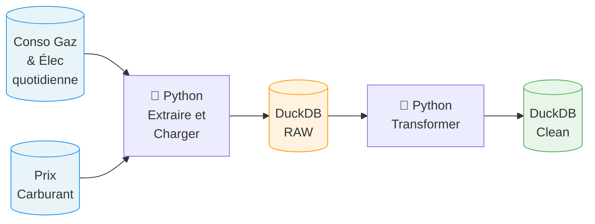
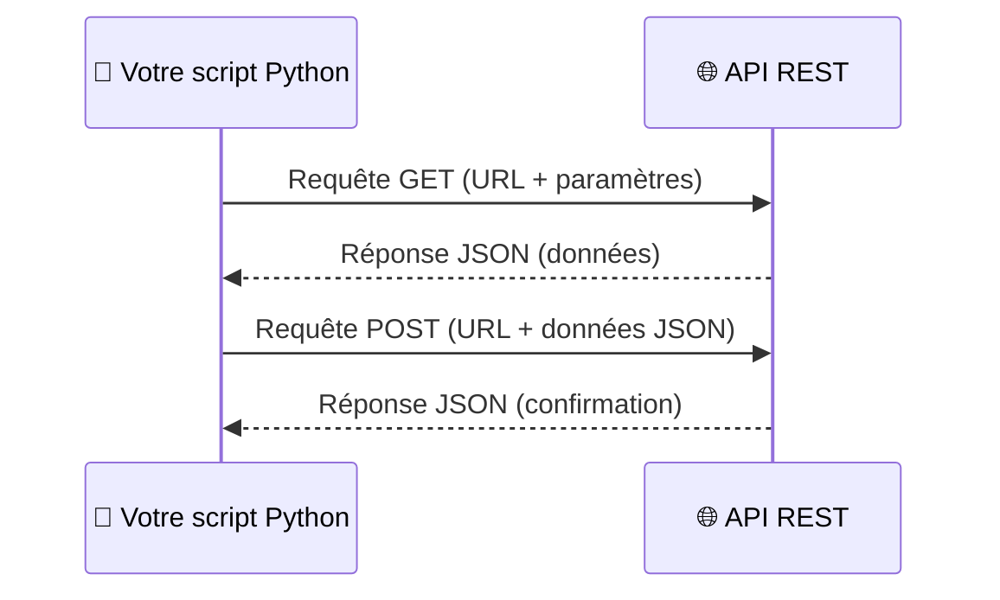
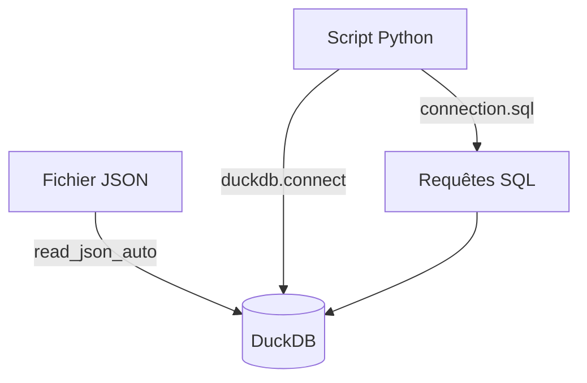
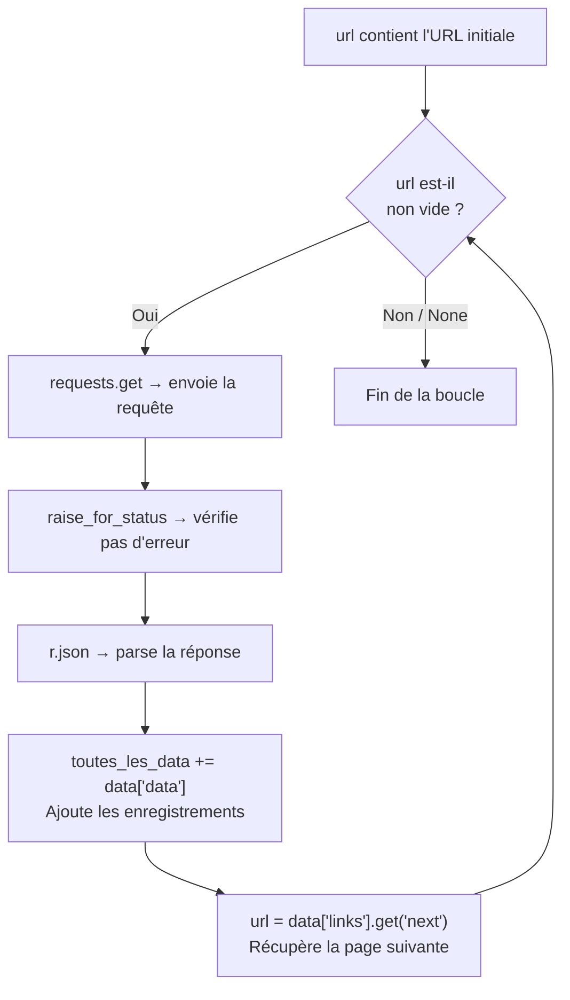
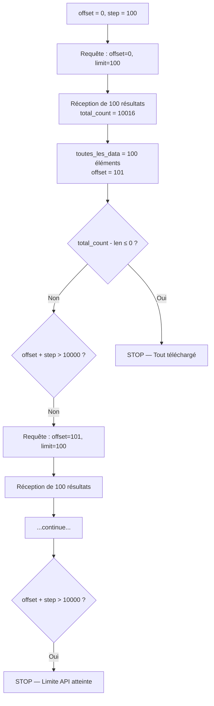
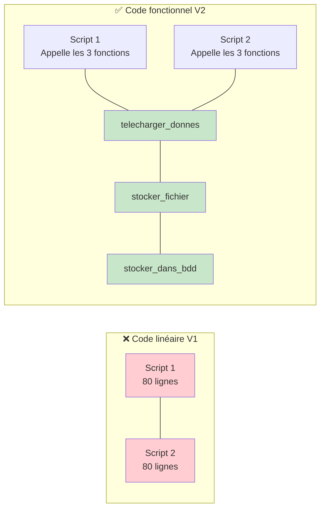
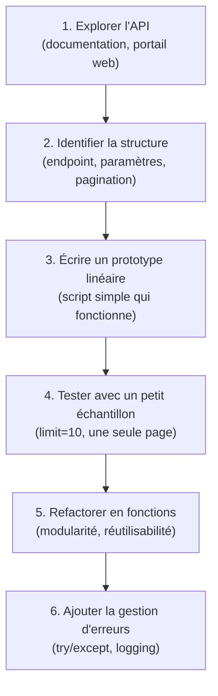

# Python Avancé — Chapitre 1 : Mise en place et première version du code

---

## Introduction

### Contexte

Ce cours s'inscrit dans un projet concret de **data engineering** : construire un pipeline automatisé qui télécharge quotidiennement des données publiques françaises, les stocke localement et les prépare pour l'analyse.

Les deux sources de données utilisées sont :

- **Consommation quotidienne brute de gaz et d'électricité** — publiée par Open Data Réseaux Énergies sur [data.gouv.fr](https://www.data.gouv.fr/fr/datasets/consommation-quotidienne-brute/)
- **Prix instantané des carburants en France** — publiée par le Ministère de l'Économie sur [data.economie.gouv.fr](https://data.economie.gouv.fr/explore/dataset/prix-des-carburants-en-france-flux-instantane-v2/information/)

L'objectif final est de télécharger ces données une fois par jour, de les stocker dans une base de données locale (DuckDB), puis de les transformer pour produire des analyses (prix moyen par carburant, cartographie, etc.).

### Objectifs de ce chapitre

À la fin de ce chapitre, vous serez capable de :

- Comprendre l'architecture d'un pipeline ETL simple
- Appeler une API REST en Python avec la librairie `requests`
- Gérer la pagination d'une API (deux stratégies différentes)
- Stocker des données dans un fichier JSON
- Créer une table dans DuckDB et y insérer des données
- Refactorer un script linéaire en fonctions réutilisables

### Prérequis

- Python 3.10+ installé sur votre machine
- Connaissances de base en Python (variables, boucles, conditions)
- Git installé (pour cloner le repo du cours)
- Un éditeur de code (VS Code recommandé)

### Installation de l'environnement

Commencez par cloner le dépôt du cours :

```bash
git clone https://github.com/QuantikDataStudio/cours_python_avance/
cd cours_python_avance
```

Installez ensuite les librairies nécessaires :

```bash
pip install requests duckdb
```

> **💡 Note** : `json` est un module intégré à Python, il n'a pas besoin d'être installé.

---

## Architecture du projet

Avant de plonger dans le code, il est essentiel de comprendre **ce que l'on construit**. Le schéma ci-dessous représente le pipeline complet du projet :



### Explication du pipeline

Ce schéma illustre un **pipeline ETL** (Extract — Transform — Load), un pattern fondamental en data engineering :

| Étape | Description | Dans notre projet |
|-------|-------------|-------------------|
| **Extract** | Récupérer les données depuis une source externe | Appeler les APIs data.gouv.fr et economie.gouv.fr |
| **Transform** | Nettoyer, reformater, enrichir les données | Transformer les données brutes (RAW) en données propres (Clean) |
| **Load** | Stocker les données dans leur destination finale | Insérer dans DuckDB |

> **💡 Ce chapitre couvre les étapes Extract et Load.** La transformation sera abordée dans un chapitre ultérieur.

---

## Concepts fondamentaux

### 1. Qu'est-ce qu'une API REST ?

Une **API** (Application Programming Interface) est un point d'accès qui permet à un programme d'interagir avec un service distant. Une API dite **REST** (Representational State Transfer) suit des conventions standardisées basées sur le protocole HTTP.

Concrètement, quand vous tapez une URL dans votre navigateur, vous faites déjà un appel HTTP. Une API REST fonctionne exactement de la même manière, sauf que la réponse est structurée (en JSON) plutôt que visuelle (page HTML).



### Les deux méthodes HTTP principales en data

| Méthode | Rôle | Analogie | Usage en data |
|---------|------|----------|---------------|
| **GET** | Récupérer des données | "Montre-moi les données" | Télécharger un dataset, lire des enregistrements |
| **POST** | Envoyer des données | "Voici des données à traiter" | Envoyer un filtre complexe, soumettre un formulaire |

#### Exemple — Requête GET

```python
import requests

url = "https://www.google.com"
response = requests.get(url)
```

**Explication ligne par ligne :**

| Ligne | Code | Explication |
|-------|------|-------------|
| 1 | `import requests` | Importe la librairie `requests`, qui simplifie les appels HTTP en Python. Sans elle, il faudrait utiliser le module `urllib` beaucoup plus verbeux. |
| 2 | `url = "https://www.google.com"` | Définit l'URL cible dans une variable. Bonne pratique : ne jamais écrire l'URL directement dans l'appel. |
| 3 | `response = requests.get(url)` | Envoie une requête HTTP GET à l'URL. La réponse (code HTTP, contenu, headers) est stockée dans l'objet `response`. |

#### Exemple — Requête POST

```python
import requests

url = "https://www.google.com"
data = {"key": "value"}
response = requests.post(url, json=data)
```

**Explication ligne par ligne :**

| Ligne | Code | Explication |
|-------|------|-------------|
| 1 | `import requests` | Même import que précédemment. |
| 2 | `url = "https://www.google.com"` | URL cible. |
| 3 | `data = {"key": "value"}` | Crée un dictionnaire Python contenant les données à envoyer. Ce dictionnaire sera automatiquement converti en JSON. |
| 4 | `requests.post(url, json=data)` | Envoie une requête POST. Le paramètre `json=data` indique à `requests` de convertir le dictionnaire en JSON et de définir le bon header `Content-Type`. |

> **⚠️ Différence clé** : `GET` passe les paramètres dans l'URL, `POST` les passe dans le corps de la requête. En data, on utilise `GET` dans 90% des cas pour récupérer des données.

---

### 2. Les modes d'ouverture de fichiers en Python

Quand on ouvre un fichier avec `open()`, on doit spécifier un **mode** qui détermine ce qu'on peut faire avec le fichier :

| Mode | Lecture | Écriture | Comportement si le fichier existe | Comportement si le fichier n'existe pas |
|------|:-------:|:--------:|-----------------------------------|----------------------------------------|
| `"r"` | ✅ | ❌ | Ouvre normalement | ❌ Erreur `FileNotFoundError` |
| `"w"` | ❌ | ✅ | **Efface tout le contenu** puis écrit | Crée le fichier |
| `"rw"` | ✅ | ✅ | Ouvre normalement | ❌ Erreur |
| `"a"` | ❌ | ✅ | **Ajoute à la fin** sans effacer | Crée le fichier |

> **⚠️ Piège fréquent** : utiliser `"w"` au lieu de `"a"` efface tout le contenu existant du fichier. C'est irréversible !

**Exemple pratique :**

```python
# Écrire dans un nouveau fichier (ou écraser l'existant)
with open("donnees.json", "w") as f:
    f.write("contenu")

# Ajouter à la fin d'un fichier existant
with open("donnees.json", "a") as f:
    f.write("contenu supplémentaire")
```

> **💡 Bonne pratique** : toujours utiliser `with open(...)` plutôt que `f = open(...)`. Le mot-clé `with` garantit que le fichier sera fermé automatiquement, même en cas d'erreur. C'est ce qu'on appelle un **context manager**.

📖 Documentation complète : [docs.python.org — open()](https://docs.python.org/3/library/functions.html#open)

---

### 3. Le format JSON

**JSON** (JavaScript Object Notation) est le format standard pour l'échange de données sur le web. Il ressemble beaucoup aux dictionnaires Python :

```json
{
    "id": 4100009,
    "latitude": "4383100",
    "longitude": "577900",
    "cp": "04100",
    "ville": "Manosque",
    "gazole_prix": 1.669
}
```

En Python, le module `json` permet de :

| Fonction | Rôle | Entrée → Sortie |
|----------|------|-----------------|
| `json.dumps(obj)` | Convertir un objet Python en **chaîne** JSON | `dict` → `str` |
| `json.dump(obj, f)` | Écrire un objet Python en JSON **dans un fichier** | `dict` → fichier |
| `json.loads(s)` | Convertir une chaîne JSON en **objet Python** | `str` → `dict` |
| `json.load(f)` | Lire un fichier JSON et le convertir en **objet Python** | fichier → `dict` |

> **💡 Astuce mnémotechnique** : les fonctions avec un `s` à la fin travaillent avec des **strings** (chaînes), celles sans `s` travaillent avec des **fichiers**.

---

### 4. Qu'est-ce que DuckDB ?

**DuckDB** est une base de données analytique embarquée (elle fonctionne directement dans votre programme, sans serveur à installer). On peut la voir comme un "SQLite pour l'analytique".

Ses avantages pour notre projet :

- **Aucune installation serveur** : un simple `pip install duckdb` suffit
- **Stockage local** : les données sont dans un fichier sur votre disque
- **SQL complet** : on peut écrire des requêtes SQL classiques
- **`read_json_auto`** : fonction native qui lit directement des fichiers JSON et détecte automatiquement la structure



---

### 5. La pagination d'API

Quand une API contient des milliers d'enregistrements, elle ne les renvoie pas tous d'un coup. Elle utilise la **pagination** : elle renvoie les données par pages (ou "lots"), et c'est au client de demander les pages suivantes.

Il existe deux stratégies principales :

```mermaid
flowchart TD
    subgraph Stratégie 1 : Curseur next
        A1[Requête page 1] --> B1[Réponse + lien 'next']
        B1 --> C1[Requête page 2 via 'next']
        C1 --> D1[Réponse + lien 'next']
        D1 --> E1[Requête page 3 via 'next']
        E1 --> F1[Réponse sans 'next' = FIN]
    end

    subgraph Stratégie 2 : Limit / Offset
        A2["Requête offset=0, limit=100"] --> B2["100 résultats"]
        B2 --> C2["Requête offset=100, limit=100"]
        C2 --> D2["100 résultats"]
        D2 --> E2["Requête offset=200, limit=100"]
        E2 --> F2["offset >= total_count = FIN"]
    end
```



| | Curseur `next` | Limit / Offset |
|---|---|---|
| **Principe** | L'API fournit le lien vers la page suivante | On calcule nous-même le décalage |
| **Avantage** | Simple, pas de calcul à faire | Contrôle total sur la taille des pages |
| **Inconvénient** | Pas de saut de pages possible | Peut être lent sur de gros datasets |
| **Utilisé par** | data.gouv.fr | data.economie.gouv.fr |

---

## Analyse des exemples de code

### Script 1 — Téléchargement de la consommation brute gaz/élec (Version 1)

#### Objectif

Ce script télécharge les données de consommation quotidienne de gaz et d'électricité depuis l'API de data.gouv.fr, les stocke dans un fichier JSON, puis les charge dans une base DuckDB.

#### Code complet

```python
import requests
import duckdb
import json

url = 'https://tabular-api.data.gouv.fr/api/resources/cfc27ff9-1871-4ee8-be64-b9a290c06935/data/?Date__exact="2024-10-31"'

toutes_les_data = []

print("Télécharger les données")

while url:
    r = requests.get(url)
    r.raise_for_status()
    data = r.json()
    toutes_les_data += data['data']
    url = data['links'].get("next")

print("Stockage dans le fichier")

with open("consommation_brute_quotidienne_gaz_elec.json", "w") as f:
    for line in toutes_les_data:
        json.dump(line, f)

print("Chargement dans la BDD")

connection = duckdb.connect("bdd_cours_python_avance")

sql_creation = """
CREATE TABLE IF NOT EXISTS consommation_brute_quotidienne_gaz_elec_raw (
    "__id" INT,
    "Date - Heure" TIMESTAMP,
    "Date" DATE,
    "Heure" STRING,
    "Consommation brute gaz (MW PCS 0°C) - GRTgaz" INT,
    "Statut - GRTgaz" STRING,
    "Consommation brute gaz (MW PCS 0°C) - Teréga" INT,
    "Statut - Teréga" STRING,
    "Consommation brute gaz totale (MW PCS 0°C)" INT,
    "Consommation brute électricité (MW) - RTE" INT,
    "Statut - RTE" STRING,
    "Consommation brute totale (MW)" INT
)
"""

connection.sql(sql_creation)

connection.sql('INSERT INTO consommation_brute_quotidienne_gaz_elec_raw '
               'SELECT * FROM read_json_auto("consommation_brute_quotidienne_gaz_elec.json")')
```

#### Explication ligne par ligne

**Bloc 1 — Les imports**

```python
import requests    # Librairie pour faire des requêtes HTTP (GET, POST, etc.)
import duckdb      # Librairie pour interagir avec la base de données DuckDB
import json        # Module natif Python pour lire/écrire du JSON
```

Chaque import charge une librairie en mémoire. `requests` et `duckdb` doivent être installés au préalable via `pip`. Le module `json` est inclus dans Python par défaut.

**Bloc 2 — Configuration de l'URL**

```python
url = 'https://tabular-api.data.gouv.fr/api/resources/cfc27ff9-1871-4ee8-be64-b9a290c06935/data/?Date__exact="2024-10-31"'
```

Cette URL est le **point d'entrée** (endpoint) de l'API. Décomposons-la :

| Partie de l'URL | Signification |
|-----------------|---------------|
| `https://tabular-api.data.gouv.fr` | Domaine du serveur API |
| `/api/resources/` | Chemin vers les ressources |
| `cfc27ff9-...` | Identifiant unique (UUID) du jeu de données |
| `/data/` | On veut les données elles-mêmes |
| `?Date__exact="2024-10-31"` | **Filtre** : on ne veut que les données du 31 octobre 2024 |

> **💡 Le `?` dans une URL** marque le début des **paramètres de requête** (query parameters). Le format est `clé=valeur`, et on sépare plusieurs paramètres avec `&`.

**Bloc 3 — La boucle de pagination**

```python
toutes_les_data = []       # Liste vide qui va accumuler toutes les données

print("Télécharger les données")

while url:                             # Tant que 'url' n'est pas None/vide
    r = requests.get(url)              # Envoie la requête GET
    r.raise_for_status()               # Lève une exception si erreur HTTP (4xx, 5xx)
    data = r.json()                    # Convertit la réponse JSON en dict Python
    toutes_les_data += data['data']    # Ajoute les enregistrements à notre liste
    url = data['links'].get("next")    # Récupère l'URL de la page suivante (ou None)
```

C'est le cœur du script. Voici le flux détaillé :



Points importants à comprendre :

- **`while url:`** — En Python, `None` et une chaîne vide `""` sont évaluées comme `False`. Donc quand l'API ne renvoie plus de lien `next`, `url` devient `None` et la boucle s'arrête.
- **`r.raise_for_status()`** — Cette méthode ne fait rien si la requête a réussi (code 200). Mais si le serveur renvoie une erreur (404, 500, etc.), elle lève une exception Python qui interrompt le programme. C'est une **sécurité essentielle**.
- **`data['data']`** — La réponse JSON de l'API a une structure précise : les enregistrements sont dans la clé `data`, et les liens de pagination sont dans la clé `links`.
- **`data['links'].get("next")`** — La méthode `.get()` est préférable à `data['links']["next"]` car elle retourne `None` au lieu de lever une erreur si la clé `"next"` n'existe pas (c'est-à-dire quand on est à la dernière page).

**Bloc 4 — Stockage dans un fichier JSON**

```python
print("Stockage dans le fichier")

with open("consommation_brute_quotidienne_gaz_elec.json", "w") as f:
    for line in toutes_les_data:
        json.dump(line, f)
```

| Ligne | Explication |
|-------|-------------|
| `with open(..., "w") as f:` | Ouvre le fichier en mode écriture (`"w"`). Si le fichier existe déjà, son contenu est **effacé**. |
| `for line in toutes_les_data:` | Parcourt chaque enregistrement (dictionnaire) de la liste. |
| `json.dump(line, f)` | Écrit chaque enregistrement en format JSON dans le fichier. |

> **⚠️ Attention** : ce code écrit tous les objets JSON les uns à la suite des autres sans séparateur. C'est le format **JSON Lines** (un objet JSON par "ligne logique"). DuckDB sait le lire grâce à `read_json_auto`, mais un `json.load()` classique ne fonctionnerait pas sur ce fichier.

**Bloc 5 — Création de la table DuckDB**

```python
connection = duckdb.connect("bdd_cours_python_avance")
```

Cette ligne crée (ou ouvre) un fichier de base de données DuckDB nommé `bdd_cours_python_avance`. Contrairement à PostgreSQL ou MySQL, il n'y a pas de serveur à démarrer : tout est dans ce fichier.

```python
sql_creation = """
CREATE TABLE IF NOT EXISTS consommation_brute_quotidienne_gaz_elec_raw (
    "__id" INT,
    "Date - Heure" TIMESTAMP,
    "Date" DATE,
    "Heure" STRING,
    "Consommation brute gaz (MW PCS 0°C) - GRTgaz" INT,
    "Statut - GRTgaz" STRING,
    "Consommation brute gaz (MW PCS 0°C) - Teréga" INT,
    "Statut - Teréga" STRING,
    "Consommation brute gaz totale (MW PCS 0°C)" INT,
    "Consommation brute électricité (MW) - RTE" INT,
    "Statut - RTE" STRING,
    "Consommation brute totale (MW)" INT
)
"""
```

Explication de la requête SQL :

| Élément SQL | Signification |
|-------------|---------------|
| `CREATE TABLE` | Crée une nouvelle table |
| `IF NOT EXISTS` | Ne crée la table que si elle n'existe pas déjà (évite les erreurs si on relance le script) |
| `"__id" INT` | Colonne `__id` de type entier. Les guillemets sont nécessaires car le nom commence par `_` |
| `TIMESTAMP` | Type date + heure (ex: `2024-10-31 14:30:00`) |
| `DATE` | Type date seule (ex: `2024-10-31`) |
| `STRING` | Type texte |
| `_raw` (suffixe du nom) | Convention : indique que ce sont des données **brutes** (non transformées) |

> **💡 Les guillemets doubles** autour des noms de colonnes sont obligatoires en SQL quand les noms contiennent des espaces, des caractères spéciaux ou des accents.

**Bloc 6 — Insertion des données**

```python
connection.sql(sql_creation)

connection.sql('INSERT INTO consommation_brute_quotidienne_gaz_elec_raw '
               'SELECT * FROM read_json_auto("consommation_brute_quotidienne_gaz_elec.json")')
```

| Ligne | Explication |
|-------|-------------|
| `connection.sql(sql_creation)` | Exécute la requête de création de table. |
| `INSERT INTO ... SELECT * FROM read_json_auto(...)` | Lit automatiquement le fichier JSON et insère toutes les lignes dans la table. `read_json_auto` détecte seul la structure du fichier. |

> **💡 `read_json_auto`** est une des fonctionnalités les plus puissantes de DuckDB. Elle détecte automatiquement le schéma (noms et types des colonnes) d'un fichier JSON, CSV, ou Parquet.

#### Erreurs possibles

| Erreur | Cause probable | Solution |
|--------|---------------|----------|
| `ModuleNotFoundError: No module named 'requests'` | Librairie non installée | `pip install requests` |
| `requests.exceptions.ConnectionError` | Pas de connexion internet ou API indisponible | Vérifier la connexion, réessayer plus tard |
| `requests.exceptions.HTTPError` | L'API a renvoyé une erreur (404, 500...) | Vérifier l'URL, les paramètres |
| `KeyError: 'data'` | La structure de la réponse JSON a changé | Afficher `data.keys()` pour inspecter la structure |
| `duckdb.CatalogException` | Conflit de types entre JSON et table SQL | Vérifier que les types SQL correspondent aux données |

#### Comment tester ce code

1. Exécutez le script : `python script_conso.py`
2. Vérifiez que le fichier JSON a été créé : `ls -la consommation_brute_quotidienne_gaz_elec.json`
3. Vérifiez les données dans DuckDB :

```python
import duckdb
conn = duckdb.connect("bdd_cours_python_avance")
print(conn.sql("SELECT COUNT(*) FROM consommation_brute_quotidienne_gaz_elec_raw").fetchall())
print(conn.sql("SELECT * FROM consommation_brute_quotidienne_gaz_elec_raw LIMIT 5").fetchall())
```

---

### Script 2 — Téléchargement du prix instantané des carburants (Version 1)

#### Objectif

Ce script télécharge les données de prix des carburants depuis l'API de data.economie.gouv.fr. La différence majeure avec le script précédent est la **stratégie de pagination** : ici on utilise `limit` et `offset` au lieu d'un lien `next`.

#### Code complet

```python
import requests
import duckdb
import json

url = 'https://data.economie.gouv.fr/api/explore/v2.1/catalog/datasets/prix-des-carburants-en-france-flux-instantane-v2/records?select=id%2Clatitude%2Clongitude%2Ccp%2Cadresse%2Cville%2Cservices%2Cgazole_prix%2Cgazole_maj%2Choraires%2Csp95_maj%2Csp95_prix%2Csp98_maj%2Csp98_prix&limit={limit}&offset={offset}'

toutes_les_data = []
total_count = 1
step = 100
offset = 0

print("Télécharger les données")

while True:
    r = requests.get(url.format(limit=step, offset=offset))
    r.raise_for_status()
    data = r.json()
    toutes_les_data += data['results']
    total_count = data['total_count']
    offset += len(toutes_les_data) + 1

    if total_count - len(toutes_les_data) <= 0:
        break

    if offset + step > 10000:
        break

print("Stockage dans le fichier")

with open("prix_instantane_carburant.json", "w") as f:
    for line in toutes_les_data:
        json.dump(line, f)

print("Chargement dans la BDD")

connection = duckdb.connect("bdd_cours_python_avance")

sql_creation = """
CREATE TABLE IF NOT EXISTS prix_instante_raw (
    id INT,
    latitude FLOAT,
    longitude FLOAT,
    cp STRING,
    adresse STRING,
    ville STRING,
    services STRING,
    gazole_prix FLOAT,
    gazole_maj TIMESTAMP,
    horaires STRING,
    sp95_maj TIMESTAMP,
    sp95_prix FLOAT,
    sp98_maj TIMESTAMP,
    sp98_prix FLOAT
)
"""

connection.sql(sql_creation)

connection.sql('INSERT INTO prix_instante_raw '
               'SELECT * FROM read_json_auto("prix_instantane_carburant.json")')
```

#### Explication ligne par ligne

**Bloc 1 — L'URL avec paramètres dynamiques**

```python
url = 'https://data.economie.gouv.fr/api/explore/v2.1/catalog/datasets/prix-des-carburants-en-france-flux-instantane-v2/records?select=id%2Clatitude%2Clongitude%2Ccp%2Cadresse%2Cville%2Cservices%2Cgazole_prix%2Cgazole_maj%2Choraires%2Csp95_maj%2Csp95_prix%2Csp98_maj%2Csp98_prix&limit={limit}&offset={offset}'
```

Décomposition de l'URL :

| Partie | Signification |
|--------|---------------|
| `select=id%2Clatitude%2C...` | Liste des colonnes à récupérer (`%2C` = virgule encodée en URL) |
| `limit={limit}` | Nombre maximum d'enregistrements par page (sera remplacé dynamiquement) |
| `offset={offset}` | Position de départ dans le dataset (sera remplacé dynamiquement) |

> **💡 `{limit}` et `{offset}`** sont des **placeholders** (emplacements réservés). Ils seront remplacés par des valeurs réelles grâce à `url.format(limit=step, offset=offset)`.

**Bloc 2 — Variables de contrôle de la pagination**

```python
toutes_les_data = []    # Accumule tous les résultats
total_count = 1         # Nombre total d'enregistrements (sera mis à jour par l'API)
step = 100              # Nombre d'enregistrements demandés par page
offset = 0              # Position de départ (on commence à 0)
```

**Bloc 3 — La boucle de pagination limit/offset**

```python
while True:
    r = requests.get(url.format(limit=step, offset=offset))
    r.raise_for_status()
    data = r.json()
    toutes_les_data += data['results']
    total_count = data['total_count']
    offset += len(toutes_les_data) + 1

    if total_count - len(toutes_les_data) <= 0:
        break

    if offset + step > 10000:
        break
```

Explication détaillée de chaque ligne :

| Ligne | Code | Explication |
|-------|------|-------------|
| 1 | `while True:` | Boucle infinie — on en sort avec `break`. Différent du `while url:` du script 1. |
| 2 | `url.format(limit=step, offset=offset)` | Remplace `{limit}` par `100` et `{offset}` par la valeur courante. |
| 3 | `r.raise_for_status()` | Vérifie que la requête a réussi. |
| 4 | `data = r.json()` | Parse la réponse JSON. |
| 5 | `toutes_les_data += data['results']` | **Attention** : ici c'est `'results'` et non `'data'` comme dans le script 1. Chaque API a sa propre structure. |
| 6 | `total_count = data['total_count']` | L'API nous indique le nombre total d'enregistrements disponibles. |
| 7 | `offset += len(toutes_les_data) + 1` | On avance le curseur pour demander les enregistrements suivants. |
| 8-9 | `if total_count - len(toutes_les_data) <= 0: break` | **Condition de sortie 1** : on a récupéré tous les enregistrements. |
| 10-11 | `if offset + step > 10000: break` | **Condition de sortie 2** : sécurité — l'API limite à 10 000 résultats. On arrête avant de dépasser. |



**Bloc 4 — La table SQL prix carburant**

```python
sql_creation = """
CREATE TABLE IF NOT EXISTS prix_instante_raw (
    id INT,              -- Identifiant de la station-service
    latitude FLOAT,      -- Coordonnée GPS latitude
    longitude FLOAT,     -- Coordonnée GPS longitude
    cp STRING,           -- Code postal
    adresse STRING,      -- Adresse de la station
    ville STRING,        -- Ville
    services STRING,     -- Services disponibles (texte JSON)
    gazole_prix FLOAT,   -- Prix du gazole en euros
    gazole_maj TIMESTAMP,-- Date de dernière mise à jour du prix gazole
    horaires STRING,     -- Horaires d'ouverture
    sp95_maj TIMESTAMP,  -- Date MAJ prix SP95
    sp95_prix FLOAT,     -- Prix du SP95
    sp98_maj TIMESTAMP,  -- Date MAJ prix SP98
    sp98_prix FLOAT      -- Prix du SP98
)
"""
```

> **💡 Notez la différence** avec la table précédente : ici les noms de colonnes sont simples (pas d'espaces ni de caractères spéciaux), donc pas besoin de guillemets doubles. Le type `FLOAT` est utilisé pour les coordonnées GPS et les prix car ce sont des nombres décimaux.

#### Différences clés entre les deux scripts

| Aspect | Script 1 (Conso gaz/élec) | Script 2 (Prix carburant) |
|--------|--------------------------|---------------------------|
| **API source** | data.gouv.fr | data.economie.gouv.fr |
| **Pagination** | Curseur `links.next` | `limit` / `offset` |
| **Boucle** | `while url:` | `while True:` + `break` |
| **Clé des données** | `data['data']` | `data['results']` |
| **Nombre d'enregistrements** | Implicite (fin quand `next` = None) | Explicite (`total_count`) |
| **Limite** | Aucune | 10 000 enregistrements max |

---

### Script 3 — Version refactorée en fonctions (Conso gaz/élec)

#### Objectif

Transformer le script linéaire en code modulaire grâce à des **fonctions**. Cette étape est fondamentale en développement professionnel.

#### Pourquoi refactorer ?



Les problèmes du code V1 :

| Problème | Conséquence |
|----------|-------------|
| **Duplication** | Le code de stockage fichier est copié-collé dans les 2 scripts |
| **Maintenabilité** | Si on veut changer le format de stockage, il faut modifier 2 fichiers |
| **Lisibilité** | Un script de 80 lignes est difficile à comprendre d'un coup d'œil |
| **Testabilité** | On ne peut pas tester une étape indépendamment des autres |

#### Code complet V2

```python
import requests
import duckdb
import json

# ══════════════════════════════════════════════════════════════
# VARIABLES GLOBALES (Convention : en haut du fichier)
# ══════════════════════════════════════════════════════════════

url_api = 'https://tabular-api.data.gouv.fr/api/resources/cfc27ff9-1871-4ee8-be64-b9a290c06935/data/?Date__exact="2024-10-31"'

fichier_cible = "consommation_brute_quotidienne_gaz_elec.json"

sql_creation = """
CREATE TABLE IF NOT EXISTS consommation_brute_quotidienne_gaz_elec_raw (
    "__id" INT,
    "Date - Heure" TIMESTAMP,
    "Date" DATE,
    "Heure" STRING,
    "Consommation brute gaz (MW PCS 0°C) - GRTgaz" INT,
    "Statut - GRTgaz" STRING,
    "Consommation brute gaz (MW PCS 0°C) - Teréga" INT,
    "Statut - Teréga" STRING,
    "Consommation brute gaz totale (MW PCS 0°C)" INT,
    "Consommation brute électricité (MW) - RTE" INT,
    "Statut - RTE" STRING,
    "Consommation brute totale (MW)" INT
)
"""

fichier_base_de_donnees = "bdd_cours_python_avance"

# ══════════════════════════════════════════════════════════════
# FONCTIONS
# ══════════════════════════════════════════════════════════════

def telecharger_donnes_conso_gaz_elec(url):
    """Télécharge toutes les pages de données depuis l'API data.gouv.fr."""
    toutes_les_data = []

    print("Télécharger les données")

    while url:
        r = requests.get(url)
        r.raise_for_status()
        data = r.json()
        toutes_les_data += data['data']
        url = data['links'].get("next")

    return toutes_les_data


def stocker_fichier(donnes, nom_fichier):
    """Stocke une liste de dictionnaires dans un fichier JSON."""
    print("Stockage dans le fichier")

    with open(nom_fichier, "w") as f:
        for line in donnes:
            json.dump(line, f)


def stocker_dans_bdd(sql, fichier, bdd):
    """Crée la table SQL et insère les données depuis le fichier JSON."""
    print("Chargement dans la BDD")

    connection = duckdb.connect(bdd)
    connection.sql(sql)
    connection.sql('INSERT INTO consommation_brute_quotidienne_gaz_elec_raw '
                   f'SELECT * FROM read_json_auto("{fichier}")')

# ══════════════════════════════════════════════════════════════
# EXÉCUTION
# ══════════════════════════════════════════════════════════════

resultat = telecharger_donnes_conso_gaz_elec(url_api)
stocker_fichier(resultat, fichier_cible)
stocker_dans_bdd(sql_creation, fichier_cible, fichier_base_de_donnees)
```

#### Explication de la structure

**Les variables globales** sont regroupées en haut du fichier. C'est une convention de code : toute la configuration est visible immédiatement. Si on doit changer l'URL de l'API ou le nom du fichier, on sait exactement où chercher.

**La fonction `telecharger_donnes_conso_gaz_elec(url)`** :

```python
def telecharger_donnes_conso_gaz_elec(url):
    toutes_les_data = []
    print("Télécharger les données")
    while url:
        r = requests.get(url)
        r.raise_for_status()
        data = r.json()
        toutes_les_data += data['data']
        url = data['links'].get("next")
    return toutes_les_data
```

| Élément | Rôle |
|---------|------|
| `def` | Mot-clé pour définir une fonction |
| `url` (paramètre) | L'URL initiale de l'API, passée en argument |
| `toutes_les_data` | Variable **locale** à la fonction (n'existe pas en dehors) |
| `return toutes_les_data` | Renvoie le résultat à l'appelant. **Différence majeure avec V1** : en V1, les données restaient dans une variable globale. |

**La fonction `stocker_fichier(donnes, nom_fichier)`** :

```python
def stocker_fichier(donnes, nom_fichier):
    print("Stockage dans le fichier")
    with open(nom_fichier, "w") as f:
        for line in donnes:
            json.dump(line, f)
```

Cette fonction est **générique** : elle peut stocker n'importe quelle liste de dictionnaires dans n'importe quel fichier. Elle sera réutilisée telle quelle pour le script prix carburant.

**La fonction `stocker_dans_bdd(sql, fichier, bdd)`** :

```python
def stocker_dans_bdd(sql, fichier, bdd):
    print("Chargement dans la BDD")
    connection = duckdb.connect(bdd)
    connection.sql(sql)
    connection.sql('INSERT INTO consommation_brute_quotidienne_gaz_elec_raw '
                   f'SELECT * FROM read_json_auto("{fichier}")')
```

> **⚠️ Limite de cette version** : le nom de la table (`consommation_brute_quotidienne_gaz_elec_raw`) est encore écrit en dur dans la requête INSERT. Pour une version encore plus générique, il faudrait le passer en paramètre. C'est un point d'amélioration possible.

**L'exécution** (les 3 dernières lignes) :

```python
resultat = telecharger_donnes_conso_gaz_elec(url_api)
stocker_fichier(resultat, fichier_cible)
stocker_dans_bdd(sql_creation, fichier_cible, fichier_base_de_donnees)
```

Le code d'exécution tient maintenant en **3 lignes lisibles**. On comprend immédiatement le flux : télécharger → stocker dans un fichier → stocker dans la BDD.

---

### Note importante : changements du dataset

> **⚠️ Attention** : le jeu de données a évolué depuis la création du cours. Deux modifications sont nécessaires :
>
> 1. **Ajouter `line.pop("flag_ignore")`** entre les lignes `for line in toutes_les_data:` et `json.dump(line, f)`. Cette ligne supprime un champ ajouté récemment au dataset qui causerait des erreurs à l'insertion en BDD.
>
> 2. **Le nom "GRTgaz" a été renommé en "NaTran"** (nouveau nom de l'entreprise). Cela peut nécessiter de mettre à jour les noms de colonnes dans la table DuckDB.

---

## Méthodologie générale

La démarche utilisée dans ce cours est applicable à tout projet de collecte de données via API. Voici la méthode en 6 étapes :



### Étapes détaillées

**Étape 1 — Explorer l'API** : Rendez-vous sur le portail de données. Repérez l'onglet "API" ou la documentation. Testez l'API directement dans le navigateur en collant l'URL.

**Étape 2 — Identifier la structure** : Notez la clé qui contient les données (`data`, `results`, `items`...), le mécanisme de pagination (curseur ou offset), et les paramètres disponibles (filtres, sélection de colonnes).

**Étape 3 — Écrire un prototype** : Commencez par un script linéaire simple, sans fonctions. L'objectif est de valider que ça fonctionne.

**Étape 4 — Tester** : Limitez le volume (une seule page, un petit `limit`) pour vérifier rapidement. Affichez les données avec `print()` pour inspecter leur structure.

**Étape 5 — Refactorer** : Identifiez les blocs logiques (téléchargement, stockage, insertion BDD) et transformez-les en fonctions.

**Étape 6 — Robustifier** : Ajoutez des `try/except`, du logging, et une gestion des cas limites (API indisponible, données manquantes).

---

## Tableaux pratiques

### Erreurs fréquentes et solutions

| Erreur | Message | Cause | Solution |
|--------|---------|-------|----------|
| Import manquant | `ModuleNotFoundError` | Librairie non installée | `pip install <librairie>` |
| URL invalide | `MissingSchema` | URL sans `http://` ou `https://` | Vérifier le format de l'URL |
| API en erreur | `HTTPError: 429` | Trop de requêtes (rate limiting) | Ajouter `time.sleep(1)` entre les requêtes |
| Clé manquante | `KeyError: 'data'` | Mauvaise clé dans la réponse JSON | Afficher `r.json().keys()` pour voir la structure |
| Types incompatibles | `ConversionException` (DuckDB) | Le type SQL ne correspond pas aux données | Vérifier les types avec `DESCRIBE table` |
| Fichier non trouvé | `FileNotFoundError` | Chemin incorrect | Vérifier le répertoire courant avec `os.getcwd()` |
| Boucle infinie | Le script ne s'arrête pas | Condition de sortie jamais atteinte | Ajouter un compteur de sécurité / un `break` conditionnel |

### Bonnes pratiques

| Pratique | Mauvais exemple | Bon exemple |
|----------|----------------|-------------|
| Variables nommées clairement | `x = requests.get(u)` | `response = requests.get(url_api)` |
| Vérifier les erreurs HTTP | `r = requests.get(url)` | `r = requests.get(url)` puis `r.raise_for_status()` |
| Utiliser `.get()` sur les dicts | `data['links']['next']` | `data['links'].get('next')` |
| Variables globales en haut | Dispersées dans le code | Regroupées en début de fichier |
| Context manager pour les fichiers | `f = open(...)` puis `f.close()` | `with open(...) as f:` |
| Nommer les constantes | `if offset > 10000:` | `LIMITE_API = 10000` puis `if offset > LIMITE_API:` |
| `IF NOT EXISTS` en SQL | `CREATE TABLE ma_table` | `CREATE TABLE IF NOT EXISTS ma_table` |

### Commandes utiles

| Commande | Description |
|----------|-------------|
| `pip install requests duckdb` | Installer les dépendances |
| `git clone <url>` | Cloner le dépôt du cours |
| `git checkout -b premiere_version_code` | Créer une nouvelle branche Git |
| `python script.py` | Exécuter un script Python |
| `python -c "import duckdb; print(duckdb.__version__)"` | Vérifier la version de DuckDB |

---

## Exercices pratiques

### Exercice 1 — Explorer une API dans le navigateur

**Niveau** : Débutant
**Objectif** : Comprendre la structure d'une réponse API

1. Ouvrez cette URL dans votre navigateur :
   `https://tabular-api.data.gouv.fr/api/resources/cfc27ff9-1871-4ee8-be64-b9a290c06935/data/?Date__exact="2024-10-31"`
2. Observez la structure JSON. Identifiez :
   - La clé qui contient les données
   - La clé qui contient les liens de pagination
   - Le nombre d'enregistrements sur cette page
3. Cliquez sur le lien `next` pour voir la page suivante

---

### Exercice 2 — Modifier le filtre de date

**Niveau** : Débutant
**Objectif** : Manipuler les paramètres d'une URL API

Modifiez le script 1 pour télécharger les données du **1er janvier 2024** au lieu du 31 octobre 2024.

**Indice** : il suffit de modifier la valeur du paramètre `Date__exact` dans l'URL.

**Vérification** : affichez `len(toutes_les_data)` pour vérifier que des données ont bien été récupérées.

---

### Exercice 3 — Compter les enregistrements

**Niveau** : Débutant
**Objectif** : Ajouter un compteur dans la boucle de pagination

Modifiez le script 1 pour afficher le nombre de pages parcourues et le nombre total d'enregistrements téléchargés à chaque itération de la boucle.

**Résultat attendu** :
```
Page 1 : 20 enregistrements (total : 20)
Page 2 : 20 enregistrements (total : 40)
Page 3 : 8 enregistrements (total : 48)
Terminé !
```

**Indice** : ajoutez une variable `page = 0` avant la boucle, incrémentez-la à chaque itération, et utilisez `len(data['data'])` pour le nombre d'enregistrements de la page courante.

---

### Exercice 4 — Ajouter une colonne au script carburant

**Niveau** : Intermédiaire
**Objectif** : Comprendre le paramètre `select` de l'API

Modifiez le script 2 pour récupérer également le prix du **E10** (colonne `e10_prix` et `e10_maj`).

**Étapes** :
1. Ajoutez `%2Ce10_prix%2Ce10_maj` au paramètre `select` de l'URL
2. Ajoutez les colonnes correspondantes dans la requête `CREATE TABLE`
3. Testez le script

---

### Exercice 5 — Refactorer le script carburant en fonctions

**Niveau** : Intermédiaire
**Objectif** : Appliquer le pattern de refactoring

En vous inspirant du script 3 (conso V2), transformez le script 2 (prix carburant V1) en version fonctionnelle avec :

- Une fonction `telecharger_donnes_prix_carburant(url, step=100)`
- La réutilisation de `stocker_fichier()` (identique)
- La réutilisation de `stocker_dans_bdd()` (adaptée au nom de table)

**Bonus** : faites en sorte que `stocker_dans_bdd()` accepte le nom de la table en paramètre pour être vraiment générique.

---

### Exercice 6 — Gestion d'erreurs

**Niveau** : Avancé
**Objectif** : Rendre le code robuste

Ajoutez une gestion d'erreurs au script 1 avec `try/except` :

1. Si la requête HTTP échoue, afficher un message d'erreur et réessayer 3 fois (avec 2 secondes d'attente entre chaque tentative)
2. Si le fichier ne peut pas être créé, afficher un message explicite
3. Si l'insertion DuckDB échoue, afficher les détails de l'erreur

**Indice** :
```python
import time

for tentative in range(3):
    try:
        r = requests.get(url)
        r.raise_for_status()
        break  # Succès, on sort de la boucle
    except requests.exceptions.RequestException as e:
        print(f"Tentative {tentative + 1}/3 échouée : {e}")
        time.sleep(2)
```

---

## Section Drill (entraînement rapide)

Répondez à ces questions sans regarder le cours. Vérifiez ensuite vos réponses.

### Questions sur les API REST

**Q1.** Quelle méthode HTTP utilise-t-on pour *récupérer* des données depuis une API ?

<details>
<summary>Réponse</summary>
La méthode <strong>GET</strong>.
</details>

**Q2.** Que fait `r.raise_for_status()` ?

<details>
<summary>Réponse</summary>
Elle vérifie que la requête HTTP a réussi. Si le serveur a renvoyé un code d'erreur (4xx ou 5xx), elle lève une exception Python.
</details>

**Q3.** Quelle est la différence entre `data['links']['next']` et `data['links'].get('next')` ?

<details>
<summary>Réponse</summary>
La première lève une <code>KeyError</code> si la clé <code>'next'</code> n'existe pas. La seconde renvoie <code>None</code> (sans erreur) si la clé est absente.
</details>

### Questions sur les fichiers

**Q4.** Quel mode d'ouverture efface le contenu existant du fichier ?

<details>
<summary>Réponse</summary>
Le mode <strong>"w"</strong> (write). Le mode <strong>"a"</strong> (append) ajoute à la fin sans effacer.
</details>

**Q5.** Pourquoi utiliser `with open(...)` plutôt que `f = open(...)` ?

<details>
<summary>Réponse</summary>
Le <code>with</code> (context manager) garantit que le fichier sera fermé automatiquement, même si une erreur survient dans le bloc de code. Sans <code>with</code>, un crash peut laisser le fichier ouvert et corrompre les données.
</details>

**Q6.** Quelle est la différence entre `json.dump()` et `json.dumps()` ?

<details>
<summary>Réponse</summary>
<code>json.dump(obj, fichier)</code> écrit directement dans un fichier. <code>json.dumps(obj)</code> retourne une chaîne de caractères (string) JSON. Le <code>s</code> = string.
</details>

### Questions sur DuckDB

**Q7.** Que fait `CREATE TABLE IF NOT EXISTS` ?

<details>
<summary>Réponse</summary>
Crée la table uniquement si elle n'existe pas déjà. Si elle existe, la commande ne fait rien (pas d'erreur). Cela permet de relancer le script sans problème.
</details>

**Q8.** Que fait `read_json_auto()` dans DuckDB ?

<details>
<summary>Réponse</summary>
C'est une fonction DuckDB qui lit un fichier JSON et détecte automatiquement la structure (noms de colonnes et types de données). Elle retourne les données sous forme de table, prête à être utilisée dans une requête SQL.
</details>

### Questions sur le refactoring

**Q9.** Citez 3 avantages du refactoring en fonctions.

<details>
<summary>Réponse</summary>
1. <strong>Réutilisabilité</strong> : une même fonction peut être appelée depuis plusieurs scripts.<br>
2. <strong>Lisibilité</strong> : le code d'exécution tient en quelques lignes claires.<br>
3. <strong>Testabilité</strong> : chaque fonction peut être testée indépendamment.
</details>

**Q10.** Pourquoi met-on les variables globales en haut du fichier ?

<details>
<summary>Réponse</summary>
C'est une <strong>convention de code</strong>. Cela permet de retrouver immédiatement toute la configuration (URLs, noms de fichiers, requêtes SQL) sans chercher dans le code. Si quelque chose doit être modifié, on sait où regarder.
</details>

---

## Section ancrage mémoriel

### Points clés à retenir

> **🔑 Point 1** — Un pipeline ETL suit toujours le même schéma : **Extraire** les données d'une source → **Transformer** les données → **Charger** dans une destination.

> **🔑 Point 2** — La pagination d'API existe en deux variantes : **curseur `next`** (l'API donne le lien suivant) et **limit/offset** (on calcule nous-même la position).

> **🔑 Point 3** — Toujours utiliser `r.raise_for_status()` après un appel `requests.get()` pour détecter les erreurs HTTP.

> **🔑 Point 4** — Toujours utiliser `.get()` sur un dictionnaire quand la clé peut être absente, au lieu d'un accès direct `dict['clé']`.

> **🔑 Point 5** — `CREATE TABLE IF NOT EXISTS` est indispensable pour rendre les scripts **idempotents** (réexécutables sans erreur).

> **🔑 Point 6** — Le refactoring en fonctions n'est pas un luxe : c'est la première étape vers du code maintenable et professionnel.

### Résumé synthétique

Ce chapitre a couvert la mise en place d'un projet de data engineering en Python. Nous avons appris à appeler des APIs REST avec `requests`, à gérer deux types de pagination (curseur et offset), à stocker des données en JSON puis dans DuckDB, et enfin à refactorer notre code linéaire en fonctions réutilisables. Les deux scripts téléchargent respectivement des données de consommation énergétique et de prix des carburants, en suivant un pattern ETL (Extract-Load) qui sera complété par l'étape Transform dans les chapitres suivants.

### Flashcards de révision

| Recto (Question) | Verso (Réponse) |
|-------------------|-----------------|
| Que signifie ETL ? | Extract — Transform — Load |
| Quelle librairie Python pour les appels HTTP ? | `requests` |
| Comment vérifier qu'une requête HTTP a réussi ? | `r.raise_for_status()` |
| Différence entre `json.dump` et `json.dumps` ? | `dump` écrit dans un fichier, `dumps` retourne un string |
| Quel mode d'ouverture ajoute à la fin du fichier ? | `"a"` (append) |
| Quel mode efface le contenu existant ? | `"w"` (write) |
| Comment DuckDB lit un fichier JSON automatiquement ? | `read_json_auto("fichier.json")` |
| Pagination par curseur : comment sait-on qu'on a fini ? | Le champ `next` vaut `None` |
| Pagination par offset : comment sait-on qu'on a fini ? | `offset >= total_count` |
| Pourquoi `IF NOT EXISTS` dans `CREATE TABLE` ? | Évite une erreur si la table existe déjà (script idempotent) |
| Pourquoi `.get("key")` plutôt que `["key"]` ? | `.get()` retourne `None` si la clé est absente au lieu de lever une erreur |
| Convention pour les variables globales ? | Les regrouper en haut du fichier |
| Que signifie le suffixe `_raw` dans un nom de table ? | Données brutes, non transformées |
| Quel type SQL pour un nombre décimal ? | `FLOAT` |
| Quel type SQL pour une date + heure ? | `TIMESTAMP` |

---

## Annexes

### Glossaire

| Terme | Définition |
|-------|-----------|
| **API** | Application Programming Interface — interface permettant à deux programmes de communiquer |
| **REST** | Representational State Transfer — style d'architecture pour les APIs web basé sur HTTP |
| **ETL** | Extract-Transform-Load — processus de collecte, transformation et stockage de données |
| **JSON** | JavaScript Object Notation — format texte léger pour l'échange de données structurées |
| **DuckDB** | Base de données analytique embarquée (sans serveur), optimisée pour les requêtes OLAP |
| **Pagination** | Technique consistant à diviser un grand ensemble de résultats en pages plus petites |
| **Offset** | Position de départ dans un ensemble de données paginé |
| **Endpoint** | Point d'accès d'une API, identifié par une URL |
| **Query parameter** | Paramètre passé dans l'URL après le `?` (ex: `?limit=100&offset=0`) |
| **Context manager** | Construction Python (`with`) qui garantit le nettoyage des ressources |
| **Idempotent** | Se dit d'une opération qui produit le même résultat qu'on l'exécute une ou plusieurs fois |
| **Refactoring** | Réorganisation du code sans changer son comportement, pour améliorer sa qualité |
| **JSON Lines** | Format où chaque ligne est un objet JSON indépendant (pas de tableau englobant) |
| **UUID** | Identifiant universel unique (ex: `cfc27ff9-1871-4ee8-be64-b9a290c06935`) |
| **Rate limiting** | Limitation du nombre de requêtes qu'un client peut faire sur une période donnée |
| **Pipeline** | Enchaînement automatisé d'étapes de traitement de données |

### Résumé des librairies utilisées

| Librairie | Installation | Usage dans le cours |
|-----------|-------------|---------------------|
| `requests` | `pip install requests` | Appels HTTP (GET/POST) vers les APIs |
| `duckdb` | `pip install duckdb` | Base de données locale, requêtes SQL |
| `json` | *(natif Python)* | Sérialisation/désérialisation JSON |

### Ressources complémentaires

| Ressource | URL |
|-----------|-----|
| Repo du cours | https://github.com/QuantikDataStudio/cours_python_avance/ |
| Notebook Colab pour pratiquer `requests` | https://colab.research.google.com/drive/16OzQkWl7xOBkc3j0LZBWuMrqZJJePvJV |
| Documentation `requests` | https://docs.python-requests.org/ |
| Documentation DuckDB Python | https://duckdb.org/docs/api/python/overview |
| Documentation modes `open()` | https://docs.python.org/3/library/functions.html#open |
| Définition REST (Wikipedia FR) | https://fr.wikipedia.org/wiki/Representational_state_transfer |
| Méthodes HTTP (Wikipedia FR) | https://fr.wikipedia.org/wiki/Hypertext_Transfer_Protocol#Méthodes |
